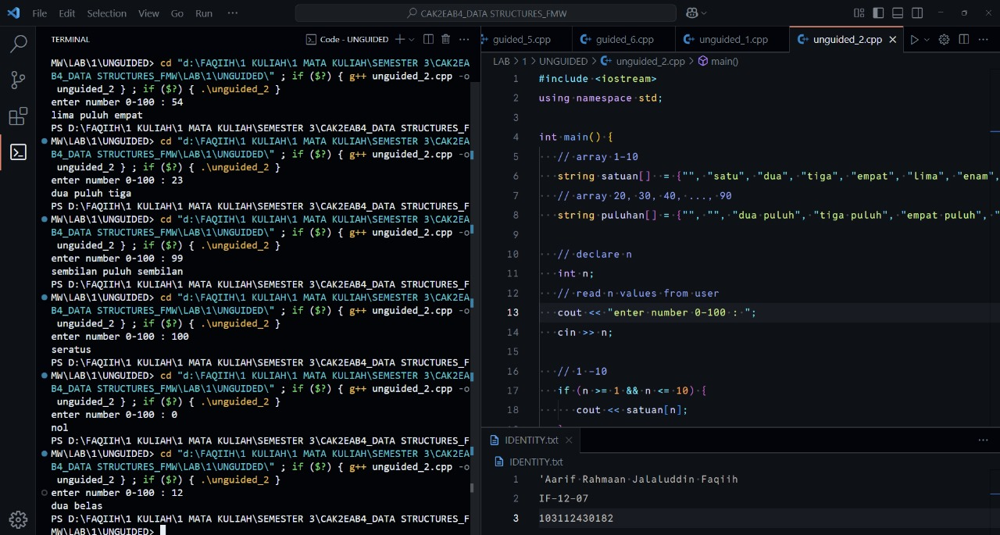
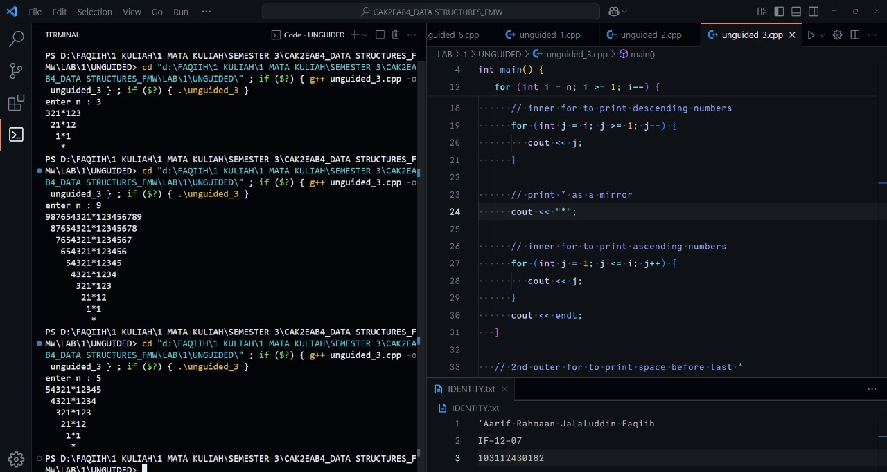

<h1 align="center">Laporan Praktikum Modul 1 <br> Nama Modul</h1>
<p align="center">'Aarif R. J. Faqiih - 103112430182</p>

## Dasar Teori

zzzzzzzzzzzzzzzzzzzzzzzzzzzzzzzzzzzzzzzzzzzzzzzzzzz

## Unguided

### Soal 1

Buatlah program yang menerima input-an dua buah bilangan bertipe float, kemudian memberikan output-an hasil penjumlahan, pengurangan, perkalian, dan pembagian dari dua bilangan tersebut.

```cpp
#include <iostream>
using namespace std;

// function to read two float numbers from user input
void readNumbers (float &a, float &b) {
   cout << "enter first float number : ";
   cin >> a;
   cout << "enter second float number : ";
   cin >> b;
   cout << "ok, we have " << a << " and " << b << endl;
   cout << "so..." << endl;
}

// function to add two numbers
float addition (float a, float b) {
   return a + b;
}

// function to subtract two numbers
float subtraction (float a, float b) {
   return a - b;
}

// function to multiply two numbers
float multiplication (float a, float b) {
   return a * b;
}

// function to divide two numbers
float division (float a, float b) {
   return a / b;
}

int main() {
   // declare two floats
   float a, b;
   // read input values from user
   readNumbers(a, b);

   // perform calculations
   float add = addition(a, b);
   float sub = subtraction(a, b);
   float mul = multiplication(a, b);
   float div = division(a, b);

   // print results
   cout << a << " + " << b << " = " << add  << endl;
   cout << a << " - " << b << " = " << sub << endl;
   cout << a << " * " << b << " = " << mul << endl;
   cout << a << " / " << b << " = " << div << endl;

   return 0;
}
```

> Output
> 
> 

program ini bertujuan untuk menampilkan hasil penjumlahan, pengurangan, perkalian, dan pembagian dari 2 angka bertipe float.

prosedur readNumbers di awal program bertujuan untuk menerima 2 input angka dari variabel a dan b yang nantinya akan masuk ke proses perhitungan.

setelah itu ada 4 fungsi utama yang menjadi core di program ini, yaitu addition, subtraction, multiplication, dan division. 4 fungsi ini memiliki 2 parameter yang sama yaitu angka bertipe float dari variabel a dan b.

fungsi addition bekerja dengan cara menjumlahkan nilai dari variabel a dan b, kemudian fungsi subtraction bekerja dengan cara mengurangi nilai dari variabel a dengan variabel b, setelah itu fungsi multiplication bekerja dengan cara mengalikan nilai dari variabel a dengan variabel b, dan fungsi division bekerja dengan cara membagi nilai dari variabel a dengan variabel b.

terakhir, fungsi main bertugas untuk mendeklarasikan variabel, memanggil fungsi, dan menampilkan hasil.

### Soal 2

Buatlah sebuah program yang menerima menerima masukan angka dan mengeluarkan output nilai angka tersebut dalam bentuk tulisan. Angka yang akan di-input-kan user adalah bilangan bulat positif mulai dari 0 s.d 100

<pre>79 : tujuh puluh sembilan</pre>

```cpp
#include <iostream>
using namespace std;

int main() {
   // array 1-10
   string satuan[]  = {"", "satu", "dua", "tiga", "empat", "lima", "enam", "tujuh", "delapan", "sembilan", "sepuluh"};
   // array 20, 30, 40, ..., 90
   string puluhan[] = {"", "", "dua puluh", "tiga puluh", "empat puluh", "lima puluh", "enam puluh", "tujuh puluh", "delapan puluh", "sembilan puluh"};

   // declare n
   int n;
   // read n values from user
   cout << "enter number 0-100 : ";
   cin >> n;

   // 1 -10
   if (n >= 1 && n <= 10) {
      cout << satuan[n];
   }

   // 20 - 99
   else if (n >= 20 && n <= 99) {
      cout << puluhan[n/10] << " " << satuan[n%10];
   }

   // 11 - 19
   else if (n >= 11 && n <= 19) {
      if (n == 11) {
         cout << "sebelas";
      } else {
         cout << satuan[n % 10] << " belas";
      }
   }

   // 0
   else if (n == 0) {
      cout << "nol";
   }

   // 100
   else if (n == 100) {
      cout << "seratus";
   }

   // not 0-100
   else {
      cout << "angka di luar 0-100";
   }

   return 0;
}
```

> Output
> 
> 

program ini bertujuan untuk menampilkan tulisan dari sebuah input angka dalam range 1 sampai 100.

agar tidak 'hard-coded' dan agar efisien, kita butuh array yang menyimpan tulisan dari angka, tidak perlu semua, cukup satuan dan puluhan saja.

jika angka yang diinput antara 1-10, maka menggunakan array satuan sebagai outputnya, cara kerjanya adalah mengambil index ke-n pada array berdasarkan angka yang diinput.

jika angka antara 20-99, maka menggunakan array puluhan sebagai outputnya, tapi bedanya kita perlu membagi n dengan 10 agar kita mendapat satu angka puluhannya, misalkan 79 menjadi 7, kenapa? karena untuk mendapatkan index ke-7 yaitu tujuh puluh, kita hanya perlu input 7 saja.

kemudian untuk mengambil bagian satuannya, kita ambil modulus 10, atau sisa bagi jika dibagi 10, kita mendapatkan sisa 9, 9 ini akan mengakses array satuan pada index ke-9, yaitu sembilan.

jika angka antara 11-19, maka untuk angka 11 perlu ditulis manual, karena itu angka spesial, kemudian gunakan array satuan tapi dengan modulus 10, kenapa? sama seperti di kasus angka puluhan tadi, kita hanya perlu ambil bagian belakangnya saja untuk mengakses index pada array satuan, kemudian di bagian belakang ditambahkan tulisan belas.

untuk angka 0 dan 100, ini diberi tulisan manual saja, yaitu nol dan seratus. jika angka di luar range 1 sampai 100, maka program menampilkan angka di luar 0-100.

### Soal 3

Buatlah program yang dapat memberikan input dan output sebagai berikut.

<pre>
input  : 3
output :
321*123
 21*12
  1*1
   *
</pre>

```cpp
#include <iostream>
using namespace std;

int main() {
   // declare n
   int n;
   // read n values from user
   cout << "enter n : ";
   cin >> n;

   // outer for to create rows
   for (int i = n; i >= 1; i--) {
      // inner for to print space before numbers
      for (int k = 0; k < n - i; k++) {
         cout << " ";
      }

      // inner for to print descending numbers
      for (int j = i; j >= 1; j--) {
         cout << j;
      }

      // print * as a mirror
      cout << "*";

      // inner for to print ascending numbers
      for (int j = 1; j <= i; j++) {
         cout << j;
      }
      cout << endl;
   }

   // 2nd outer for to print space before last *
   for (int k = 0; k < n; k++) {
      cout << " ";
   }

   // * tail
   cout << "*";

   return 0;
}
```

> Output
> 
> 

program ini bertujuan untuk menampilkan urutan angka secara descending dan ada bintang di tengahnya seperti cermin, kemudian di sisi kanan bintang ada kebalikan dari urutan angka di sisi kiri, angka di sisi kanan diurutkan secara ascending.

pertama, masukan jumlah n. masuk di perulangan pertama, yaitu for (int i = n; i >= 1; i--), ini berfungsi untuk melakukan pengulangan jumlah baris.

perulangan kedua, yaitu for (int k = 0; k < n - i; k++), berfungsi untuk memberikan spasi sebelum mencetak angka, kenapa perlu spasi? agar bisa rata di tengah, jumlah spasinya mengikuti urutan perulangan.

perulangan ketiga, yaitu for (int j = i; j >= 1; j--), berfungsi untuk menampilkan urutan angka di sisi kiri, yaitu angka yang diurutkan secara descending karena j--.

sebagai cermin antara sisi kiri dan kanan, kita perlu menambahkan cout << "*";.

perulangan keempat, yaitu for (int j = 1; j <= i; j++), berfungsi untuk menampilkan urutan angka di sisi kanan, yaitu angka yang diurutkan secara ascending karena j++.

karena di bagian paling bawah terdapat 1 bintang tambahan dan bintang itu juga akan dibuat rata tengah, maka kita perlu spasi terlebih dahulu menggunakan for (int k = 0; k < n; k++).

terakhir, cetak bintang di paling bawah dengan cout << "*";.

## Referensi

1. https://www.w3schools.com/cpp/cpp_functions.asp (diakses Selasa, 23 September 2025)
2. https://www.w3schools.com/cpp/cpp_for_loop.asp (diakses Rabu, 24 September 2025)
3. https://www.w3schools.com/cpp/cpp_for_loop_nested.asp (diakses Rabu, 24 September 2025)
