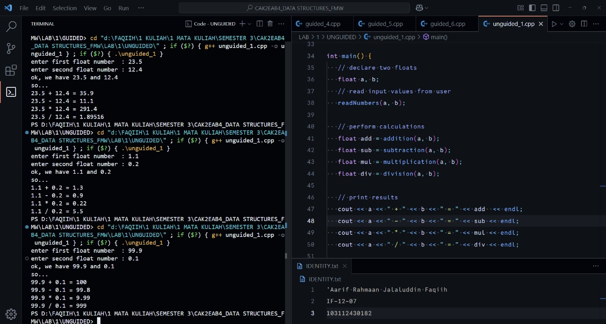

<h1 align="center">Laporan Praktikum Modul 1 <br> Nama Modul</h1>
<p align="center">'Aarif R. J. Faqiih - 103112430182</p>

## Dasar Teori

zzzzzzzzzzzzzzzzzzzzzzzzzzzzzzzzzzzzzzzzzzzzzzzzzzz

## Unguided

### Soal 1

Buatlah program yang menerima input-an dua buah bilangan bertipe float, kemudian memberikan output-an hasil penjumlahan, pengurangan, perkalian, dan pembagian dari dua bilangan tersebut.

```cpp
#include <iostream>
using namespace std;

// function to read two float numbers from user input
void readNumbers (float &a, float &b) {
   cout << "enter first float number : ";
   cin >> a;
   cout << "enter second float number : ";
   cin >> b;
   cout << "ok, we have " << a << " and " << b << endl;
   cout << "so..." << endl;
}

// function to add two numbers
float addition (float a, float b) {
   return a + b;
}

// function to subtract two numbers
float subtraction (float a, float b) {
   return a - b;
}

// function to multiply two numbers
float multiplication (float a, float b) {
   return a * b;
}

// function to divide two numbers
float division (float a, float b) {
   return a / b;
}

int main() {
   // declare two floats
   float a, b;
   // read input values from user
   readNumbers(a, b);

   // perform calculations
   float add = addition(a, b);
   float sub = subtraction(a, b);
   float mul = multiplication(a, b);
   float div = division(a, b);

   // print results
   cout << a << " + " << b << " = " << add  << endl;
   cout << a << " - " << b << " = " << sub << endl;
   cout << a << " * " << b << " = " << mul << endl;
   cout << a << " / " << b << " = " << div << endl;

   return 0;
}
```

> Output
> 
> 

program ini bertujuan untuk menampilkan hasil penjumlahan, pengurangan, perkalian, dan pembagian dari 2 angka bertipe float.

prosedur readNumbers di awal program bertujuan untuk menerima 2 input angka dari variabel a dan b yang nantinya akan masuk ke proses perhitungan.

setelah itu ada 4 fungsi utama yang menjadi core di program ini, yaitu addition, subtraction, multiplication, dan division. 4 fungsi ini memiliki 2 parameter yang sama yaitu angka bertipe float dari variabel a dan b.

fungsi addition bekerja dengan cara menjumlahkan nilai dari variabel a dan b, kemudian fungsi subtraction bekerja dengan cara mengurangi nilai dari variabel a dengan variabel b, setelah itu fungsi multiplication bekerja dengan cara mengalikan nilai dari variabel a dengan variabel b, dan fungsi division bekerja dengan cara membagi nilai dari variabel a dengan variabel b.

terakhir, fungsi main bertugas untuk mendeklarasikan variabel, memanggil fungsi, dan menampilkan hasil.
