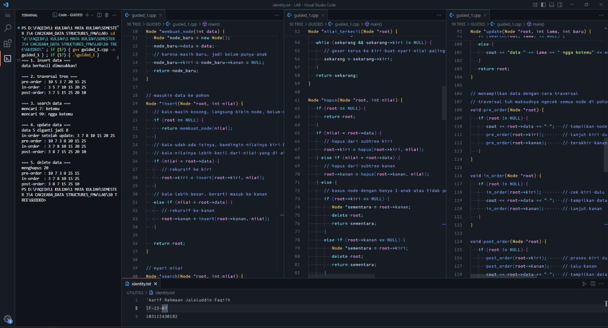
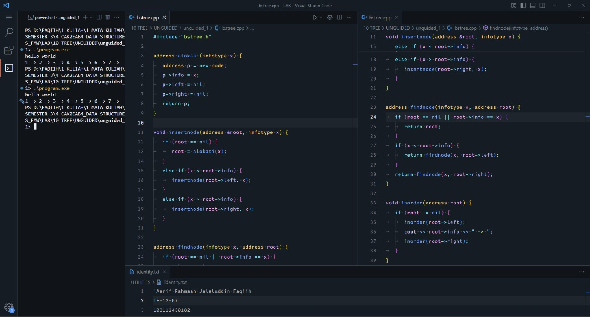
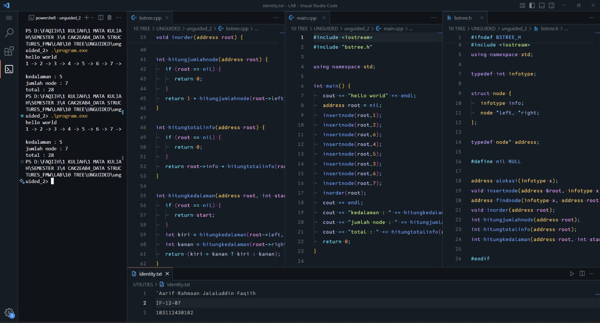
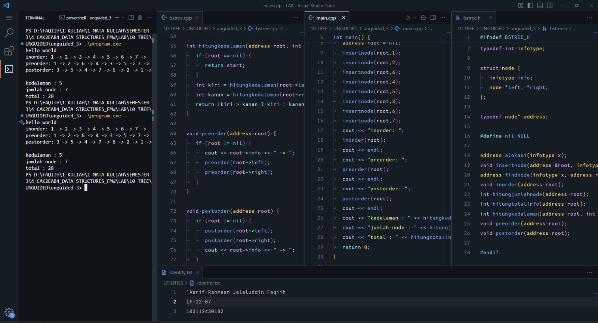

<h1 align="center">Laporan Praktikum Modul 10 <br> TREE</h1>
<p align="center">'Aarif Rahmaan Jalaluddin Faqiih - 103112430182</p>

## Dasar Teori

xxxxx

---

## Guided

### Soal 1

```cpp
#include <iostream>
using namespace std;

struct Node {
   int data;
   Node *kiri, *kanan;
};

// bikin node baru
Node *membuat_node(int data) {
   Node *node_baru = new Node();
   node_baru->data = data;  
   // karena masih baru, jadi belum punya anak
   node_baru->kiri = node_baru->kanan = NULL;
   return node_baru;
}

// masukin data ke pohon
Node *insert(Node *root, int nilai) {
   // kalo masih kosong, langsung bikin node, belum mikirin kiri kanan
   if (root == NULL) {
      return membuat_node(nilai);
   }
   // kalo udah ada isinya, bandingin nilainya kiri kanan
   // kalo nilainya lebih kecil dari nilai yang di atasnya, berarti masuk ke kiri
   if (nilai < root->data) {
      // rekursif ke kiri
      root->kiri = insert(root->kiri, nilai);
   }
   // kalo lebih besar, berarti masuk ke kanan
   else if (nilai > root->data) {
      // rekursif ke kanan
      root->kanan = insert(root->kanan, nilai);
   }

   return root;
}

// nyari nilai
Node *search(Node *root, int nilai) {
   if (root == NULL || root->data == nilai) {
      return root;
   }
   // lanjut ke subtree kiri
   if (nilai < root->data) {
      return search(root->kiri, nilai);
   }
   // lanjut ke subtree kanan
   return search(root->kanan, nilai);
}

Node *nilai_terkecil(Node *root) {
   Node *sekarang = root;
   while (sekarang && sekarang->kiri != NULL) {
      // geser terus ke kiri buat nyari nilai paling kecil
      sekarang = sekarang->kiri;
   }
   return sekarang;
}

Node *hapus(Node *root, int nilai) {
   if (root == NULL) {
      return root;
   }
   if (nilai < root->data) {
      // hapus dari subtree kiri
      root->kiri = hapus(root->kiri, nilai);
   } else if (nilai > root->data) {
      // hapus dari subtree kanan
      root->kanan = hapus(root->kanan, nilai);
   } else {
      // kasus node dengan hanya 1 anak atau tidak punya anak
      if (root->kiri == NULL) {
         Node *sementara = root->kanan;
         delete root;
         return sementara;
      }
      else if (root->kanan == NULL) {
         Node *sementara = root->kiri;
         delete root;
         return sementara;
      }
      // kasus dua anak: cari nilai terkecil di subtree kanan
      Node *sementara = nilai_terkecil(root->kanan);
      root->data = sementara->data;
      root->kanan = hapus(root->kanan, sementara->data);
   }
   return root;
}

// ubah data
Node *update(Node *root, int lama, int baru) {
   if (search(root, lama) != NULL) {
      // hapus data lama
      root = hapus(root, lama);
      // masukin data baru
      root = insert(root, baru);
      cout << "data " << lama << " diganti jadi " << baru << endl;
   }
   else {
      cout << "data " << lama << " ngga ketemu" << endl;
   }
   return root;
}

// menampilkan data dengan cara traversal
// traversal tuh maksudnya ngecek semua node di pohon satu per satu
void pre_order(Node *root) {
   if (root != NULL) {
      cout << root->data << " ";   // tampilkan node saat masuk
      pre_order(root->kiri);       // lanjut kiri dulu
      pre_order(root->kanan);      // terakhir kanan
   }
}

void in_order(Node *root) {
   if (root != NULL) {
      in_order(root->kiri);        // cek kiri dulu
      cout << root->data << " ";   // tampilkan data setelah kiri selesai
      in_order(root->kanan);       // lanjut kanan
   }
}

void post_order(Node *root) {
   if (root != NULL) {
      post_order(root->kiri);      // proses kiri dulu
      post_order(root->kanan);     // lalu kanan
      cout << root->data << " ";   // tampilkan data paling terakhir
   }
}

int main() {
   Node *root = NULL;

   cout << "=== 1. insert data ===" << endl;
   root = insert(root, 10);
   insert(root, 5);
   insert(root, 20);
   insert(root, 3);
   insert(root, 7);
   insert(root, 15);
   insert(root, 25);
   cout << "data berhasil dimasukkan!" << endl;

   cout << "\n=== 2. traversal tree ===" << endl;
   cout << "pre-order : ";
   pre_order(root);
   cout << endl;
   cout << "in-order  : ";
   in_order(root);
   cout << endl;
   cout << "post-order: ";
   post_order(root);
   cout << endl;

   cout << "\n=== 3. search data ===" << endl;
   int cari1 = 7, cari2 = 99;
   cout << "mencari " << cari1 << ": " << (search(root, cari1) ? "ketemu" : "ngga ketemu") << endl;
   cout << "mencari " << cari2 << ": " << (search(root, cari2) ? "ketemu" : "ngga ketemu") << endl;
   cout << endl;

   cout << "=== 4. update data ===" << endl;
   root = update(root, 5, 8);
   cout << "in-order setelah update: ";
   in_order(root);
   cout << endl;

   cout << "pre-order : ";
   pre_order(root);
   cout << endl;
   cout << "in-order  : ";
   in_order(root);
   cout << endl;
   cout << "post-order: ";
   post_order(root);
   cout << endl;

   cout << "\n=== 5. delete data ===" << endl;
   cout << "menghapus 20" << endl;
   root = hapus(root, 20);

   cout << "pre-order : ";
   pre_order(root);
   cout << endl;
   cout << "in-order  : ";
   in_order(root);
   cout << endl;
   cout << "post-order: ";
   post_order(root);
   cout << endl;
   return 0;
}
```

> Output
> 
> 

program ini bertujuan untuk membuat, menampilkan, mencari, mengubah, dan menghapus data di dalam struktur data binary search tree. binary search tree sendiri adalah struktur data berbentuk pohon yang punya aturan bahwa nilai yang lebih kecil selalu berada di kiri dan nilai yang lebih besar selalu berada di kanan.

pertama ada struct Node yang isinya variabel data dan dua pointer kiri dan kanan. pointer ini tujuannya untuk ngasih tau node sebelah kiri dan node sebelah kanan. kalau node baru dibuat, otomatis pointer kiri dan kanan masih kosong atau NULL.

setelah itu ada prosedur membuat_node yang fungsinya untuk bikin node baru. saat node dibuat, nilai data diisi sesuai input, dan pointer kiri serta kanan diset NULL karena node belum punya anak.

lalu ada fungsi insert untuk memasukkan data ke tree. kalau root masih kosong, berarti langsung bikin node baru dan jadikan itu root. kalau root udah ada nilainya, maka dibandingkan apakah nilai yang mau dimasukin lebih kecil atau lebih besar. kalau lebih kecil masuk ke subtree kiri, kalau lebih besar masuk ke subtree kanan. proses ini dilakukan secara rekursif sampai ketemu posisi yang kosong untuk ditaruh.

fungsi search digunakan untuk mencari suatu nilai di dalam tree. cara kerjanya mirip dengan insert, yaitu membandingkan nilai yang dicari dengan nilai di root. kalau lebih kecil, masuk ke kiri, kalau lebih besar masuk ke kanan. proses ini dilakukan terus sampai ketemu nilai yang sesuai atau sampai ketemu NULL yang berarti datanya tidak ada.

fungsi nilai_terkecil dipakai untuk mencari nilai paling kecil dari suatu subtree. caranya tinggal geser pointer terus ke kiri karena di binary search tree nilai terkecil pasti selalu di posisi paling kiri.

fungsi hapus digunakan untuk menghapus data di tree. kalau nilai yang dicari lebih kecil dari nilai root, maka proses penghapusan dilakukan di subtree kiri. kalau lebih besar dilakukan di subtree kanan. kalau nilainya sama dengan root, maka ada beberapa kemungkinan. pertama, node tidak punya anak atau hanya punya satu anak, maka node tinggal dihapus dan diganti dengan anaknya. kedua, node punya dua anak. dalam kasus ini dicari nilai terkecil dari subtree kanan untuk menggantikan nilai node yang mau dihapus. setelah itu nilai terkecil tersebut dihapus dari subtree kanan.

fungsi update dipakai untuk mengganti nilai lama menjadi nilai baru. pertama dicek apakah nilai lama ada di tree dengan fungsi search. kalau ada, nilai lama dihapus dengan fungsi hapus lalu nilai baru dimasukkan lagi dengan fungsi insert. kalau nilai lama tidak ditemukan, maka muncul pesan kalau datanya tidak ada.

fungsi pre_order, in_order, dan post_order adalah fungsi traversal yang tujuannya untuk menampilkan semua data di tree. pre-order menampilkan data saat node pertama kali dikunjungi, in-order menampilkan data setelah subtree kiri selesai, sedangkan post-order menampilkan data setelah kiri dan kanan selesai dicek.

di fungsi main, pertama tree masih kosong. lalu masukan beberapa data menggunakan fungsi insert. setelah itu data ditampilkan menggunakan traversal pre-order, in-order, dan post-order. kemudian dilakukan pencarian untuk dua angka, apakah ketemu atau tidak. setelah itu dilakukan update yaitu mengganti angka 5 menjadi 8. tree ditampilkan lagi setelah update. terakhir dilakukan proses delete untuk menghapus angka 20, dan hasil tree ditampilkan lagi menggunakan traversal.

---

## Unguided

### Soal 1 : xxxxx

<code>xxxxx.h</code>

```cpp
xxxxx
```

<code>xxxxx.cpp</code>

```cpp
xxxxx
```

<code>xxxxx.cpp</code>

```cpp
xxxxx
```

> Output
> 
> 

xxxxx

---

### Soal 2 : xxxxx

<code>xxxxx.h</code>

```cpp
xxxxx
```

<code>xxxxx.cpp</code>

```cpp
xxxxx
```

<code>xxxxx.cpp</code>

```cpp
xxxxx
```

> Output
> 
> 

xxxxx

---

### Soal 3 : xxxxx

<code>xxxxx.h</code>

```cpp
xxxxx
```

<code>xxxxx.cpp</code>

```cpp
xxxxx
```

<code>xxxxx</code>

```cpp
xxxxx
```

> Output
> 
> 

xxxxx

---

## Kesimpulan

xxxxx

---

## Referensi

1. xxxxx
2. xxxxx
3. xxxxx
4. xxxxx
