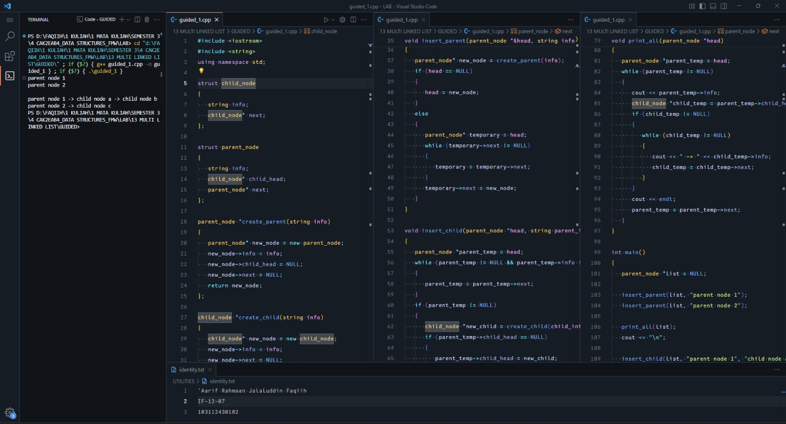
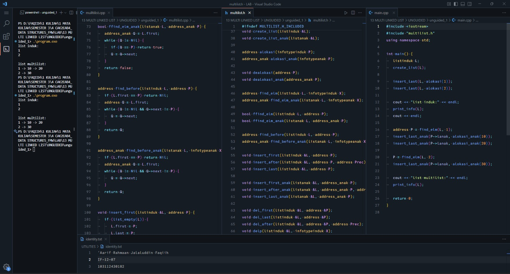
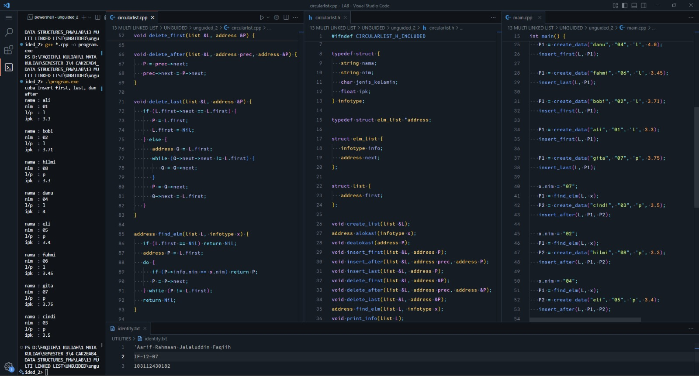

<h1 align="center">Laporan Praktikum Modul 13 <br> MULTI LINKED LIST</h1>
<p align="center">'Aarif Rahmaan Jalaluddin Faqiih - 103112430182</p>

## Dasar Teori

Multi Linked List adalah struktur data berbasis *linked list* yang menghubungkan dua level daftar, yaitu list induk dan list anak. Setiap elemen induk dapat memiliki sub-list sendiri, sehingga struktur yang terbentuk menyerupai hubungan *one-to-many*.

---

### 1. **Konsep Dasar Linked List**

* Linked list adalah struktur data dinamis yang tersusun dari node-node yang saling terhubung melalui pointer, berbeda dengan array.
* Keuntungan:

  * ukuran dapat berubah-ubah,

* Kekurangan:

  * akses elemen bersifat sequential,
  * membutuhkan memori tambahan untuk pointer.

---

### 2. **Multi Linked List**

Multi Linked List memperluas konsep dasar linked list dengan menambahkan hubungan *parent–child*. Setiap node induk memiliki pointer ke:

1. **node induk berikutnya**, dan
2. **list anak**, yang berisi node anak yang juga tersusun sebagai linked list.

**Struktur:**

```
Parent1 -> Parent2 -> Parent3 -> ...
   |         |         |
  Anak…     Anak…     Anak…
```

**Karakteristik:**

* Setiap elemen induk berdiri sebagai node dalam linked list tingkat pertama.
* Setiap elemen induk menyimpan sebuah sub-list anak.
* List induk dan list anak dapat diimplementasikan sebagai:

  * single linked list,
  * double linked list,
  * circular linked list.

---

### 3. **Operasi pada Multi Linked List**

Operasi dasar terbagi menjadi dua kategori:

#### A. Operasi pada List Induk

* *create_list* -> inisialisasi list induk.
* *alokasi/dalokasi* -> memesan & membebaskan memori node induk.
* *insert_first / insert_last / insert_after* -> penyisipan node induk di berbagai posisi.
* *delete_first / delete_last / delete_after* -> penghapusan node induk.
* *find_elm* -> pencarian elemen induk berdasarkan nilai info.
* *nb_list* -> menghitung jumlah node induk.
* *print_info* -> menampilkan seluruh node induk beserta daftar anak masing-masing.

#### B. Operasi pada List Anak

Mirip dengan operasi induk, tetapi dilakukan pada sub-list dalam setiap node induk:

* create_list_anak
* alokasi_anak / dealokasi_anak
* insert_first_anak / insert_last_anak / insert_after_anak
* delete_first_anak / delete_last_anak / delete_after_anak
* find_elm_anak
* nb_list_anak
* print_info_anak

---

### 4. **Manfaat Multi Linked List**

Struktur ini cocok untuk data hierarkis, misalnya:

* kategori (induk) -> produk (anak),
* dosen (induk) -> mahasiswa bimbingan (anak),
* kota (induk) -> kecamatan (anak),
* mata kuliah (induk) -> daftar mahasiswa (anak).

---

### 5. **Circular Linked List**

Circular Linked List adalah variasi linked list di mana node terakhir menunjuk kembali ke node pertama.

**Ciri:**

* traversal dapat berputar tanpa berhenti,
* tidak memiliki `NULL` sebagai penanda akhir.

Dalam konteks ADT circular list:

* insert/delete harus memperhatikan node terakhir supaya tetap menunjuk ke node pertama,
* pencarian harus dilakukan dengan loop `do … while`.

---

## Guided

### Soal 1

```cpp
#include <iostream>
#include <string>
using namespace std;

struct child_node
{
   string info;
   child_node* next;
};

struct parent_node
{
   string info;
   child_node* child_head;
   parent_node* next;
};

parent_node *create_parent(string info)
{
   parent_node* new_node = new parent_node;
   new_node->info = info;
   new_node->child_head = NULL;
   new_node->next = NULL;
   return new_node;
};

child_node *create_child(string info)
{
   child_node* new_node = new child_node;
   new_node->info = info;
   new_node->next = NULL;
   return new_node;
};

void insert_parent(parent_node *&head, string info)
{
   parent_node* new_node = create_parent(info);
   if (head == NULL)
   {
      head = new_node;
   }
   else
   {
      parent_node* temporary = head;
      while (temporary->next != NULL)
      {
         temporary = temporary->next;
      }
      temporary->next = new_node;
   }
}

void insert_child(parent_node *head, string parent_info, string child_info)
{
   parent_node *parent_temp = head;
   while (parent_temp != NULL && parent_temp->info != parent_info)
   {
      parent_temp = parent_temp->next;
   }
   if (parent_temp != NULL)
   {
      child_node *new_child = create_child(child_info);
      if (parent_temp->child_head == NULL)
      {
         parent_temp->child_head = new_child;
      }
      else
      {
         child_node *child_temp = parent_temp->child_head;
         while (child_temp->next != NULL)
         {
            child_temp = child_temp->next;
         }
         child_temp->next = new_child;
      }
   }
}

void print_all(parent_node *head)
{
   parent_node *parent_temp = head;
   while (parent_temp != NULL)
   {
      cout << parent_temp->info;
      child_node *child_temp = parent_temp->child_head;
      if (child_temp != NULL)
      {
         while (child_temp != NULL)
         {
            cout << " -> " << child_temp->info;
            child_temp = child_temp->next;
         }
      }
      cout << endl;
      parent_temp = parent_temp->next;
   }
}

int main()
{
   parent_node *list = NULL;

   insert_parent(list, "parent node 1");
   insert_parent(list, "parent node 2");

   print_all(list);
   cout << "\n";

   insert_child(list, "parent node 1", "child node a");
   insert_child(list, "parent node 1", "child node b");
   insert_child(list, "parent node 2", "child node c");

   print_all(list);

   return 0;
}
```

> Output
> 
> 

program ini bertujuan untuk menampilkan struktur data yang terdiri dari node parent dan node child, di mana setiap parent bisa punya beberapa child, dan relasinya ditampilkan secara berurutan.

di awal program terdapat dua buah struct, yaitu child_node dan parent_node. child_node berfungsi untuk menyimpan data child berupa string dan pointer next untuk menghubungkan child berikutnya. sedangkan parent_node berfungsi untuk menyimpan data parent berupa string, kemudian pointer child_head untuk menunjuk ke child pertamanya, dan pointer next untuk menghubungkan parent berikutnya.

setelah itu ada dua fungsi untuk membuat node baru, yaitu create_parent dan create_child. keduanya bekerja dengan cara mengalokasikan node baru menggunakan new, mengisi nilai info sesuai parameter, kemudian mengatur pointer next menjadi NULL. khusus parent_node ada tambahan pointer child_head yang juga diatur menjadi NULL, karena ketika parent baru dibuat, belum ada child yang dimiliki.

prosedur insert_parent bekerja dengan cara menambahkan parent baru ke bagian akhir dari linked list parent. pertama dicek apakah head masih kosong, jika iya maka parent baru langsung menjadi head. jika tidak, maka dilakukan traversal menggunakan pointer temporary hingga mencapai parent terakhir, dan parent baru ditambahkan di bagian belakang dengan cara mengatur pointer next dari parent terakhir menuju parent baru.

prosedur insert_child bekerja dengan cara mencari parent tertentu berdasarkan info. caranya adalah melakukan traversal dari head hingga menemukan parent yang info-nya sama dengan parent_info. jika parent ditemukan, maka dibuat child baru menggunakan create_child. jika parent tersebut belum punya child sama sekali, maka child baru menjadi child_head. tetapi jika sudah ada child sebelumnya, maka dilakukan traversal lagi hingga child terakhir, kemudian child baru disambungkan di bagian belakang.

fungsi print_all bertugas menampilkan seluruh data parent beserta child-nya. caranya adalah melakukan traversal parent satu per satu, mencetak info parent, lalu jika parent tersebut punya child, dilakukan traversal child untuk mencetak seluruh child yang terhubung dari parent tersebut. setelah semua child dari parent itu dicetak, program berpindah ke parent berikutnya.

terakhir, fungsi main bertugas untuk membuat list parent kosong, kemudian menambahkan dua parent menggunakan insert_parent. setelah itu hasilnya ditampilkan menggunakan print_all. lalu beberapa child ditambahkan ke parent tertentu menggunakan insert_child, dan hasil akhirnya ditampilkan lagi menggunakan print_all.

---

## Unguided

### Soal 1 : buat multilist.cpp untuk implementasi semua fungsi pada multilist.h. Buat main.cpp untuk pemanggilan fungsi-fungsi tersebut.

<code>multilist.h</code>

```cpp
#ifndef MULTILIST_H_INCLUDED
#define MULTILIST_H_INCLUDED
#define Nil NULL

typedef int infotypeanak;
typedef int infotypeinduk;

typedef struct elemen_list_induk *address;
typedef struct elemen_list_anak *address_anak;

struct elemen_list_anak {
	infotypeanak info;
	address_anak next;
	address_anak prev;
};

struct listanak {
	address_anak first;
	address_anak last;
};

struct elemen_list_induk {
	infotypeinduk info;
	listanak lanak;
	address next;
	address prev;
};

struct listinduk {
	address first;
	address last;
};

bool list_empty(listinduk L);
bool list_empty_anak(listanak L);

void create_list(listinduk &L);
void create_list_anak(listanak &L);

address alokasi(infotypeinduk P);
address_anak alokasi_anak(infotypeanak P);

void dealokasi(address P);
void dealokasi_anak(address_anak P);

address find_elm(listinduk L, infotypeinduk X);
address_anak find_elm_anak(listanak L, infotypeanak X);

bool ffind_elm(listinduk L, address P);
bool ffind_elm_anak(listanak L, address_anak P);

address find_before(listinduk L, address P);
address_anak find_before_anak(listanak L, infotypeanak X, address_anak P);

void insert_first(listinduk &L, address P);
void insert_after(listinduk &L, address P, address Prec);
void insert_last(listinduk &L, address P);

void insert_first_anak(listanak &L, address_anak P);
void insert_after_anak(listanak &L, address_anak P, address_anak Prec);
void insert_last_anak(listanak &L, address_anak P);

void del_first(listinduk &L, address &P);
void del_last(listinduk &L, address &P);
void del_after(listinduk &L, address &P, address Prec);
void delp(listinduk &L, infotypeinduk X);

void del_first_anak(listanak &L, address_anak &P);
void del_last_anak(listanak &L, address_anak &P);
void del_after_anak(listanak &L, address_anak &P, address_anak Prec);
void delp_anak(listanak &L, infotypeanak X);

void print_info(listinduk L);
int nb_list(listinduk L);

void print_info_anak(listanak L);
int nb_list_anak(listanak L);

void del_all(listinduk &L);

#endif
```

<code>multilist.cpp</code>

```cpp
#include <iostream>
#include "multilist.h"
using namespace std;

bool list_empty(listinduk L) {
	return L.first == Nil;
}

bool list_empty_anak(listanak L) {
	return L.first == Nil;
}

void create_list(listinduk &L) {
	L.first = Nil;
	L.last = Nil;
}

void create_list_anak(listanak &L) {
	L.first = Nil;
	L.last = Nil;
}

address alokasi(infotypeinduk P) {
	address Q = new elemen_list_induk;
	Q->info = P;
	create_list_anak(Q->lanak);
	Q->next = Nil;
	Q->prev = Nil;
	return Q;
}

address_anak alokasi_anak(infotypeanak P) {
	address_anak Q = new elemen_list_anak;
	Q->info = P;
	Q->next = Nil;
	Q->prev = Nil;
	return Q;
}

void dealokasi(address P) {
	delete P;
}

void dealokasi_anak(address_anak P) {
	delete P;
}

address find_elm(listinduk L, infotypeinduk X) {
	address P = L.first;
	while (P != Nil && P->info != X) {
		P = P->next;
	}
	return P;
}

address_anak find_elm_anak(listanak L, infotypeanak X) {
	address_anak P = L.first;
	while (P != Nil && P->info != X) {
		P = P->next;
	}
	return P;
}

bool ffind_elm(listinduk L, address P) {
	address Q = L.first;
	while (Q != Nil) {
		if (Q == P) return true;
		Q = Q->next;
	}
	return false;
}

bool ffind_elm_anak(listanak L, address_anak P) {
	address_anak Q = L.first;
	while (Q != Nil) {
		if (Q == P) return true;
		Q = Q->next;
	}
	return false;
}

address find_before(listinduk L, address P) {
	if (L.first == P) return Nil;
	address Q = L.first;
	while (Q != Nil && Q->next != P) {
		Q = Q->next;
	}
	return Q;
}

address_anak find_before_anak(listanak L, infotypeanak X, address_anak P) {
	if (L.first == P) return Nil;
	address_anak Q = L.first;
	while (Q != Nil && Q->next != P) {
		Q = Q->next;
	}
	return Q;
}

void insert_first(listinduk &L, address P) {
	if (list_empty(L)) {
		L.first = P;
		L.last = P;
	} else {
		P->next = L.first;
		L.first->prev = P;
		L.first = P;
	}
}

void insert_after(listinduk &L, address P, address Prec) {
	P->next = Prec->next;
	P->prev = Prec;
	if (Prec->next != Nil) Prec->next->prev = P;
	Prec->next = P;
	if (L.last == Prec) L.last = P;
}

void insert_last(listinduk &L, address P) {
	if (list_empty(L)) {
		insert_first(L, P);
	} else {
		P->prev = L.last;
		L.last->next = P;
		L.last = P;
	}
}

void insert_first_anak(listanak &L, address_anak P) {
	if (list_empty_anak(L)) {
		L.first = P;
		L.last = P;
	} else {
		P->next = L.first;
		L.first->prev = P;
		L.first = P;
	}
}

void insert_after_anak(listanak &L, address_anak P, address_anak Prec) {
	P->next = Prec->next;
	P->prev = Prec;
	if (Prec->next != Nil) Prec->next->prev = P;
	Prec->next = P;
	if (L.last == Prec) L.last = P;
}

void insert_last_anak(listanak &L, address_anak P) {
	if (list_empty_anak(L)) {
		insert_first_anak(L, P);
	} else {
		P->prev = L.last;
		L.last->next = P;
		L.last = P;
	}
}

void del_first(listinduk &L, address &P) {
	P = L.first;
	if (L.first == L.last) {
		L.first = Nil;
		L.last = Nil;
	} else {
		L.first = P->next;
		L.first->prev = Nil;
	}
}

void del_last(listinduk &L, address &P) {
	P = L.last;
	if (L.first == L.last) {
		L.first = Nil;
		L.last = Nil;
	} else {
		L.last = P->prev;
		L.last->next = Nil;
	}
}

void del_after(listinduk &L, address &P, address Prec) {
	P = Prec->next;
	Prec->next = P->next;
	if (P->next != Nil) P->next->prev = Prec;
	if (L.last == P) L.last = Prec;
}

void delp(listinduk &L, infotypeinduk X) {
	address P = find_elm(L, X);
	if (P != Nil) {
		if (P == L.first) {
			del_first(L, P);
			dealokasi(P);
		} else if (P == L.last) {
			del_last(L, P);
			dealokasi(P);
		} else {
			address Q;
			del_after(L, Q, P->prev);
			dealokasi(Q);
		}
	}
}

void del_first_anak(listanak &L, address_anak &P) {
	P = L.first;
	if (L.first == L.last) {
		L.first = Nil;
		L.last = Nil;
	} else {
		L.first = P->next;
		L.first->prev = Nil;
	}
}

void del_last_anak(listanak &L, address_anak &P) {
	P = L.last;
	if (L.first == L.last) {
		L.first = Nil;
		L.last = Nil;
	} else {
		L.last = P->prev;
		L.last->next = Nil;
	}
}

void del_after_anak(listanak &L, address_anak &P, address_anak Prec) {
	P = Prec->next;
	Prec->next = P->next;
	if (P->next != Nil) P->next->prev = Prec;
	if (L.last == P) L.last = Prec;
}

void delp_anak(listanak &L, infotypeanak X) {
	address_anak P = find_elm_anak(L, X);
	if (P != Nil) {
		if (P == L.first) {
			del_first_anak(L, P);
			dealokasi_anak(P);
		} else if (P == L.last) {
			del_last_anak(L, P);
			dealokasi_anak(P);
		} else {
			address_anak Q;
			del_after_anak(L, Q, P->prev);
			dealokasi_anak(Q);
		}
	}
}

void print_info_anak(listanak L) {
	address_anak P = L.first;
	while (P != Nil) {
		cout << " -> " << P->info;
		P = P->next;
	}
}

void print_info(listinduk L) {
	address P = L.first;
	while (P != Nil) {
		cout << P->info;
		print_info_anak(P->lanak);
		cout << endl;
		P = P->next;
	}
}

int nb_list(listinduk L) {
	int c = 0;
	address P = L.first;
	while (P != Nil) {
		c++;
		P = P->next;
	}
	return c;
}

int nb_list_anak(listanak L) {
	int c = 0;
	address_anak P = L.first;
	while (P != Nil) {
		c++;
		P = P->next;
	}
	return c;
}

void del_all(listinduk &L) {
	address P;
	while (L.first != Nil) {
		del_first(L, P);
		dealokasi(P);
	}
}
```

<code>main.cpp</code>

```cpp
#include <iostream>
#include "multilist.h"
using namespace std;

int main() {
	listinduk L;
	create_list(L);

	insert_last(L, alokasi(1));
	insert_last(L, alokasi(2));

	cout << "list induk:" << endl;
	print_info(L);
	cout << endl;

	address P = find_elm(L, 1);
	insert_last_anak(P->lanak, alokasi_anak(10));
	insert_last_anak(P->lanak, alokasi_anak(20));

	P = find_elm(L, 2);
	insert_last_anak(P->lanak, alokasi_anak(30));

	cout << "list multilist:" << endl;
	print_info(L);

	return 0;
}
```

> Output
> 
> 

program ini bertujuan untuk membuat, mengelola, dan menampilkan struktur data multilist yang terdiri dari list induk dan list anak, di mana setiap elemen induk dapat memiliki list anak masing-masing.

di awal program terdapat dua buah struct utama, yaitu listinduk dan listanak. listinduk adalah list yang berisi elemen induk, sedangkan listanak adalah list yang berada di dalam setiap elemen induk. setiap elemen induk memiliki info bertipe integer, pointer next dan prev untuk membentuk double linked list, serta sebuah listanak bernama lanak yang menjadi wadah untuk anak-anaknya. elemen anak juga memiliki info integer dan pointer next serta prev seperti list induk.

prosedur create_list dan create_list_anak digunakan untuk membuat list baru dengan cara mengatur first dan last menjadi Nil agar list kosong dan siap digunakan. kemudian ada fungsi alokasi dan alokasi_anak yang bekerja dengan cara membuat elemen baru di heap menggunakan operator new, mengisi info dengan nilai input, mengatur pointer next dan prev menjadi Nil, dan mengembalikan alamat elemen tersebut. pada alokasi induk, elemen yang dibuat langsung diberi list anak kosong menggunakan create_list_anak.

fungsi dealokasi dan dealokasi_anak bekerja dengan cara menghapus elemen yang tidak dipakai lagi menggunakan delete. kemudian ada fungsi find_elm dan find_elm_anak yang bekerja dengan cara menelusuri list dari first hingga menemukan nilai info yang dicari, jika tidak ditemukan maka mengembalikan Nil.

fungsi insert_first, insert_after, dan insert_last bekerja dengan cara memasukkan elemen baru ke posisi pertama, setelah elemen tertentu, atau terakhir dalam list induk. logika yang sama juga berlaku pada insert_first_anak, insert_after_anak, dan insert_last_anak untuk list anak. pointer next dan prev disesuaikan agar struktur double linked list tetap benar.

fungsi del_first, del_after, dan del_last bekerja dengan cara menghapus elemen pertama, elemen setelah suatu elemen, atau elemen terakhir dari list induk. logika serupa juga diterapkan pada del_first_anak, del_after_anak, dan del_last_anak untuk list anak. fungsi delp dan delp_anak bekerja dengan cara mencari elemen berdasarkan info, kemudian menghapusnya dengan memanggil fungsi delete yang sesuai.

fungsi print_info dan print_info_anak bekerja dengan menelusuri list dari first hingga akhir sambil menampilkan info setiap elemen. print_info menampilkan elemen induk dan memanggil print_info_anak untuk menampilkan anak-anak dari elemen tersebut. kemudian nb_list dan nb_list_anak digunakan untuk menghitung banyaknya elemen dalam list.

terakhir, fungsi main bertugas untuk membuat list induk, mengisi elemen induk menggunakan insert_last, kemudian menambahkan elemen anak ke masing-masing induk dengan memanggil insert_last_anak. setelah itu program menampilkan isi list induk dan list multilist menggunakan print_info.

### Soal 2 :

- Terdapat 11 fungsi/prosedur untuk ADT circularlist
  - procedure CreateList( input/output L : List )
  - function alokasi( x : infotype ) -> address
  - procedure dealokasi( input/output t P : address )
  - procedure insertFirst( input/output L : List, input P : address )
  - procedure insertAfter( input/output L : List, input Prec : address, P : address)
  - procedure insertLast( input/output L : List, input P : address )
  - procedure deleteFirst( input/output L : List, input/output P : address )
  - procedure deleteAfter( input/output L : List, input Prec : address, input/output t P : address )
  - procedure deleteLast( input/output L : List, P : address )
  - function findElm( L : List, x : infotype ) -> address
  - procedure printInfo( input L : List )

- Keterangan
  - fungsi findElm mencari elemen di dalam list L berdasarkan nim
    - fungsi mengembalikan elemen dengan dengan info nim == x.nim jika ditemukan
    - fungsi mengembalikan NIL jika tidak ditemukan

- Buatlah implementasi ADT Doubly Linked list pada file “circularlist.cpp”. Tambahkan fungsi/prosedur berikut pada file “main.cpp”.
  - fungsi create ( in nama, nim : string, jenis_kelamin : char, ipk : float)
    - fungsi disediakan, ketik ulang code yang diberikan
    - fungsi mengalokasikan sebuah elemen list dengan info sesuai input

<code>circularlist.h</code>

```cpp
#ifndef CIRCULARLIST_H_INCLUDED
#define CIRCULARLIST_H_INCLUDED
#define Nil NULL

#include <string>
using namespace std;

typedef struct {
   string nama;
   string nim;
   char jenis_kelamin;
   float ipk;
} infotype;

typedef struct elm_list *address;

struct elm_list {
   infotype info;
   address next;
};

struct list {
   address first;
};

void create_list(list &L);
address alokasi(infotype x);
void dealokasi(address P);
void insert_first(list &L, address P);
void insert_after(list &L, address prec, address P);
void insert_last(list &L, address P);
void delete_first(list &L, address &P);
void delete_after(list &L, address prec, address &P);
void delete_last(list &L, address &P);
address find_elm(list L, infotype x);
void print_info(list L);

#endif
```

<code>circularlist.cpp</code>

```cpp
#include <iostream>
#include "circularlist.h"
using namespace std;

void create_list(list &L) {
   L.first = Nil;
}

address alokasi(infotype x) {
   address P = new elm_list;
   P->info = x;
   P->next = P;
   return P;
}

void dealokasi(address P) {
   delete P;
}

void insert_first(list &L, address P) {
   if (L.first == Nil) {
      L.first = P;
   } else {
      address Q = L.first;
      while (Q->next != L.first) {
         Q = Q->next;
      }
      P->next = L.first;
      Q->next = P;
      L.first = P;
   }
}

void insert_after(list &L, address prec, address P) {
   P->next = prec->next;
   prec->next = P;
}

void insert_last(list &L, address P) {
   if (L.first == Nil) {
      L.first = P;
   } else {
      address Q = L.first;
      while (Q->next != L.first) {
         Q = Q->next;
      }
      Q->next = P;
      P->next = L.first;
   }
}

void delete_first(list &L, address &P) {
   P = L.first;
   if (P->next == P) {
      L.first = Nil;
   } else {
      address Q = L.first;
      while (Q->next != L.first) {
         Q = Q->next;
      }
      L.first = P->next;
      Q->next = L.first;
   }
}

void delete_after(list &L, address prec, address &P) {
   P = prec->next;
   prec->next = P->next;
}

void delete_last(list &L, address &P) {
   if (L.first->next == L.first) {
      P = L.first;
      L.first = Nil;
   } else {
      address Q = L.first;
      while (Q->next->next != L.first) {
         Q = Q->next;
      }
      P = Q->next;
      Q->next = L.first;
   }
}

address find_elm(list L, infotype x) {
   if (L.first == Nil) return Nil;
   address P = L.first;
   do {
      if (P->info.nim == x.nim) return P;
      P = P->next;
   } while (P != L.first);
   return Nil;
}

void print_info(list L) {
   if (L.first == Nil) return;
   address P = L.first;
   do {
      cout << P->info.nama << " "
           << P->info.nim << " "
           << P->info.jenis_kelamin << " "
           << P->info.ipk << endl;
      P = P->next;
   } while (P != L.first);
}
```

<code>main.cpp</code>

```cpp
#include <iostream>
#include "circularlist.h"
using namespace std;

address create_data(string nama, string nim, char jenis_kelamin, float ipk) {
   infotype x;
   x.nama = nama;
   x.nim = nim;
   x.jenis_kelamin = jenis_kelamin;
   x.ipk = ipk;
   address P = alokasi(x);
   return P;
}

int main() {
   list L, A, B, L2;
   address P1 = Nil;
   address P2 = Nil;
   infotype x;

   create_list(L);

   cout << "coba insert first, last, dan after" << endl;

   P1 = create_data("danu", "04", 'l', 4.0);
   insert_first(L, P1);

   P1 = create_data("fahmi", "06", 'l', 3.45);
   insert_last(L, P1);

   P1 = create_data("bobi", "02", 'l', 3.71);
   insert_first(L, P1);

   P1 = create_data("ali", "01", 'l', 3.3);
   insert_first(L, P1);

   P1 = create_data("gita", "07", 'p', 3.75);
   insert_last(L, P1);

   x.nim = "07";
   P1 = find_elm(L, x);
   P2 = create_data("cindi", "03", 'p', 3.5);
   insert_after(L, P1, P2);

   x.nim = "02";
   P1 = find_elm(L, x);
   P2 = create_data("hilmi", "08", 'p', 3.3);
   insert_after(L, P1, P2);

   x.nim = "04";
   P1 = find_elm(L, x);
   P2 = create_data("eli", "05", 'p', 3.4);
   insert_after(L, P1, P2);

   print_info(L);

   return 0;
}
```

> Output
> 
> 

program ini bertujuan untuk membuat, mengelola, dan menampilkan data mahasiswa menggunakan struktur data circular linked list, yaitu bentuk linked list yang node terakhirnya selalu menunjuk kembali ke node pertama sehingga membentuk lingkaran.

di bagian awal program yaitu circularlist.h, terdapat definisi struct infotype yang menyimpan data mahasiswa seperti nama, nim, jenis kelamin, dan ipk. kemudian ada struct elm_list yang menjadi node pada linked list, setiap node menyimpan info bertipe infotype dan pointer next yang menunjuk ke node berikutnya. struct list hanya menyimpan satu pointer yaitu first yang menunjuk ke elemen pertama di circular linked list. setelah itu ada sederetan deklarasi fungsi yang dipakai untuk membuat list, menambah data, menghapus data, mencari data, dan menampilkan isi list.

di circularlist.cpp terdapat implementasi dari semua fungsi tersebut. fungsi create_list bekerja dengan cara mengatur pointer first menjadi kosong atau Nil, artinya list masih belum memiliki elemen. fungsi alokasi bekerja dengan cara membuat node baru memakai operator new, kemudian mengisi info di dalam node sesuai input, dan menunjuk next ke dirinya sendiri agar langsung berbentuk circular ketika masih satu node. fungsi dealokasi hanya bertugas menghapus node dari memori menggunakan delete.

fungsi insert_first bekerja dengan cara memasukkan node baru P ke posisi paling awal list. jika list kosong maka first langsung menunjuk ke P. jika tidak kosong maka program mencari node terakhir yaitu node yang next-nya menunjuk ke first. setelah ketemu, node baru P akan diarahkan next-nya ke first, node terakhir akan diarahkan next-nya ke P, lalu first diperbarui menjadi P. fungsi insert_last bekerja hampir sama tetapi menempatkan node baru di posisi paling belakang list, yaitu dengan mencari node terakhir lalu menghubungkan node terakhir ke node baru dan node baru kembali menunjuk ke first agar tetap circular. fungsi insert_after bekerja dengan cara menyisipkan node P setelah node prec, yaitu mengatur P->next ke prec->next, lalu prec->next menunjuk ke P sehingga P berada tepat setelah prec.

fungsi delete_first bekerja dengan cara menghapus node paling awal list. jika list hanya memiliki satu node maka first dibuat kosong. jika lebih dari satu node maka program mencari node terakhir, lalu first digeser ke node berikutnya, dan node terakhir dihubungkan lagi ke first yang baru. fungsi delete_after bekerja dengan cara mengambil node setelah prec kemudian memutus hubungan node tersebut dengan cara menghubungkan prec langsung ke node berikutnya. fungsi delete_last bekerja dengan cara mencari node sebelum node terakhir, yaitu node yang next->next-nya menunjuk ke first. setelah ketemu, node terakhir dilepas dan node sebelum terakhir dihubungkan ke first.

fungsi find_elm bekerja dengan cara mencari node berdasarkan nim. pencarian dilakukan dari first kemudian bergerak mengikuti next sampai kembali lagi ke first. jika ditemukan node dengan nim yang sama maka node tersebut dikembalikan, jika tidak ditemukan maka mengembalikan Nil. fungsi print_info bekerja dengan cara menampilkan seluruh isi list mulai dari first kemudian bergerak node demi node mengikuti next sampai kembali lagi ke first.

di main.cpp terdapat fungsi create_data yang bertugas membuat data mahasiswa berdasarkan input nama, nim, jenis kelamin, dan ipk, kemudian mengalokasikan node baru dengan memanggil fungsi alokasi. di fungsi main, pertama-tama dibuat list L dan diinisialisasi memakai create_list. setelah itu ada proses memasukkan beberapa data menggunakan insert_first, insert_last, dan insert_after sesuai contoh. setiap data mahasiswa dibuat dulu memakai create_data kemudian disisipkan ke dalam list dengan posisi yang berbeda-beda. untuk penyisipan setelah node tertentu program memakai find_elm untuk mencari node berdasar nim.

---

## Kesimpulan

implementasi fungsi pada multilist.cpp memastikan operasi dasar seperti alokasi, pencarian, penyisipan, penghapusan, dan penelusuran dapat dilakukan pada dua level list secara konsisten menggunakan double linked list. sementara itu, circular linked list menampilkan karakteristik list yang node terakhirnya selalu kembali ke node pertama, sehingga traversal bersifat melingkar tanpa titik akhir.

---

## Referensi

1. Mahir Koding. Struktur data nested linked list. Diakses 5 Desember 2025, dari https://www.mahirkoding.com/struktur-data-nested-linked-list/
2. GeeksforGeeks. Types of linked list. Diakses 7 Desember 2025, dari https://www.geeksforgeeks.org/dsa/types-of-linked-list/
3. GeeksforGeeks. Flatten a multilevel linked list using level order traversal. Diakses 4 Desember 2025, dari https://www.geeksforgeeks.org/dsa/flatten-a-linked-list-with-next-and-child-pointers/
4. Mahir Koding. Struktur Data Double Linked List dengan Bahasa C. Diakses 9 Desember 2025, dari https://www.mahirkoding.com/struktur-data-double-linked-list-dengan-bahasa-c/
