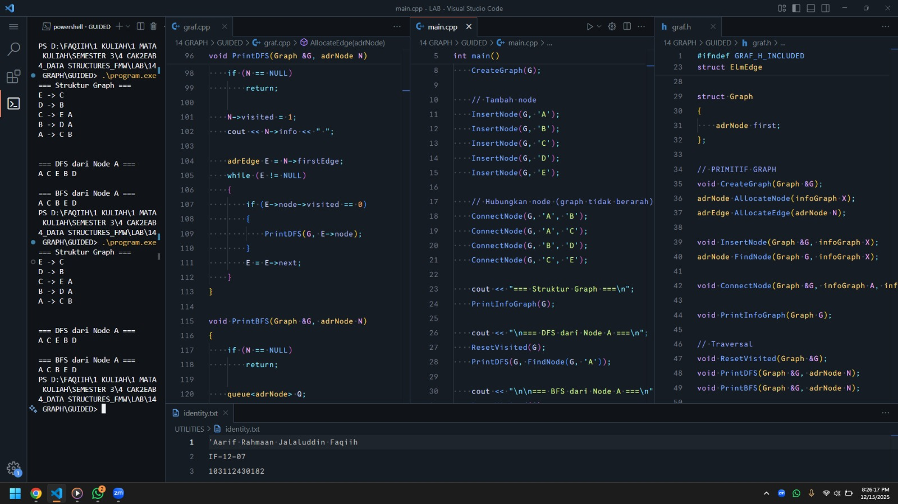
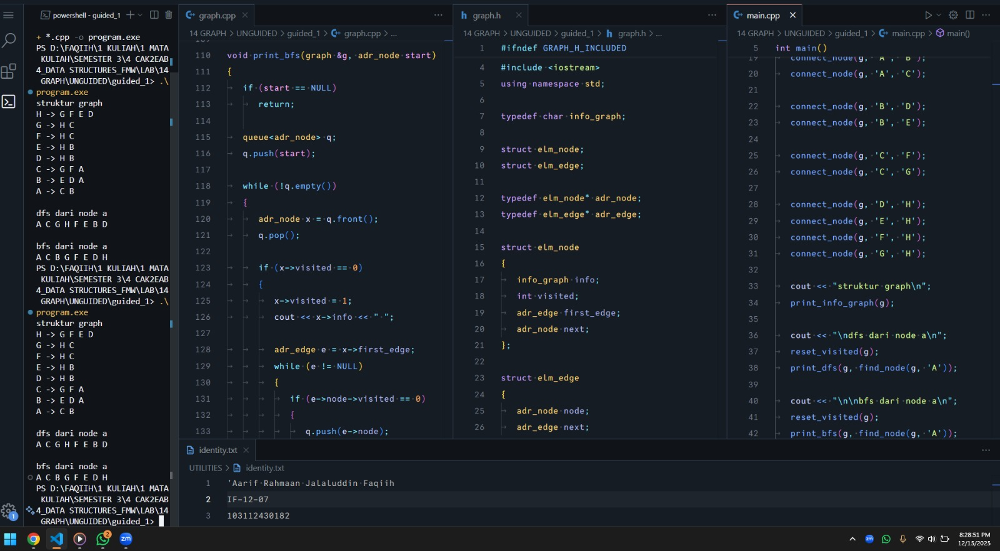
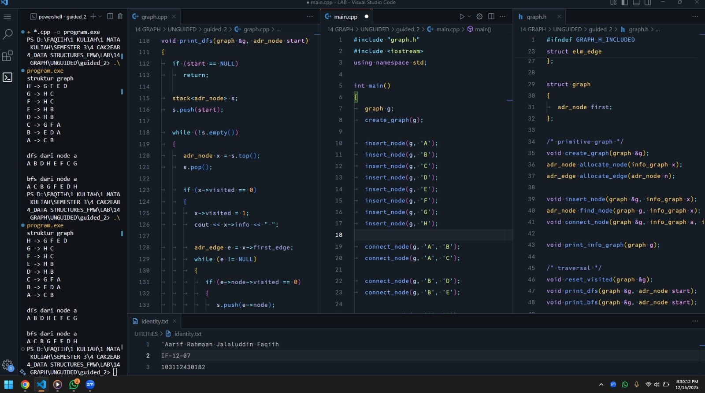

<h1 align="center">Laporan Praktikum Modul 14 <br> GRAPH</h1>
<p align="center">'Aarif Rahmaan Jalaluddin Faqiih - 103112430182</p>

## Dasar Teori

---

## Guided

### Soal 1

<code>graf.h</code>

```cpp
#ifndef GRAF_H_INCLUDED
#define GRAF_H_INCLUDED

#include <iostream>
using namespace std;

typedef char infoGraph;

struct ElmNode;
struct ElmEdge;

typedef ElmNode *adrNode;
typedef ElmEdge *adrEdge;

struct ElmNode
{
    infoGraph info;
    int visited;
    adrEdge firstEdge;
    adrNode next;
};

struct ElmEdge
{
    adrNode node;
    adrEdge next;
};

struct Graph
{
    adrNode first;
};

// PRIMITIF GRAPH
void CreateGraph(Graph &G);
adrNode AllocateNode(infoGraph X);
adrEdge AllocateEdge(adrNode N);

void InsertNode(Graph &G, infoGraph X);
adrNode FindNode(Graph G, infoGraph X);

void ConnectNode(Graph &G, infoGraph A, infoGraph B);

void PrintInfoGraph(Graph G);

// Traversal
void ResetVisited(Graph &G);
void PrintDFS(Graph &G, adrNode N);
void PrintBFS(Graph &G, adrNode N);

#endif
```

<code>graf.cpp</code>

```cpp
#include "graf.h"
#include <queue>
#include <stack>

void CreateGraph(Graph &G)
{
    G.first = NULL;
}

adrNode AllocateNode(infoGraph X)
{
    adrNode P = new ElmNode;
    P->info = X;
    P->visited = 0;
    P->firstEdge = NULL;
    P->next = NULL;
    return P;
}

adrEdge AllocateEdge(adrNode N)
{
    adrEdge P = new ElmEdge;
    P->node = N;
    P->next = NULL;
    return P;
}

void InsertNode(Graph &G, infoGraph X)
{
    adrNode P = AllocateNode(X);
    P->next = G.first;
    G.first = P;
}

adrNode FindNode(Graph G, infoGraph X)
{
    adrNode P = G.first;
    while (P != NULL)
    {
        if (P->info == X)
            return P;
        P = P->next;
    }
    return NULL;
}

void ConnectNode(Graph &G, infoGraph A, infoGraph B)
{
    adrNode N1 = FindNode(G, A);
    adrNode N2 = FindNode(G, B);

    if (N1 == NULL || N2 == NULL)
    {
        cout << "Node tidak ditemukan!\n";
        return;
    }

    // Buat edge dari N1 ke N2
    adrEdge E1 = AllocateEdge(N2);
    E1->next = N1->firstEdge;
    N1->firstEdge = E1;

    // Karena undirected → buat edge balik
    adrEdge E2 = AllocateEdge(N1);
    E2->next = N2->firstEdge;
    N2->firstEdge = E2;
}

void PrintInfoGraph(Graph G)
{
    adrNode P = G.first;
    while (P != NULL)
    {
        cout << P->info << " -> ";
        adrEdge E = P->firstEdge;
        while (E != NULL)
        {
            cout << E->node->info << " ";
            E = E->next;
        }
        cout << endl;
        P = P->next;
    }
}

void ResetVisited(Graph &G)
{
    adrNode P = G.first;
    while (P != NULL)
    {
        P->visited = 0;
        P = P->next;
    }
}

void PrintDFS(Graph &G, adrNode N)
{
    if (N == NULL)
        return;

    N->visited = 1;
    cout << N->info << " ";

    adrEdge E = N->firstEdge;
    while (E != NULL)
    {
        if (E->node->visited == 0)
        {
            PrintDFS(G, E->node);
        }
        E = E->next;
    }
}

void PrintBFS(Graph &G, adrNode N)
{
    if (N == NULL)
        return;

    queue<adrNode> Q;
    Q.push(N);

    while (!Q.empty())
    {
        adrNode curr = Q.front();
        Q.pop();

        if (curr->visited == 0)
        {
            curr->visited = 1;
            cout << curr->info << " ";

            adrEdge E = curr->firstEdge;
            while (E != NULL)
            {
                if (E->node->visited == 0)
                {
                    Q.push(E->node);
                }
                E = E->next;
            }
        }
    }
}
```

<code>main.cpp</code>

```cpp
#include "graf.h"
#include <iostream>
using namespace std;

int main()
{
    Graph G;
    CreateGraph(G);

    // Tambah node
    InsertNode(G, 'A');
    InsertNode(G, 'B');
    InsertNode(G, 'C');
    InsertNode(G, 'D');
    InsertNode(G, 'E');

    // Hubungkan node (graph tidak berarah)
    ConnectNode(G, 'A', 'B');
    ConnectNode(G, 'A', 'C');
    ConnectNode(G, 'B', 'D');
    ConnectNode(G, 'C', 'E');

    cout << "=== Struktur Graph ===\n";
    PrintInfoGraph(G);

    cout << "\n=== DFS dari Node A ===\n";
    ResetVisited(G);
    PrintDFS(G, FindNode(G, 'A'));

    cout << "\n\n=== BFS dari Node A ===\n";
    ResetVisited(G);
    PrintBFS(G, FindNode(G, 'A'));

    cout << endl;
    return 0;
}
```

> Output
> 
> 

program ini bertujuan untuk mengimplementasikan struktur data graph tidak berarah (undirected graph) menggunakan adjacency list, serta menampilkan hasil traversal graph dengan metode DFS (Depth First Search) dan BFS (Breadth First Search).

di awal terdapat file header graf.h yang berfungsi sebagai tempat deklarasi struktur data dan prototype fungsi. pada bagian ini didefinisikan tipe data infoGraph yang bertipe char untuk menyimpan informasi pada setiap node. kemudian dibuat struct ElmNode untuk merepresentasikan node graph yang berisi info, penanda visited untuk traversal, pointer ke edge pertama, dan pointer ke node berikutnya. selain itu ada struct ElmEdge yang berfungsi sebagai penghubung antar node, yang menyimpan alamat node tujuan dan pointer ke edge berikutnya. struct Graph sendiri hanya menyimpan pointer ke node pertama.

masih di graf.h, terdapat kumpulan primitif graph seperti CreateGraph untuk inisialisasi graph, AllocateNode dan AllocateEdge untuk alokasi memori node dan edge, InsertNode untuk menambahkan node ke dalam graph, FindNode untuk mencari node berdasarkan informasinya, ConnectNode untuk menghubungkan dua node, dan PrintInfoGraph untuk menampilkan struktur graph. selain itu juga ada fungsi traversal yaitu ResetVisited, PrintDFS, dan PrintBFS.

pada file graf.cpp, fungsi CreateGraph bekerja dengan cara menginisialisasi graph dengan mengosongkan pointer first. fungsi AllocateNode membuat node baru dengan mengisi info sesuai parameter, visited bernilai 0, dan pointer lainnya bernilai NULL. fungsi AllocateEdge membuat edge baru yang menunjuk ke node tujuan tertentu.

fungsi InsertNode bekerja dengan cara menambahkan node baru ke awal list node graph. fungsi FindNode melakukan pencarian node dengan cara menelusuri seluruh node sampai menemukan info yang sesuai. fungsi ConnectNode bertugas untuk menghubungkan dua node, di mana terlebih dahulu dilakukan pencarian node A dan node B. jika salah satu node tidak ditemukan, maka program menampilkan pesan error. jika keduanya ditemukan, maka dibuat dua edge karena graph bersifat tidak berarah, satu dari A ke B dan satu lagi dari B ke A.

fungsi PrintInfoGraph menampilkan isi graph dengan cara menelusuri setiap node, lalu menampilkan semua node yang terhubung dengannya melalui edge. fungsi ResetVisited digunakan untuk mengatur ulang status visited semua node menjadi 0 agar traversal bisa dilakukan ulang.

fungsi PrintDFS bekerja dengan prinsip depth first search, yaitu mengunjungi satu node, menandainya sebagai visited, lalu secara rekursif mengunjungi node tetangganya yang belum dikunjungi. fungsi PrintBFS bekerja dengan prinsip breadth first search menggunakan queue, yaitu mengunjungi node secara melebar level demi level dengan bantuan struktur data antrian.

terakhir pada file main.cpp, fungsi main bertugas untuk membuat graph, menambahkan beberapa node, dan menghubungkan node-node tersebut sesuai contoh. setelah itu program menampilkan struktur graph menggunakan PrintInfoGraph.

---

## Unguided

### Soal 1 : Buatlah ADT Graph tidak berarah file “graph.h”. Buatlah implementasi ADT Graph pada file “graph.cpp” dan cobalah hasil implementasi ADT pada file “main.cpp”.

<code>graph.h</code>

```cpp
#ifndef GRAPH_H_INCLUDED
#define GRAPH_H_INCLUDED

#include <iostream>
using namespace std;

typedef char info_graph;

struct elm_node;
struct elm_edge;

typedef elm_node* adr_node;
typedef elm_edge* adr_edge;

struct elm_node
{
	info_graph info;
	int visited;
	adr_edge first_edge;
	adr_node next;
};

struct elm_edge
{
	adr_node node;
	adr_edge next;
};

struct graph
{
	adr_node first;
};

/* primitive graph */
void create_graph(graph &g);
adr_node allocate_node(info_graph x);
adr_edge allocate_edge(adr_node n);

void insert_node(graph &g, info_graph x);
adr_node find_node(graph g, info_graph x);
void connect_node(graph &g, info_graph a, info_graph b);

void print_info_graph(graph g);

/* traversal */
void reset_visited(graph &g);
void print_dfs(graph &g, adr_node start);
void print_bfs(graph &g, adr_node start);

#endif
```

<code>graph.cpp</code>

```cpp
#include "graph.h"
#include <queue>
#include <stack>

void create_graph(graph &g)
{
	g.first = NULL;
}

adr_node allocate_node(info_graph x)
{
	adr_node p = new elm_node;
	p->info = x;
	p->visited = 0;
	p->first_edge = NULL;
	p->next = NULL;
	return p;
}

adr_edge allocate_edge(adr_node n)
{
	adr_edge p = new elm_edge;
	p->node = n;
	p->next = NULL;
	return p;
}

void insert_node(graph &g, info_graph x)
{
	adr_node p = allocate_node(x);
	p->next = g.first;
	g.first = p;
}

adr_node find_node(graph g, info_graph x)
{
	adr_node p = g.first;
	while (p != NULL)
	{
		if (p->info == x)
			return p;
		p = p->next;
	}
	return NULL;
}

void connect_node(graph &g, info_graph a, info_graph b)
{
	adr_node n1 = find_node(g, a);
	adr_node n2 = find_node(g, b);

	if (n1 == NULL || n2 == NULL)
		return;

	adr_edge e1 = allocate_edge(n2);
	e1->next = n1->first_edge;
	n1->first_edge = e1;

	adr_edge e2 = allocate_edge(n1);
	e2->next = n2->first_edge;
	n2->first_edge = e2;
}

void print_info_graph(graph g)
{
	adr_node p = g.first;
	while (p != NULL)
	{
		cout << p->info << " -> ";
		adr_edge e = p->first_edge;
		while (e != NULL)
		{
			cout << e->node->info << " ";
			e = e->next;
		}
		cout << endl;
		p = p->next;
	}
}

void reset_visited(graph &g)
{
	adr_node p = g.first;
	while (p != NULL)
	{
		p->visited = 0;
		p = p->next;
	}
}

void print_dfs(graph &g, adr_node start)
{
	if (start == NULL)
		return;

	start->visited = 1;
	cout << start->info << " ";

	adr_edge e = start->first_edge;
	while (e != NULL)
	{
		if (e->node->visited == 0)
		{
			print_dfs(g, e->node);
		}
		e = e->next;
	}
}

void print_bfs(graph &g, adr_node start)
{
	if (start == NULL)
		return;

	queue<adr_node> q;
	q.push(start);

	while (!q.empty())
	{
		adr_node x = q.front();
		q.pop();

		if (x->visited == 0)
		{
			x->visited = 1;
			cout << x->info << " ";

			adr_edge e = x->first_edge;
			while (e != NULL)
			{
				if (e->node->visited == 0)
				{
					q.push(e->node);
				}
				e = e->next;
			}
		}
	}
}
```

<code>main.cpp</code>

```cpp
#include "graph.h"
#include <iostream>
using namespace std;

int main()
{
	graph g;
	create_graph(g);

	/* insert node sesuai ilustrasi */
	insert_node(g, 'A');
	insert_node(g, 'B');
	insert_node(g, 'C');
	insert_node(g, 'D');
	insert_node(g, 'E');
	insert_node(g, 'F');
	insert_node(g, 'G');
	insert_node(g, 'H');

	/* connect node sesuai gambar */
	connect_node(g, 'A', 'B');
	connect_node(g, 'A', 'C');

	connect_node(g, 'B', 'D');
	connect_node(g, 'B', 'E');

	connect_node(g, 'C', 'F');
	connect_node(g, 'C', 'G');

	connect_node(g, 'D', 'H');
	connect_node(g, 'E', 'H');
	connect_node(g, 'F', 'H');
	connect_node(g, 'G', 'H');

	cout << "struktur graph\n";
	print_info_graph(g);

	cout << "\ndfs dari node a\n";
	reset_visited(g);
	print_dfs(g, find_node(g, 'A'));

	cout << "\n\nbfs dari node a\n";
	reset_visited(g);
	print_bfs(g, find_node(g, 'A'));

	cout << endl;
	return 0;
}
```

> Output
> 
> 

program ini bertujuan untuk membuat dan menguji sebuah ADT graph tidak berarah menggunakan representasi adjacency list, serta menampilkan hasil traversal graph menggunakan metode DFS dan BFS.

file graph.h berfungsi sebagai tempat pendefinisian struktur data dan prototype fungsi dari ADT graph. pada file ini didefinisikan tipe data node dan edge, di mana setiap node menyimpan info berupa karakter, penanda visited untuk traversal, pointer ke edge pertama, dan pointer ke node berikutnya. sedangkan edge menyimpan pointer ke node tujuan dan pointer ke edge berikutnya. struct graph sendiri hanya menyimpan pointer ke node pertama sebagai awal graph.

di dalam graph.cpp terdapat implementasi dari seluruh fungsi yang sudah dideklarasikan di graph.h. fungsi create_graph digunakan untuk menginisialisasi graph dengan cara mengatur pointer first menjadi NULL. fungsi allocate_node bertugas untuk membuat node baru dengan nilai info tertentu, visited diset 0, dan pointer lainnya di-set NULL. fungsi allocate_edge digunakan untuk membuat edge baru yang menunjuk ke node tujuan.

fungsi insert_node berfungsi untuk menambahkan node ke dalam graph dengan cara memasukkan node baru di awal linked list node. fungsi find_node digunakan untuk mencari node berdasarkan info yang dicari dengan cara menelusuri seluruh node di graph sampai ketemu atau NULL jika tidak ada. fungsi connect_node berfungsi untuk menghubungkan dua node secara tidak berarah, artinya dibuat dua edge, satu dari node a ke b dan satu lagi dari node b ke a.

fungsi print_info_graph digunakan untuk menampilkan struktur graph, yaitu setiap node beserta node-node tetangganya. cara kerjanya adalah dengan menelusuri seluruh node, lalu untuk setiap node menelusuri edge-edge yang terhubung dengannya.

untuk traversal, fungsi reset_visited digunakan untuk mengembalikan semua status visited node menjadi 0 agar traversal bisa dijalankan ulang. fungsi print_dfs melakukan traversal depth first search dengan cara rekursif, dimulai dari node awal, menandai node sebagai visited, mencetak info node, lalu mengunjungi node tetangga yang belum dikunjungi. fungsi print_bfs melakukan traversal breadth first search dengan bantuan queue, di mana node awal dimasukkan ke queue, kemudian diproses satu per satu sambil memasukkan node tetangga yang belum dikunjungi ke dalam queue.

pada file main.cpp, program bertugas untuk menguji implementasi ADT graph. pertama dibuat graph kosong, lalu dilakukan insert node sesuai ilustrasi dengan node A sampai H. setelah itu node-node tersebut dihubungkan menggunakan fungsi connect_node sesuai dengan struktur graph yang diinginkan.

setelah graph terbentuk, program menampilkan struktur graph menggunakan print_info_graph. kemudian dilakukan traversal DFS dari node A dengan terlebih dahulu mereset visited, lalu dilakukan traversal BFS dari node A dengan langkah yang sama. hasil akhirnya adalah urutan node yang dikunjungi berdasarkan metode DFS dan BFS.

### Soal 2 : Buatlah prosedur untuk menampilkanhasil penelusuran DFS. prosedur PrintDFS (Graph G, adrNode N);

<code>graph.h</code>

```cpp
#ifndef GRAPH_H_INCLUDED
#define GRAPH_H_INCLUDED

#include <iostream>
using namespace std;

typedef char info_graph;

struct elm_node;
struct elm_edge;

typedef elm_node* adr_node;
typedef elm_edge* adr_edge;

struct elm_node
{
	info_graph info;
	int visited;
	adr_edge first_edge;
	adr_node next;
};

struct elm_edge
{
	adr_node node;
	adr_edge next;
};

struct graph
{
	adr_node first;
};

/* primitive graph */
void create_graph(graph &g);
adr_node allocate_node(info_graph x);
adr_edge allocate_edge(adr_node n);

void insert_node(graph &g, info_graph x);
adr_node find_node(graph g, info_graph x);
void connect_node(graph &g, info_graph a, info_graph b);

void print_info_graph(graph g);

/* traversal */
void reset_visited(graph &g);
void print_dfs(graph &g, adr_node start);
void print_bfs(graph &g, adr_node start);

#endif
```

<code>graph.cpp</code>

```cpp
#include "graph.h"
#include <queue>
#include <stack>

void create_graph(graph &g)
{
	g.first = NULL;
}

adr_node allocate_node(info_graph x)
{
	adr_node p = new elm_node;
	p->info = x;
	p->visited = 0;
	p->first_edge = NULL;
	p->next = NULL;
	return p;
}

adr_edge allocate_edge(adr_node n)
{
	adr_edge p = new elm_edge;
	p->node = n;
	p->next = NULL;
	return p;
}

void insert_node(graph &g, info_graph x)
{
	adr_node p = allocate_node(x);
	p->next = g.first;
	g.first = p;
}

adr_node find_node(graph g, info_graph x)
{
	adr_node p = g.first;
	while (p != NULL)
	{
		if (p->info == x)
			return p;
		p = p->next;
	}
	return NULL;
}

void connect_node(graph &g, info_graph a, info_graph b)
{
	adr_node n1 = find_node(g, a);
	adr_node n2 = find_node(g, b);

	if (n1 == NULL || n2 == NULL)
		return;

	adr_edge e1 = allocate_edge(n2);
	e1->next = n1->first_edge;
	n1->first_edge = e1;

	adr_edge e2 = allocate_edge(n1);
	e2->next = n2->first_edge;
	n2->first_edge = e2;
}

void print_info_graph(graph g)
{
	adr_node p = g.first;
	while (p != NULL)
	{
		cout << p->info << " -> ";
		adr_edge e = p->first_edge;
		while (e != NULL)
		{
			cout << e->node->info << " ";
			e = e->next;
		}
		cout << endl;
		p = p->next;
	}
}

void reset_visited(graph &g)
{
	adr_node p = g.first;
	while (p != NULL)
	{
		p->visited = 0;
		p = p->next;
	}
}

// void print_dfs(graph &g, adr_node start)
// {
// 	if (start == NULL)
// 		return;

// 	start->visited = 1;
// 	cout << start->info << " ";

// 	adr_edge e = start->first_edge;
// 	while (e != NULL)
// 	{
// 		if (e->node->visited == 0)
// 		{
// 			print_dfs(g, e->node);
// 		}
// 		e = e->next;
// 	}
// }

void print_dfs(graph &g, adr_node start)
{
	if (start == NULL)
		return;

	stack<adr_node> s;
	s.push(start);

	while (!s.empty())
	{
		adr_node x = s.top();
		s.pop();

		if (x->visited == 0)
		{
			x->visited = 1;
			cout << x->info << " ";

			adr_edge e = x->first_edge;
			while (e != NULL)
			{
				if (e->node->visited == 0)
				{
					s.push(e->node);
				}
				e = e->next;
			}
		}
	}
}

void print_bfs(graph &g, adr_node start)
{
	if (start == NULL)
		return;

	queue<adr_node> q;
	q.push(start);

	while (!q.empty())
	{
		adr_node x = q.front();
		q.pop();

		if (x->visited == 0)
		{
			x->visited = 1;
			cout << x->info << " ";

			adr_edge e = x->first_edge;
			while (e != NULL)
			{
				if (e->node->visited == 0)
				{
					q.push(e->node);
				}
				e = e->next;
			}
		}
	}
}
```

<code>main.cpp</code>

```cpp
#include "graph.h"
#include <iostream>
using namespace std;

int main()
{
	graph g;
	create_graph(g);

	/* insert node sesuai ilustrasi */
	insert_node(g, 'A');
	insert_node(g, 'B');
	insert_node(g, 'C');
	insert_node(g, 'D');
	insert_node(g, 'E');
	insert_node(g, 'F');
	insert_node(g, 'G');
	insert_node(g, 'H');

	/* connect node sesuai gambar */
	connect_node(g, 'A', 'B');
	connect_node(g, 'A', 'C');

	connect_node(g, 'B', 'D');
	connect_node(g, 'B', 'E');

	connect_node(g, 'C', 'F');
	connect_node(g, 'C', 'G');

	connect_node(g, 'D', 'H');
	connect_node(g, 'E', 'H');
	connect_node(g, 'F', 'H');
	connect_node(g, 'G', 'H');

	cout << "struktur graph\n";
	print_info_graph(g);

	cout << "\ndfs dari node a\n";
	reset_visited(g);
	print_dfs(g, find_node(g, 'A'));

	cout << "\n\nbfs dari node a\n";
	reset_visited(g);
	print_bfs(g, find_node(g, 'A'));

	cout << endl;
	return 0;
}
```

> Output
> 
> 

prosedur print_dfs menerima dua parameter, yaitu graph dan node awal sebagai titik mulai penelusuran. jika node awal bernilai NULL, maka prosedur langsung dihentikan karena tidak ada node yang bisa ditelusuri.

di dalam prosedur ini dibuat sebuah stack yang bertipe adr_node. node awal dimasukkan ke dalam stack sebagai langkah pertama traversal. kemudian dilakukan perulangan selama stack tidak kosong.

pada setiap iterasi, node paling atas di stack diambil dan dikeluarkan. jika node tersebut belum pernah dikunjungi, maka status visited diubah menjadi 1 dan info node ditampilkan ke layar.

setelah itu, seluruh node tetangga dari node tersebut ditelusuri melalui edge. jika ditemukan node tetangga yang belum dikunjungi, maka node tersebut dimasukkan ke dalam stack. proses ini akan membuat traversal berjalan ke dalam terlebih dahulu sesuai konsep depth first search.

### Soal 3 : Buatlah prosedur untuk menampilkanhasil penelusuran BFS. prosedur PrintBFS (Graph G, adrNode N);

<code>graph.h</code>

```cpp
#ifndef GRAPH_H_INCLUDED
#define GRAPH_H_INCLUDED

#include <iostream>
using namespace std;

typedef char info_graph;

struct elm_node;
struct elm_edge;

typedef elm_node* adr_node;
typedef elm_edge* adr_edge;

struct elm_node
{
	info_graph info;
	int visited;
	adr_edge first_edge;
	adr_node next;
};

struct elm_edge
{
	adr_node node;
	adr_edge next;
};

struct graph
{
	adr_node first;
};

/* primitive graph */
void create_graph(graph &g);
adr_node allocate_node(info_graph x);
adr_edge allocate_edge(adr_node n);

void insert_node(graph &g, info_graph x);
adr_node find_node(graph g, info_graph x);
void connect_node(graph &g, info_graph a, info_graph b);

void print_info_graph(graph g);

/* traversal */
void reset_visited(graph &g);
void print_dfs(graph &g, adr_node start);
void print_bfs(graph &g, adr_node start);

#endif
```

<code>graph.cpp</code>

```cpp
#include "graph.h"
#include <queue>
#include <stack>

void create_graph(graph &g)
{
	g.first = NULL;
}

adr_node allocate_node(info_graph x)
{
	adr_node p = new elm_node;
	p->info = x;
	p->visited = 0;
	p->first_edge = NULL;
	p->next = NULL;
	return p;
}

adr_edge allocate_edge(adr_node n)
{
	adr_edge p = new elm_edge;
	p->node = n;
	p->next = NULL;
	return p;
}

void insert_node(graph &g, info_graph x)
{
	adr_node p = allocate_node(x);
	p->next = g.first;
	g.first = p;
}

adr_node find_node(graph g, info_graph x)
{
	adr_node p = g.first;
	while (p != NULL)
	{
		if (p->info == x)
			return p;
		p = p->next;
	}
	return NULL;
}

void connect_node(graph &g, info_graph a, info_graph b)
{
	adr_node n1 = find_node(g, a);
	adr_node n2 = find_node(g, b);

	if (n1 == NULL || n2 == NULL)
		return;

	adr_edge e1 = allocate_edge(n2);
	e1->next = n1->first_edge;
	n1->first_edge = e1;

	adr_edge e2 = allocate_edge(n1);
	e2->next = n2->first_edge;
	n2->first_edge = e2;
}

void print_info_graph(graph g)
{
	adr_node p = g.first;
	while (p != NULL)
	{
		cout << p->info << " -> ";
		adr_edge e = p->first_edge;
		while (e != NULL)
		{
			cout << e->node->info << " ";
			e = e->next;
		}
		cout << endl;
		p = p->next;
	}
}

void reset_visited(graph &g)
{
	adr_node p = g.first;
	while (p != NULL)
	{
		p->visited = 0;
		p = p->next;
	}
}

// void print_dfs(graph &g, adr_node start)
// {
// 	if (start == NULL)
// 		return;

// 	start->visited = 1;
// 	cout << start->info << " ";

// 	adr_edge e = start->first_edge;
// 	while (e != NULL)
// 	{
// 		if (e->node->visited == 0)
// 		{
// 			print_dfs(g, e->node);
// 		}
// 		e = e->next;
// 	}
// }

void print_dfs(graph &g, adr_node start)
{
	if (start == NULL)
		return;

	stack<adr_node> s;
	s.push(start);

	while (!s.empty())
	{
		adr_node x = s.top();
		s.pop();

		if (x->visited == 0)
		{
			x->visited = 1;
			cout << x->info << " ";

			adr_edge e = x->first_edge;
			while (e != NULL)
			{
				if (e->node->visited == 0)
				{
					s.push(e->node);
				}
				e = e->next;
			}
		}
	}
}

// void print_bfs(graph &g, adr_node start)
// {
// 	if (start == NULL)
// 		return;

// 	queue<adr_node> q;
// 	q.push(start);

// 	while (!q.empty())
// 	{
// 		adr_node x = q.front();
// 		q.pop();

// 		if (x->visited == 0)
// 		{
// 			x->visited = 1;
// 			cout << x->info << " ";

// 			adr_edge e = x->first_edge;
// 			while (e != NULL)
// 			{
// 				if (e->node->visited == 0)
// 				{
// 					q.push(e->node);
// 				}
// 				e = e->next;
// 			}
// 		}
// 	}
// }

void print_bfs(graph &g, adr_node start)
{
	if (start == NULL)
		return;

	queue<adr_node> q;
	q.push(start);

	while (!q.empty())
	{
		adr_node x = q.front();
		q.pop();

		if (x->visited == 0)
		{
			x->visited = 1;
			cout << x->info << " ";

			adr_edge e = x->first_edge;
			while (e != NULL)
			{
				if (e->node->visited == 0)
				{
					q.push(e->node);
				}
				e = e->next;
			}
		}
	}
}
```

<code>main.cpp</code>

```cpp
#include "graph.h"
#include <iostream>
using namespace std;

int main()
{
	graph g;
	create_graph(g);

	/* insert node sesuai ilustrasi */
	insert_node(g, 'A');
	insert_node(g, 'B');
	insert_node(g, 'C');
	insert_node(g, 'D');
	insert_node(g, 'E');
	insert_node(g, 'F');
	insert_node(g, 'G');
	insert_node(g, 'H');

	/* connect node sesuai gambar */
	connect_node(g, 'A', 'B');
	connect_node(g, 'A', 'C');

	connect_node(g, 'B', 'D');
	connect_node(g, 'B', 'E');

	connect_node(g, 'C', 'F');
	connect_node(g, 'C', 'G');

	connect_node(g, 'D', 'H');
	connect_node(g, 'E', 'H');
	connect_node(g, 'F', 'H');
	connect_node(g, 'G', 'H');

	cout << "struktur graph\n";
	print_info_graph(g);

	cout << "\ndfs dari node a\n";
	reset_visited(g);
	print_dfs(g, find_node(g, 'A'));

	cout << "\n\nbfs dari node a\n";
	reset_visited(g);
	print_bfs(g, find_node(g, 'A'));

	cout << endl;
	return 0;
}

```

> Output
> 
> 

prosedur print_bfs menerima dua parameter, yaitu graph dan node awal sebagai titik mulai penelusuran. jika node awal bernilai NULL, maka prosedur langsung dihentikan karena tidak ada node yang bisa diproses.

di dalam prosedur ini dibuat sebuah queue yang bertipe adr_node. node awal dimasukkan ke dalam queue sebagai langkah pertama traversal. setelah itu dilakukan perulangan selama queue tidak kosong.

pada setiap iterasi, node paling depan di queue diambil dan dikeluarkan. jika node tersebut belum pernah dikunjungi, maka status visited diubah menjadi 1 dan info node ditampilkan ke layar.

selanjutnya, seluruh node tetangga dari node tersebut ditelusuri melalui edge. jika ditemukan node tetangga yang belum dikunjungi, maka node tersebut dimasukkan ke dalam queue. proses ini membuat traversal berjalan melebar terlebih dahulu, yaitu mengunjungi node-node yang satu level sebelum masuk ke level berikutnya.

---

## Kesimpulan

xxx

---

## Referensi

1. xxx
2. xxx
3. xxx
4. xxx
