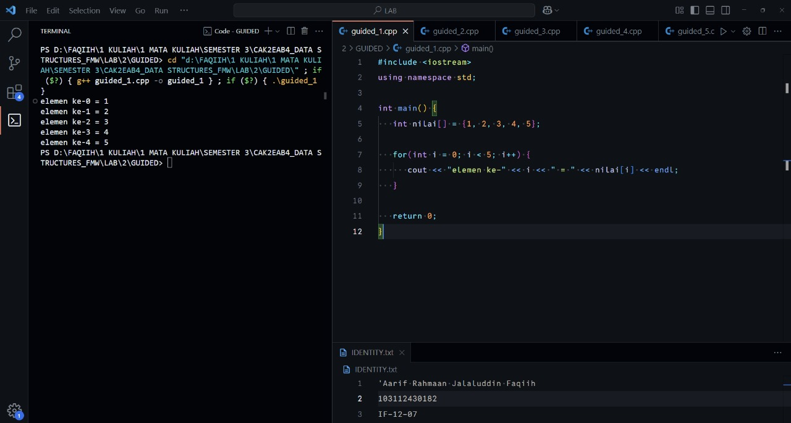
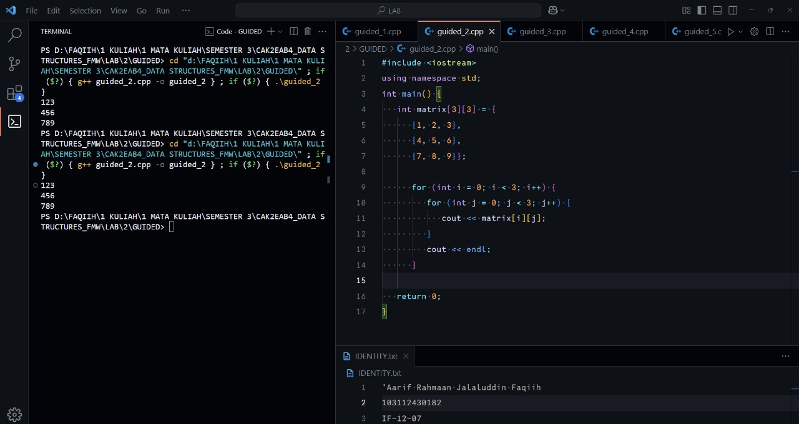
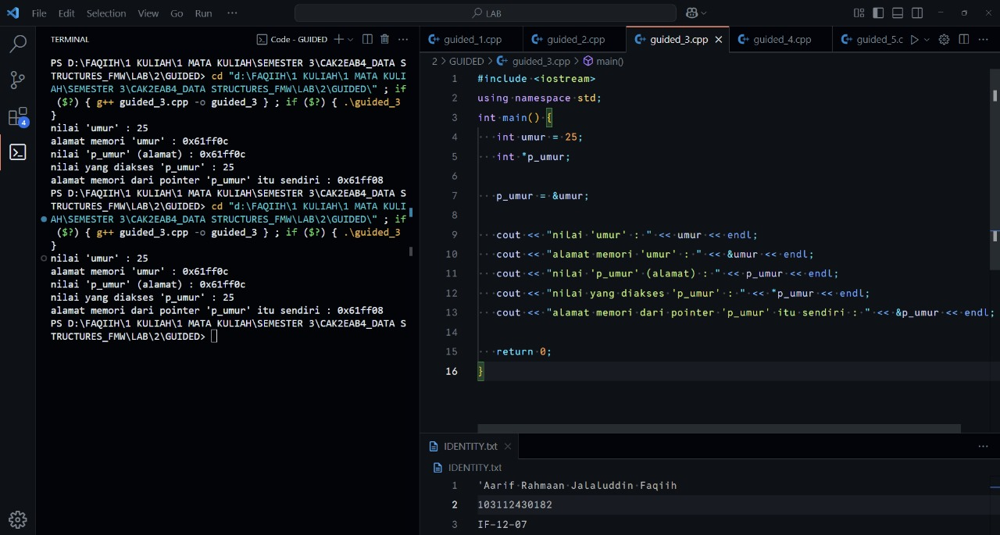
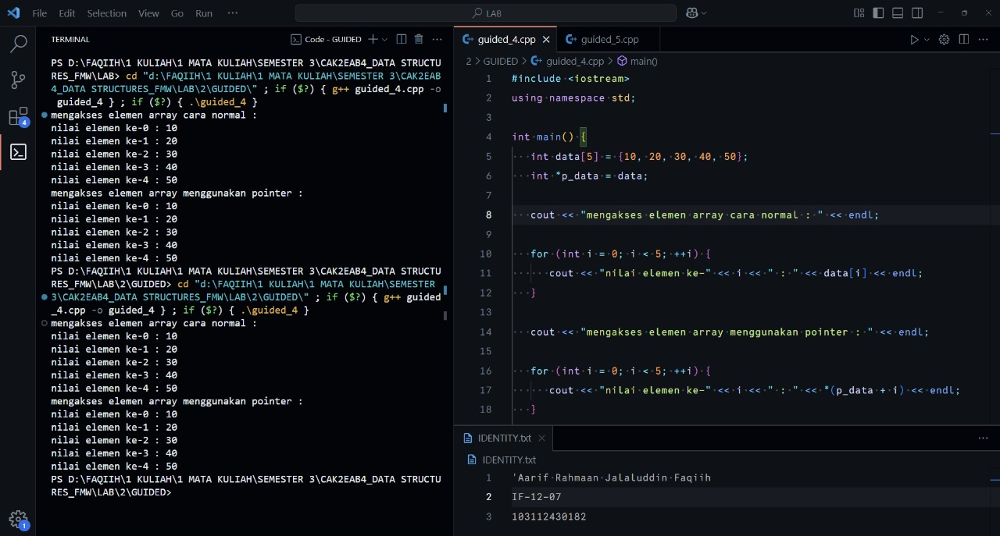
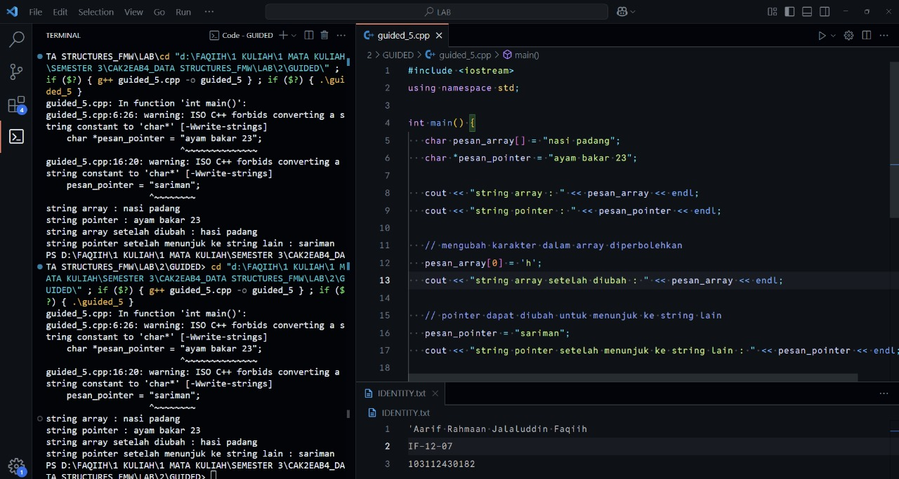
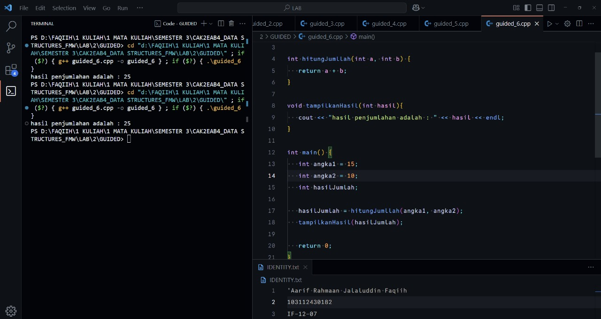
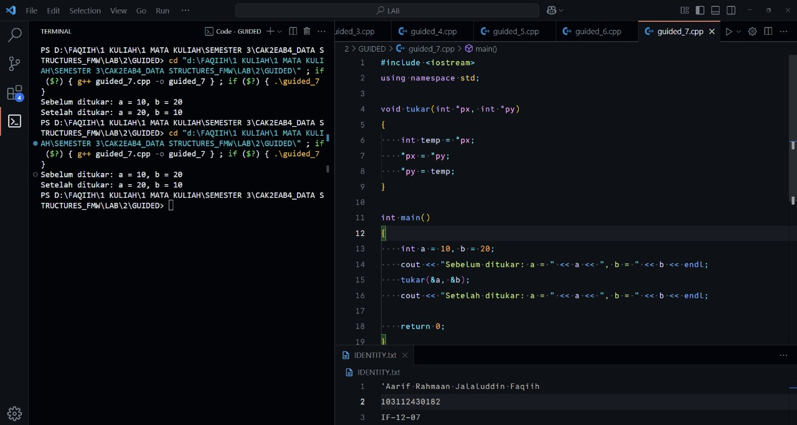
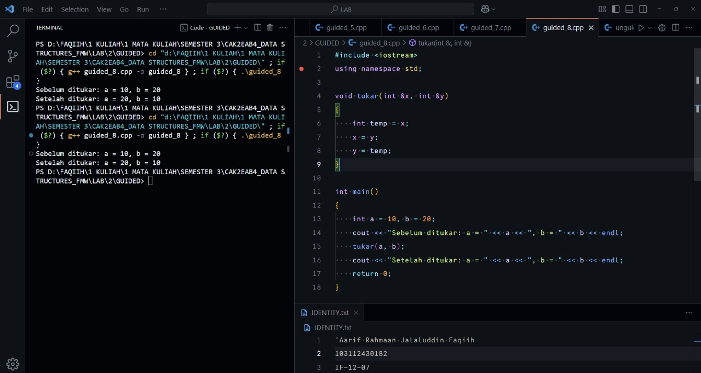
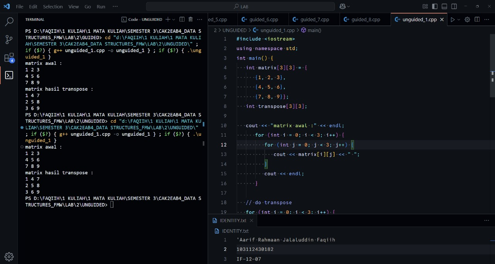

<h1 align="center">Laporan Praktikum Modul 2 <br> PENGENALAN BAHASA C++ (BAGIAN KEDUA)</h1>
<p align="center">'Aarif R. J. Faqiih - 103112430182</p>

## Dasar Teori

XXXXXXXXXXXXXXXXXXXXXXXXXXXXXXXXXXXXXXXXXXXXXXXX

---

## Guided

### Soal 1

program untuk mengiterasi dan menampilkan nilai-nilai dalam array beserta indeksnya.

```cpp
#include <iostream>
using namespace std;

int main() {
   int nilai[] = {1, 2, 3, 4, 5};

   for(int i = 0; i < 5; i++) {
      cout << "elemen ke-" << i << " = " << nilai[i] << endl;
   }

   return 0;
}
```

> Output
> 
> 

XXXXXXXXXXXXXXXXXXXXXXXXXXXXXXXXXXXXXXXXXXXXXXXX

---

### Soal 2

program untuk menampilkan elemen-elemen dalam matriks 3x3.

```cpp
#include <iostream>
using namespace std;
int main() {
   int matrix[3][3] = {
      {1, 2, 3},
      {4, 5, 6},
      {7, 8, 9}};

      for (int i = 0; i < 3; i++) {
         for (int j = 0; j < 3; j++) {
            cout << matrix[i][j];
         }
         cout << endl;
      }

   return 0;
}
```

> Output
> 
> 

XXXXXXXXXXXXXXXXXXXXXXXXXXXXXXXXXXXXXXXXXXXXXXXX

---

### Soal 3

program yang digunakan untuk menampilkan nilai, alamat memori, dan isi pointer dari sebuah variabel.

```cpp
#include <iostream>
using namespace std;
int main() {
   int umur = 25;
   int *p_umur;

   p_umur = &umur;

   cout << "nilai 'umur' : " << umur << endl;
   cout << "alamat memori 'umur' : " << &umur << endl;
   cout << "nilai 'p_umur' (alamat) : " << p_umur << endl;
   cout << "nilai yang diakses 'p_umur' : " << *p_umur << endl;
   cout << "alamat memori dari pointer 'p_umur' itu sendiri : " << &p_umur << endl;

   return 0;
}
```

> Output
> 
> 

XXXXXXXXXXXXXXXXXXXXXXXXXXXXXXXXXXXXXXXXXXXXXXXX

---

### Soal 4

program yang digunakan untuk mengakses dan menampilkan elemen array dengan cara biasa dan menggunakan pointer.

```cpp
#include <iostream>
using namespace std;

int main() {
   int data[5] = {10, 20, 30, 40, 50};
   int *p_data = data;

   cout << "mengakses elemen array cara normal : " << endl;

   for (int i = 0; i < 5; ++i) {
      cout << "nilai elemen ke-" << i << " : " << data[i] << endl;
   }

   cout << "mengakses elemen array menggunakan pointer : " << endl;

   for (int i = 0; i < 5; ++i) {
      cout << "nilai elemen ke-" << i << " : " << *(p_data + i) << endl;
   }

   return 0;
}
```

> Output
> 
> 

XXXXXXXXXXXXXXXXXXXXXXXXXXXXXXXXXXXXXXXXXXXXXXXX

---

### Soal 5

program yang digunakan untuk menunjukkan perbedaan antara string sebagai array dan string sebagai pointer.

```cpp
#include <iostream>
using namespace std;

int main() {
   char pesan_array[] = "nasi padang";
   char *pesan_pointer = "ayam bakar 23";

   cout << "string array : " << pesan_array << endl;
   cout << "string pointer : " << pesan_pointer << endl;

   // mengubah karakter dalam array diperbolehkan
   pesan_array[0] = 'h';
   cout << "string array setelah diubah : " << pesan_array << endl;

   // pointer dapat diubah untuk menunjuk ke string lain
   pesan_pointer = "sariman";
   cout << "string pointer setelah menunjuk ke string lain : " << pesan_pointer << endl;

   return 0;
}
```

> Output
> 
> 

XXXXXXXXXXXXXXXXXXXXXXXXXXXXXXXXXXXXXXXXXXXXXXXX

---

### Soal 6

program yang digunakan untuk menghitung dan menampilkan hasil penjumlahan dua angka.

```cpp
#include <iostream>
using namespace std;

int hitungJumllah(int a, int b) {
   return a + b;
}

void tampilkanHasil(int hasil){
   cout << "hasil penjumlahan adalah : " << hasil << endl;
}

int main() {
   int angka1 = 15;
   int angka2 = 10;
   int hasilJumlah;

   hasilJumlah = hitungJumllah(angka1, angka2);
   tampilkanHasil(hasilJumlah);

   return 0;
}
```

> Output
> 
> 

XXXXXXXXXXXXXXXXXXXXXXXXXXXXXXXXXXXXXXXXXXXXXXXX

---

### Soal 7

program yang digunakan untuk menukar nilai dua variabel menggunakan pointer.

```cpp
#include <iostream>
using namespace std;

void tukar(int *px, int *py)
{
    int temp = *px;
    *px = *py;
    *py = temp;
}

int main()
{
    int a = 10, b = 20;
    cout << "Sebelum ditukar: a = " << a << ", b = " << b << endl;
    tukar(&a, &b);
    cout << "Setelah ditukar: a = " << a << ", b = " << b << endl;

    return 0;
}
```

> Output
> 
> 

XXXXXXXXXXXXXXXXXXXXXXXXXXXXXXXXXXXXXXXXXXXXXXXX

---

### Soal 8

program yang digunakan untuk menukar nilai dua variabel menggunakan referensi.

```cpp
#include <iostream>
using namespace std;

void tukar(int &x, int &y)
{
    int temp = x;
    x = y;
    y = temp;
}

int main()
{
    int a = 10, b = 20;
    cout << "Sebelum ditukar: a = " << a << ", b = " << b << endl;
    tukar(a, b);
    cout << "Setelah ditukar: a = " << a << ", b = " << b << endl;
    return 0;
}
```

> Output
> 
> 

XXXXXXXXXXXXXXXXXXXXXXXXXXXXXXXXXXXXXXXXXXXXXXXX

---

## Unguided

### Soal 1

Buatlah sebuah program untuk melakukan transpose pada sebuah matriks persegi berukuran 3x3. Operasi transpose adalah mengubah baris menjadi kolom dan sebaliknya. Inisialisasi matriks awal di dalam kode, kemudian buat logika untuk melakukan transpose dan simpan hasilnya ke dalam matriks baru. Terakhir, tampilkan matriks awal dan matriks hasil transpose.

<pre>
Contoh Output:

Matriks Awal:
1 2 3
4 5 6
7 8 9

Matriks Hasil Transpose:
1 4 7
2 5 8
3 6 9
</pre>

```cpp
#include <iostream>
using namespace std;
int main() {
   int matrix[3][3] = {
      {1, 2, 3},
      {4, 5, 6},
      {7, 8, 9}};
   int transpose[3][3];

   cout << "matrix awal :" << endl;
      for (int i = 0; i < 3; i++) {
         for (int j = 0; j < 3; j++) {
            cout << matrix[i][j] << " ";
         }
         cout << endl;
      }

   // do transpose
   for (int i = 0; i < 3; i++) {
      for (int j = 0; j < 3; j++) {
         transpose[i][j] = matrix[j][i];
      }
   }

   // print transpose
   cout << "matrix hasil transpose :" << endl;
   for (int i = 0; i < 3; i++) {
      for (int j = 0; j < 3; j++) {
         cout << transpose[i][j] << " ";
      }
      cout << endl;
   }

   return 0;
}
```

> Output
> 
> 

XXXXXXXXXXXXXXXXXXXXXXXXXXXXXXXXXXXXXXXXXXXXXXXX

---

### Soal 2

Buatlah program yang menunjukkan penggunaan call by reference. Buat sebuah prosedur bernama kuadratkan yang menerima satu parameter integer secara referensi (&). Prosedur ini akan mengubah nilai asli variabel yang dilewatkan dengan nilai kuadratnya. Tampilkan nilai variabel di main() sebelum dan sesudah memanggil prosedur untuk membuktikan perubahannya.

<pre>
Contoh Output:

Nilai awal: 5
Nilai setelah dikuadratkan: 25
</pre>

```cpp
#include <iostream>
using namespace std;

// call by reference using &
void kuadratkan(int &n) {
   n = n * n;
}

int main() {
   int n = 5;
   cout << "nilai awal : " << n << endl;

   kuadratkan(n);
   cout << "nilai setelah dikuadratkan : " << n;

   return 0;
}
```

> Output
> 
> 

XXXXXXXXXXXXXXXXXXXXXXXXXXXXXXXXXXXXXXXXXXXXXXXX

## Referensi

1. https://www.w3schools.com/cpp/cpp_arrays_loop.asp (diakses Selasa, 30 September 2025)
2. https://www.w3schools.com/cpp/cpp_references.asp (diakses Selasa, 30 September 2025)
3. https://www.w3schools.com/cpp/cpp_references_memory.asp (diakses Selasa, 30 September 2025)
4. https://www.w3schools.com/cpp/cpp_pointers.asp (diakses Selasa, 30 September 2025)
5. https://www.w3schools.com/cpp/cpp_pointers_dereference.asp (diakses Selasa, 30 September 2025)
6. https://www.w3schools.com/cpp/cpp_pointers_modify.asp (diakses Selasa, 30 September 2025)
7. https://www.w3schools.com/cpp/cpp_functions.asp (diakses Selasa, 30 September 2025)
8. https://www.w3schools.com/cpp/cpp_function_param.asp (diakses Selasa, 30 September 2025)
9. https://www.w3schools.com/cpp/cpp_function_multiple.asp (diakses Selasa, 30 September 2025)
10. https://www.w3schools.com/cpp/cpp_function_return.asp (diakses Selasa, 30 September 2025)
11. https://www.w3schools.com/cpp/cpp_function_reference.asp (diakses Selasa, 30 September 2025)
12. https://www.scaler.com/topics/cpp/function-pointer-cpp/ (diakses Selasa, 30 September 2025)
