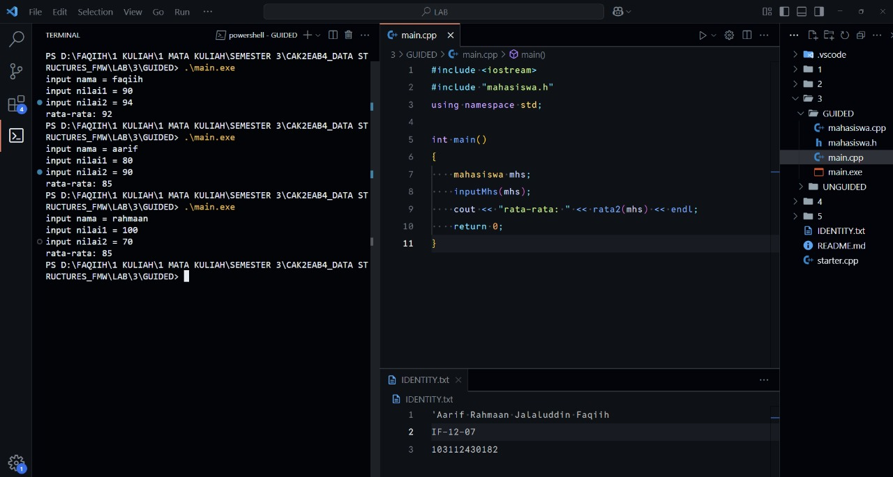
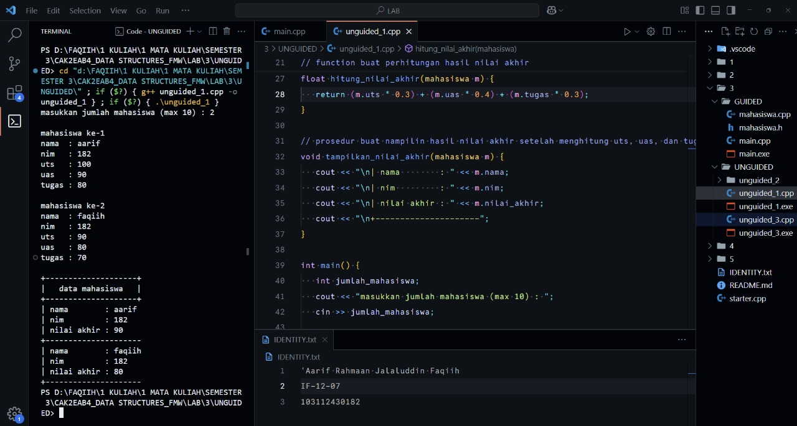
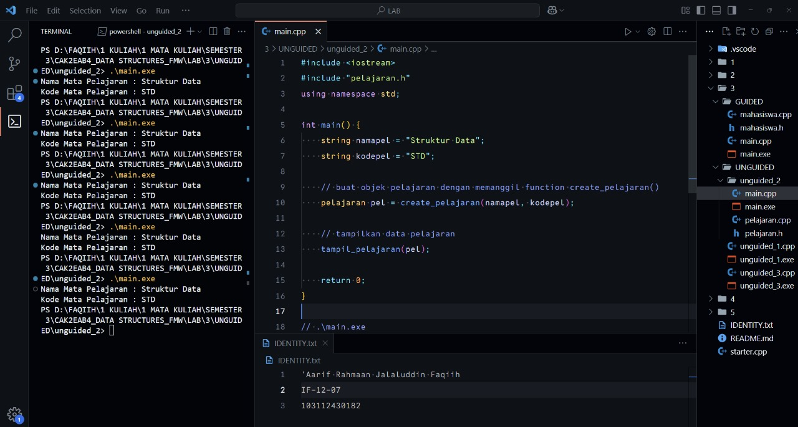
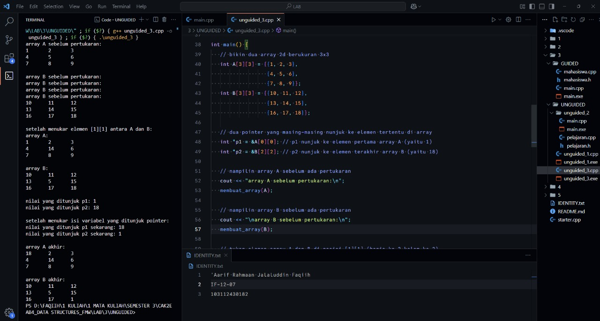

<h1 align="center">Laporan Praktikum Modul 3 <br> ABSTRACT DATA TYPE (ADT)</h1>
<p align="center">'Aarif R. J. Faqiih - 103112430182</p>

## Dasar Teori

XXXXXXXXXXXXXXXXXXXXXXXXXXXXXXXXXXXXXXXXXXXXXXXX

---

## Guided

### Soal 1

program untuk mencari rata-rata dari 2 nilai mahasiswa

<code>mahasiswa.h</code>

```cpp
#ifndef MAHASISWA_H_INCLUDED
#define MAHASISWA_H_INCLUDED
struct mahasiswa
{
   char nim[10];
   int nilai1, nilai2;
};

void inputMhs(mahasiswa &m);
float rata2(mahasiswa m);
#endif
```

<code>mahasiswa.cpp</code>

```cpp
#include "mahasiswa.h"
#include <iostream>
using namespace std;

void inputMhs(mahasiswa &m) {
   cout << "input nama = ";
   cin >> (m).nim;
   cout << "input nilai1 = ";
   cin >> (m).nilai1;
   cout << "input nilai2 = ";
   cin >> (m).nilai2;
}

float rata2(mahasiswa m) {
   return float(m.nilai1 + m.nilai2) / 2;
}
```
<code>main.cpp</code>

```cpp
#include <iostream>
#include "mahasiswa.h"
using namespace std;

int main()
{
    mahasiswa mhs;
    inputMhs(mhs);
    cout << "rata-rata: " << rata2(mhs) << endl;
    return 0;
}
```

> Output
> 
> 

XXXXXXXXXXXXXXXXXXXXXXXXXXXXXXXXXXXXXXXXXXXXXXXX

---

## Unguided

### Soal 1

XXXXXXXXXXXXXXXXXXXXXXXX

```cpp
#include <iostream>
using namespace std;

// struct buat nampung data mahasiswa
// field/kolomnya ada nama, nim, uts, uas, tugas, sama nilai akhir
struct mahasiswa {
   string nama;
   string nim;
   float uts, uas, tugas, nilai_akhir;
};

// prosedur buat input data mahasiswa ke masing-masing field/kolom
void input_data_mahasiswa(mahasiswa &m) {
   cout << "nama  : "; cin >> m.nama;
   cout << "nim   : "; cin >> m.nim;
   cout << "uts   : "; cin >> m.uts;
   cout << "uas   : "; cin >> m.uas;
   cout << "tugas : "; cin >> m.tugas;
}

// function buat perhitungan hasil nilai akhir
// rumusnya:
// nilai uts   * 0.3 atau 30% dari nilai akhir
// nilai uas   * 0.4 atau 40% dari nilai akhir
// nilai tugas * 0.3 atau 30% dari nilai akhir
// nilai akhir hasilnya bakal angka desimal, jadi pake tipe data float
float hitung_nilai_akhir(mahasiswa m) {
   return (m.uts * 0.3) + (m.uas * 0.4) + (m.tugas * 0.3);
}

// prosedur buat nampilin hasil nilai akhir setelah menghitung uts, uas, dan tugas
void tampilkan_nilai_akhir(mahasiswa m) {
   cout << "\n| nama        : " << m.nama;
   cout << "\n| nim         : " << m.nim;
   cout << "\n| nilai akhir : " << m.nilai_akhir;
   cout << "\n+---------------------";
}

int main() {
   int jumlah_mahasiswa;
   cout << "masukkan jumlah mahasiswa (max 10) : ";
   cin >> jumlah_mahasiswa;

   // buat nampung maksimal 10 mahasiswa
   mahasiswa array_mahasiswa[10];

   for (int i = 0; i < jumlah_mahasiswa; i++) {
      cout << "\nmahasiswa ke-" << i + 1 << endl;
      input_data_mahasiswa(array_mahasiswa[i]);
      // simpan hasil hitung nilai akhir ke field 'nilai_akhir' masing-masing mahasiswa
      array_mahasiswa[i].nilai_akhir = hitung_nilai_akhir(array_mahasiswa[i]);
   }

   cout << "\n+--------------------+";
   cout << "\n|   data mahasiswa   |";
   cout << "\n+--------------------+";
   for (int i = 0; i < jumlah_mahasiswa; i++) {
      tampilkan_nilai_akhir(array_mahasiswa[i]);
   }

   return 0;
}
```

> Output
> 
> 

XXXXXXXXXXXXXXXXXXXXXXXXXXXXXXXXXXXXXXXXXXXXXXXX

---

### Soal 2

XXXXXXXXXXXXXXXXXXXXXXXX

<code>pelajaran.h</code>

```cpp
#ifndef PELAJARAN_H_INCLUDED
#define PELAJARAN_H_INCLUDED

#include <string>
using namespace std;

// struct pelajaran
// berisi dua field: namaMapel dan kodeMapel
// ini adalah tipe data baru (ADT) yang mewakili 1 pelajaran
struct pelajaran {
    string namaMapel;
    string kodeMapel;
};

// function untuk membuat data pelajaran baru
// menerima dua parameter string, lalu mengembalikan struct pelajaran
pelajaran create_pelajaran(string namapel, string kodepel);

// procedure untuk menampilkan isi data pelajaran
void tampil_pelajaran(pelajaran pel);

#endif
```

<code>pelajaran.cpp</code>

```cpp
#include "pelajaran.h"
#include <iostream>
using namespace std;

// function create_pelajaran()
// fungsinya untuk mengisi field namaMapel dan kodeMapel
// lalu mengembalikan struct pelajaran yang sudah terisi
pelajaran create_pelajaran(string namapel, string kodepel) {
    pelajaran p;
    p.namaMapel = namapel;
    p.kodeMapel = kodepel;
    return p;
}

// procedure tampil_pelajaran()
// fungsinya untuk menampilkan data pelajaran ke layar
void tampil_pelajaran(pelajaran pel) {
    cout << "Nama Mata Pelajaran : " << pel.namaMapel << endl;
    cout << "Kode Mata Pelajaran : " << pel.kodeMapel << endl;
}
```

<code>main.cpp</code>

```cpp
#include <iostream>
#include "pelajaran.h"
using namespace std;

int main() {
    string namapel = "Struktur Data";
    string kodepel = "STD";

    // buat objek pelajaran dengan memanggil function create_pelajaran()
    pelajaran pel = create_pelajaran(namapel, kodepel);

    // tampilkan data pelajaran
    tampil_pelajaran(pel);

    return 0;
}
```

> Output
> 
> 

XXXXXXXXXXXXXXXXXXXXXXXXXXXXXXXXXXXXXXXXXXXXXXXX

---

### Soal 3

XXXXXXXXXXXXXXXXXXXXXXXX

```cpp
#include <iostream>
using namespace std;

// prosedur untuk bikin array 3x3
void membuat_array(int arr[3][3]) {
   // selama i kurang dari 3, maka bakal nge-loop baris
   for (int i = 0; i < 3; i++) {
      // selama j kurang dari 3, maka bakal nge-loop kolom
      for (int j = 0; j < 3; j++) {
         // \t itu gunanya buat ngasih jarak antar angka biar rapi
         cout << arr[i][j] << "\t";
      }
      // endl buat ganti baris tiap baris array selesai ditampilkan
      cout << endl;
   }
}

// prosedur untuk menukar isi dari dua array 2d di posisi tertentu
void menukar_elemen(int arr1[3][3], int arr2[3][3], int baris, int kolom) {
   // nyimpen sementara nilai dari array pertama di variabel temp
   int temp = arr1[baris][kolom];
   // isi array pertama diganti dengan nilai dari array kedua
   arr1[baris][kolom] = arr2[baris][kolom];
   // isi array kedua diganti dengan nilai yang disimpen di temp tadi
   arr2[baris][kolom] = temp;
}

// prosedur untuk menukar isi dari dua variabel yang ditunjuk pointer
void menukar_pointer(int *x, int *y) {
   // nyimpen nilai yang ditunjuk pointer x ke variabel temp
   int temp = *x;
   // isi yang ditunjuk pointer x diganti sama nilai yang ditunjuk pointer y
   *x = *y;
   // isi yang ditunjuk pointer y diganti sama nilai yang disimpen di temp
   *y = temp;
}

int main() {
   // bikin dua array 2d berukuran 3x3
   int A[3][3] = {{1, 2, 3},
                  {4, 5, 6},
                  {7, 8, 9}};
   int B[3][3] = {{10, 11, 12},
                  {13, 14, 15},
                  {16, 17, 18}};

   // dua pointer yang masing-masing nunjuk ke elemen tertentu di array
   int *p1 = &A[0][0]; // p1 nunjuk ke elemen pertama array A (yaitu 1)
   int *p2 = &B[2][2]; // p2 nunjuk ke elemen terakhir array B (yaitu 18)

   // nampilin array A sebelum ada pertukaran
   cout << "array A sebelum pertukaran:\n";
   membuat_array(A);

   // nampilin array B sebelum ada pertukaran
   cout << "\narray B sebelum pertukaran:\n";
   membuat_array(B);

   // tukar elemen array A dan B di posisi [1][1] (baris ke-2 kolom ke-2)
   menukar_elemen(A, B, 1, 1);

   // nampilin hasil setelah pertukaran elemen array
   cout << "\nsetelah menukar elemen [1][1] antara A dan B:\n";
   cout << "array A:\n";
   membuat_array(A);

   cout << "\narray B:\n";
   membuat_array(B);

   // nampilin nilai yang ditunjuk pointer sebelum pertukaran pointer
   cout << "\nnilai yang ditunjuk p1: " << *p1 << endl;
   cout << "nilai yang ditunjuk p2: " << *p2 << endl;

   // tukar isi variabel yang ditunjuk pointer p1 dan p2
   menukar_pointer(p1, p2);

   // nampilin nilai yang ditunjuk pointer setelah pertukaran
   cout << "\nsetelah menukar isi variabel yang ditunjuk pointer:\n";
   cout << "nilai yang ditunjuk p1 sekarang: " << *p1 << endl;
   cout << "nilai yang ditunjuk p2 sekarang: " << *p2 << endl;

   // nampilin kondisi akhir dari array setelah semua pertukaran
   cout << "\narray A akhir:\n";
   membuat_array(A);
   cout << "\narray B akhir:\n";
   membuat_array(B);

   return 0;
}
```

> Output
> 
> 

XXXXXXXXXXXXXXXXXXXXXXXXXXXXXXXXXXXXXXXXXXXXXXXX

---

## Referensi

1. https://www.w3schools.com/cpp/cpp_functions.asp (diakses XXXXXXXXXXXX)
