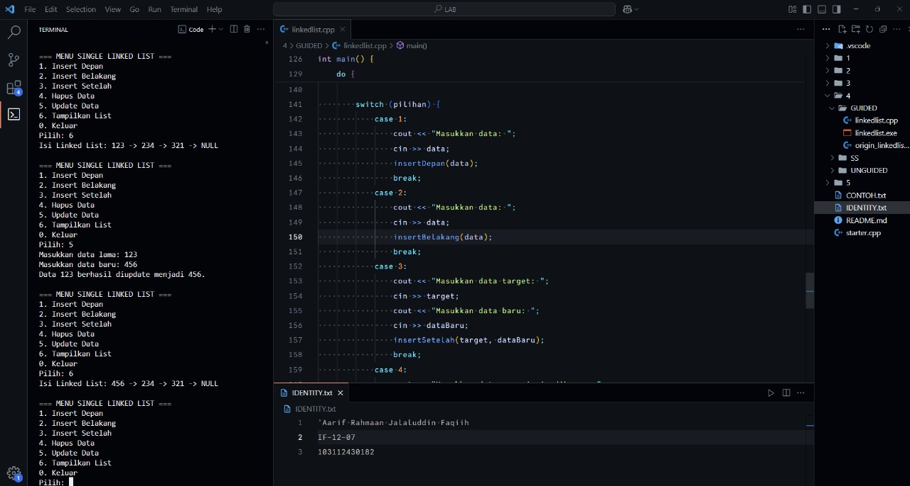
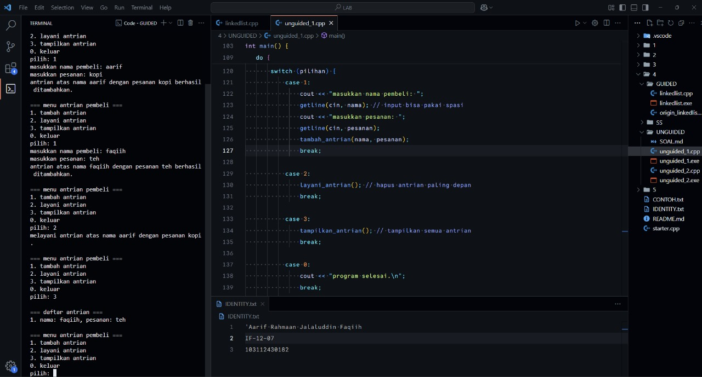
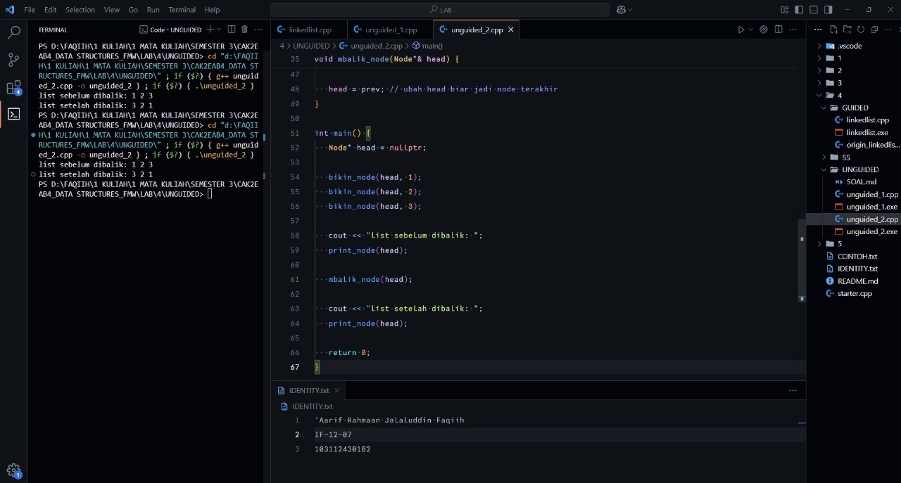

<h1 align="center">Laporan Praktikum Modul XXX <br> XXXXXXXXXXXX</h1>
<p align="center">'Aarif Rahmaan Jalaluddin Faqiih - 103112430182</p>

## Dasar Teori

XXXXXXXXXXXXXXXXXXXXXXXXXXXXXXXXXXXXXXXXXXXXXXXX

---

## Guided

### Soal 1

XXXXXXXXXXXXXXXXXXXXXXXX

```cpp
#include <iostream>
using namespace std;

// Struktur Node
struct Node {
    int data;
    Node* next;
};

// Pointer awal
Node* head = nullptr;

// Fungsi untuk membuat node baru
Node* createNode(int data) {
    Node* newNode = new Node();
    newNode->data = data;
    newNode->next = nullptr;
    return newNode;
}

// ========== INSERT FUNCTION ==========
void insertDepan(int data) {
    Node* newNode = createNode(data);
    newNode->next = head;
    head = newNode;
    cout << "Data " << data << " berhasil ditambahkan di depan.\n";
}

void insertBelakang(int data) {
    Node* newNode = createNode(data);
    if (head == nullptr) {
        head = newNode;
    } else {
        Node* temp = head;
        while (temp->next != nullptr) {
            temp = temp->next;
        }
        temp->next = newNode;
    }
    cout << "Data " << data << " berhasil ditambahkan di belakang.\n";
}

void insertSetelah(int target, int dataBaru) {
    Node* temp = head;
    while (temp != nullptr && temp->data != target) {
        temp = temp->next;
    }

    if (temp == nullptr) {
        cout << "Data " << target << " tidak ditemukan!\n";
    } else {
        Node* newNode = createNode(dataBaru);
        newNode->next = temp->next;
        temp->next = newNode;
        cout << "Data " << dataBaru << " berhasil disisipkan setelah " << target << ".\n";
    }
}

// ========== DELETE FUNCTION ==========
void hapusNode(int data) {
    if (head == nullptr) {
        cout << "List kosong!\n";
        return;
    }

    Node* temp = head;
    Node* prev = nullptr;

    // Jika data di node pertama
    if (temp != nullptr && temp->data == data) {
        head = temp->next;
        delete temp;
        cout << "Data " << data << " berhasil dihapus.\n";
        return;
    }

    // Cari node yang akan dihapus
    while (temp != nullptr && temp->data != data) {
        prev = temp;
        temp = temp->next;
    }

    // Jika data tidak ditemukan
    if (temp == nullptr) {
        cout << "Data " << data << " tidak ditemukan!\n";
        return;
    }

    prev->next = temp->next;
    delete temp;
    cout << "Data " << data << " berhasil dihapus.\n";
}

// ========== UPDATE FUNCTION ==========
void updateNode(int dataLama, int dataBaru) {
    Node* temp = head;
    while (temp != nullptr && temp->data != dataLama) {
        temp = temp->next;
    }

    if (temp == nullptr) {
        cout << "Data " << dataLama << " tidak ditemukan!\n";
    } else {
        temp->data = dataBaru;
        cout << "Data " << dataLama << " berhasil diupdate menjadi " << dataBaru << ".\n";
    }
}

// ========== DISPLAY FUNCTION ==========
void tampilkanList() {
    if (head == nullptr) {
        cout << "List kosong!\n";
        return;
    }

    Node* temp = head;
    cout << "Isi Linked List: ";
    while (temp != nullptr) {
        cout << temp->data << " -> ";
        temp = temp->next;
    }
    cout << "NULL\n";
}

// ========== MAIN PROGRAM ==========
int main() {
    int pilihan, data, target, dataBaru;

    do {
        cout << "\n=== MENU SINGLE LINKED LIST ===\n";
        cout << "1. Insert Depan\n";
        cout << "2. Insert Belakang\n";
        cout << "3. Insert Setelah\n";
        cout << "4. Hapus Data\n";
        cout << "5. Update Data\n";
        cout << "6. Tampilkan List\n";
        cout << "0. Keluar\n";
        cout << "Pilih: ";
        cin >> pilihan;

        switch (pilihan) {
            case 1:
                cout << "Masukkan data: ";
                cin >> data;
                insertDepan(data);
                break;
            case 2:
                cout << "Masukkan data: ";
                cin >> data;
                insertBelakang(data);
                break;
            case 3:
                cout << "Masukkan data target: ";
                cin >> target;
                cout << "Masukkan data baru: ";
                cin >> dataBaru;
                insertSetelah(target, dataBaru);
                break;
            case 4:
                cout << "Masukkan data yang ingin dihapus: ";
                cin >> data;
                hapusNode(data);
                break;
            case 5:
                cout << "Masukkan data lama: ";
                cin >> data;
                cout << "Masukkan data baru: ";
                cin >> dataBaru;
                updateNode(data, dataBaru);
                break;
            case 6:
                tampilkanList();
                break;
            case 0:
                cout << "Program selesai.\n";
                break;
            default:
                cout << "Pilihan tidak valid!\n";
        }
    } while (pilihan != 0);

    return 0;
}
```

> Output
> 
> 

pada bagian awal, kita buat struktur data node yang memiliki dua anggota yaitu data untuk menyimpan nilai dan next untuk menunjuk ke node berikutnya. kemudian kita deklarasikan pointer head sebagai penunjuk ke awal linked list, yang awalnya diset ke nullptr (kosong).

fungsi createNode berfungsi untuk membuat node baru dengan nilai tertentu. caranya adalah dengan mengalokasikan memori baru, mengisi datanya, dan mengatur next-nya ke nullptr karena node ini belum terhubung ke node lain.

fungsi insertDepan bertujuan untuk menambahkan node baru di bagian paling depan linked list. caranya adalah dengan membuat node baru, lalu next dari node baru diarahkan ke head, kemudian head digeser ke node baru tersebut.

fungsi insertBelakang berfungsi untuk menambahkan node baru di bagian akhir linked list. jika head masih kosong, maka langsung set head ke node baru tersebut. tapi jika sudah ada isinya, kita telusuri dari head sampai node terakhir (yang next-nya nullptr), lalu next dari node terakhir itu diarahkan ke node baru.

fungsi insertSetelah digunakan jika kita ingin menyisipkan node baru setelah node tertentu. caranya adalah kita telusuri dari head hingga menemukan node dengan nilai yang dicari (target), jika ketemu, kita buat node baru, lalu sambungkan node baru itu di antara node target dan node setelahnya, artinya next dari node baru mengarah ke next dari node target, dan next dari node target diganti ke node baru.

fungsi hapusNode digunakan untuk menghapus node dengan nilai tertentu. pertama-tama kita periksa dulu apakah list-nya kosong. jika tidak kosong, kita periksa apakah node yang akan dihapus adalah node pertama (head). jika iya, cukup pindahkan head ke node selanjutnya dan hapus node tersebut. jika bukan node pertama, maka kita cari dulu node yang berisi nilai tersebut sambil menyimpan node sebelumnya (prev), kemudian node sebelumnya kita sambungkan ke node setelah node yang akan dihapus, lalu node target dihapus.

fungsi updateNode digunakan untuk mengubah nilai dari suatu node. kita telusuri node satu per satu sampai menemukan node dengan nilai lama (dataLama), lalu ubah nilainya menjadi dataBaru.

fungsi tampilkanList berfungsi untuk mencetak semua isi dari linked list dari depan ke belakang. kita mulai dari head, lalu cetak nilai dari setiap node sampai next-nya nullptr. untuk akhir list kita tambahkan tulisan “NULL” untuk menandakan akhir list.

terakhir, di dalam fungsi main, program akan menampilkan menu interaktif berupa pilihan mulai dari insert depan, insert belakang, insert setelah, hapus data, update data, tampilkan isi list, dan keluar. user akan diminta untuk memilih salah satu operasi, lalu input data yang dibutuhkan, dan program akan menjalankan operasi tersebut sesuai dengan pilihan. proses ini akan terus berulang sampai user memilih keluar (pilihan 0).

---

## Unguided

### Soal 1

buatlah single linked list untuk Antrian yang menyimpan data pembeli( nama dan pesanan). program memiliki beberapa menu seperti tambah antrian,  layani antrian(hapus), dan tampilkan antrian. \*antrian pertama harus yang pertama dilayani.

```cpp
#include <iostream>
using namespace std;

// struct node dengan 2 field/kolom, yaitu nama dan pesanan
// dan satu pointer bernama 'next' buat nyambung ke node berikutnya
struct node {
   string nama;
   string pesanan;
   node*  next;
};

// pointer head buat nandain antrian paling depan
// pointer tail buat nandain antrian paling belakang
// awalnya dua-duanya kosong/nullptr karena belum ada data
node* head = nullptr;
node* tail = nullptr;

// fungsi buat bikin node baru
// fungsi ini nerima 2 parameter, yaitu nama dan pesanan dari pembeli
node* tambah_node(string nama, string pesanan) {
   // bikin node baru
   node* new_node    = new node();
   // isi field nama dan pesanan dengan data dari parameter
   new_node->nama    = nama;
   new_node->pesanan = pesanan;
   // karena node baru belum nyambung ke node lain, jadi next-nya kosong/nullptr
   new_node->next    = nullptr;
   // return node yang baru dibikin
   return new_node;
}

// fungsi buat nambah antrian ke belakang
// jadi node yang baru dibikin ada di posisi terakhir
void tambah_antrian(string nama, string pesanan) {
   // panggil fungsi tambah_node buat bikin node baru
   node* new_node = tambah_node(nama, pesanan);

   // cek dulu, kalo head-nya kosong berarti antrian masih kosong
   // maka node baru ini jadi head sekaligus tail
   if (head == nullptr) {
      head = tail = new_node;
   } else {
      // kalo udah ada data sebelumnya, berarti tail di data sebelumnya nyambung ke node baru
      tail->next = new_node;
      // update tail ke node baru
      tail       = new_node;
   }

   cout << "antrian atas nama " << nama << " dengan pesanan " << pesanan << " berhasil ditambahkan.\n";
}

// fungsi buat melayani (menghapus) antrian paling depan
void layani_antrian() {
   // cek dulu, kalo head-nya kosong berarti belum ada antrian
   if (head == nullptr) {
      cout << "antrian kosong, bikin antrian dulu.\n";
      return;
   }

   // simpen dulu node paling depan ke variabel temp
   node* temp = head;

   // tampilkan info siapa yang lagi dilayani
   cout << "melayani antrian atas nama " << temp->nama << " dengan pesanan " << temp->pesanan << ".\n";

   // pindahkan head ke node berikutnya
   head = head->next;

   // hapus node lama
   delete temp;

   // kalo setelah dihapus ternyata head kosong, berarti antrian udah habis
   // jadi tail juga harus dikosongin
   if (head == nullptr) {
      tail = nullptr;
   }
}

// fungsi buat nampilin semua data antrian yang lagi nunggu dilayanin
void tampilkan_antrian() {
   // cek dulu, kalo head kosong berarti ga ada antrian
   if (head == nullptr) {
       cout << "antrian kosong.\n";
       return;
   }

   // mulai dari node paling depan (head)
   node* temp = head;
   int nomor = 1;

   cout << "\n=== daftar antrian ===\n";

   // selama masih ada node (temp ga nullptr)
   while (temp != nullptr) {
       // tampilkan urutan, nama, dan pesanan
       cout << nomor++ << ". nama: " << temp->nama << ", pesanan: " << temp->pesanan << endl;
       // lanjut ke node berikutnya
       temp = temp->next;
   }
}

// eksekusi
int main() {
   int pilihan;
   string nama, pesanan;

   // perulangan menu utama
   // selama user belum pilih 0 (keluar), menu bakal terus muncul
   do {
       cout << "\n=== menu antrian pembeli ===\n";
       cout << "1. tambah antrian\n";
       cout << "2. layani antrian\n";
       cout << "3. tampilkan antrian\n";
       cout << "0. keluar\n";
       cout << "pilih: ";
       cin >> pilihan;
       cin.ignore(); // biar input nama pembeli ga error, soalnya kalo ga pake ini ke-skip langsung ke input pesanan

       // pilih menu sesuai input user
       switch (pilihan) {
           case 1:
               cout << "masukkan nama pembeli: ";
               getline(cin, nama); // input bisa pakai spasi
               cout << "masukkan pesanan: ";
               getline(cin, pesanan);
               tambah_antrian(nama, pesanan);
               break;

           case 2:
               layani_antrian(); // hapus antrian paling depan
               break;

           case 3:
               tampilkan_antrian(); // tampilkan semua antrian
               break;

           case 0:
               cout << "program selesai.\n";
               break;

           default:
               cout << "pilihan tidak valid!\n";
       }
   } while (pilihan != 0); // berhenti kalau user milih 0

   return 0;
}
```

> Output
> 
> 

struktur node di sini punya tiga elemen: nama, pesanan, dan next. next adalah pointer yang digunakan untuk menyambungkan setiap node, membentuk sebuah linked list. jadi, node yang pertama akan menunjuk ke node berikutnya, dan seterusnya sampai akhir.

pertama, ada pointer head dan tail yang menandakan antrian paling depan dan paling belakang. keduanya awalnya kosong (nullptr), karena belum ada data.

fungsi tambah_node digunakan untuk membuat node baru yang berisi nama dan pesanan dari pembeli. node baru ini kemudian akan disambungkan ke antrian di belakangnya. dalam hal ini, fungsi ini akan mengembalikan pointer ke node baru yang telah dibuat.

fungsi tambah_antrian bertugas untuk menambahkan antrian baru. pertama, fungsi ini memanggil tambah_node untuk membuat node baru. setelah itu, kalau antrian masih kosong (head kosong), maka node baru ini akan menjadi head sekaligus tail. kalau antrian sudah ada, maka tail->next akan diubah untuk menunjuk ke node baru, dan pointer tail diperbarui ke node baru tersebut.

fungsi layani_antrian digunakan untuk melayani antrian paling depan, yang berarti menghapus node pertama (head). setelah melayani, head akan digeser ke node berikutnya. kalau setelah dipindahkan head kosong, berarti antrian sudah habis, jadi tail juga dikosongkan.

fungsi tampilkan_antrian berfungsi untuk menampilkan semua antrian yang ada, mulai dari head dan terus sampai akhir (selama temp != nullptr). setiap node akan menampilkan urutan antrian, nama pembeli, dan pesanan.

di dalam fungsi main, ada menu utama yang memungkinkan user untuk memilih opsi: menambah antrian, melayani antrian, atau menampilkan antrian. menu ini terus berulang sampai user memilih opsi untuk keluar.

---

### Soal 2

buatlah program kode untuk membalik (reverse) singly linked list (1-2-3 menjadi 3-2-1).

```cpp
#include <iostream>
using namespace std;

struct Node {
   int data;
   Node* next;
};

void bikin_node(Node*& head, int nilai) {
   Node* baru = new Node();
   baru->data = nilai;
   baru->next = nullptr;

   if (head == nullptr) {
      head = baru;
   } else {
      Node* temp = head;
      while (temp->next != nullptr) {
         temp = temp->next;
      }
      temp->next = baru;
   }
}

void print_node(Node* head) {
   Node* temp = head;
   while (temp != nullptr) {
      cout << temp->data << " ";
      temp = temp->next;
   }
   cout << endl;
}

// fungsi buat membalik urutan linked list
void mbalik_node(Node*& head) {
   Node* prev = nullptr;     // pointer sebelumnya yang masih kosong
   Node* current = head;     // pointer yang lagi di posisi sekarang
   Node* next = nullptr;     // pointer bantu buat nyimpan node berikutnya

   // selama masih ada node berikutnya
   while (current != nullptr) {
      next = current->next;  // simpan node setelah current
      current->next = prev;  // arah panah dibalik, dari current ke prev
      prev = current;        // geser prev ke current
      current = next;        // geser current ke node berikutnya
   }

   head = prev; // ubah head biar jadi node terakhir
}

int main() {
   Node* head = nullptr;

   bikin_node(head, 1);
   bikin_node(head, 2);
   bikin_node(head, 3);

   cout << "list sebelum dibalik: ";
   print_node(head);

   mbalik_node(head);

   cout << "list setelah dibalik: ";
   print_node(head);

   return 0;
}
```

> Output
> 
> 

pertama-tama ada prosedur bikin_node, prosedur ini gunanya untuk menambahkan node baru ke dalam linked list. parameternya ada dua, yaitu head yang menunjuk ke awal linked list, dan nilai yang mau dimasukin ke dalam node baru. di dalam fungsi ini pertama dibuat dulu node baru menggunakan operator new, lalu diisi datanya, dan next-nya diset ke null karena ini node terakhir. setelah itu dicek apakah linked list masih kosong (head masih null), kalau kosong berarti node yang baru langsung jadi head. kalau tidak kosong, artinya sudah ada node sebelumnya, jadi perlu perulangan while untuk mencari node terakhir (node yang next-nya null), dan setelah ketemu node terakhir, node baru dihubungkan ke situ.

kemudian ada prosedur print_node yang gunanya buat menampilkan isi dari linked list. caranya cukup dengan membuat pointer sementara bernama temp yang mulai dari head, lalu selama temp belum null, cetak data yang ada di dalam temp, lalu geser temp ke node selanjutnya, dan terus diulang sampai semua node selesai ditampilkan.

setelah itu ada fungsi mbalik_node yang jadi inti dari program ini. fungsi ini berfungsi untuk membalik urutan linked list. prinsip kerjanya adalah dengan membalik arah panah antar node satu per satu. ada tiga pointer bantu yang dipakai, yaitu prev, current, dan next. prev awalnya null karena belum ada node sebelumnya. current mulai dari head, yaitu node pertama. kemudian selama current belum null, simpan dulu node berikutnya ke dalam next, lalu ubah arah panah dari current ke prev, setelah itu geser prev ke current, dan current ke next. langkah ini terus diulang sampai semua node selesai diproses. setelah semua node dibalik, head diubah agar menunjuk ke node terakhir (yang sekarang jadi paling depan setelah dibalik).

di bagian main, pertama dibuat head yang masih null. lalu dibuat tiga node berurutan dengan nilai 1, 2, dan 3 menggunakan fungsi bikin_node. setelah itu tampilkan list sebelum dibalik menggunakan print_node. lalu panggil mbalik_node untuk membalik urutan node, dan terakhir cetak lagi list setelah dibalik untuk melihat hasil akhirnya. hasilnya, list yang tadinya 1 2 3 akan jadi 3 2 1.

---

## Referensi

1. https://www.w3schools.com/cpp/cpp_pointers.asp (diakses 13 Oktober 2025)
2. https://www.w3schools.com/cpp/cpp_pointers_dereference.asp (diakses 13 Oktober 2025)
3. https://www.w3schools.com/cpp/cpp_pointers_modify.asp (diakses 13 Oktober 2025)
4. https://www.scaler.com/topics/cpp/function-pointer-cpp/ (diakses 14 Oktober 2025)
5. https://youtu.be/VVemCxif9vg?si=uGEh0uEfT05ADV9y (diakses diakses 14 Oktober 2025)
6. https://youtu.be/ycoM07QQjHo?si=4DJuqj76p7Auu4os (diakses diakses 14 Oktober 2025)
7. https://youtu.be/4AeTdylYtwE?si=wvcX6EdBJQdiNOdF (diakses diakses 15 Oktober 2025)
