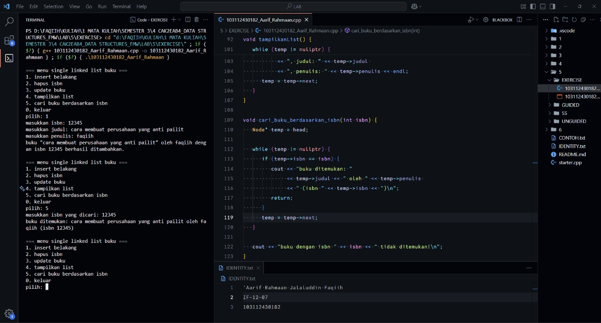
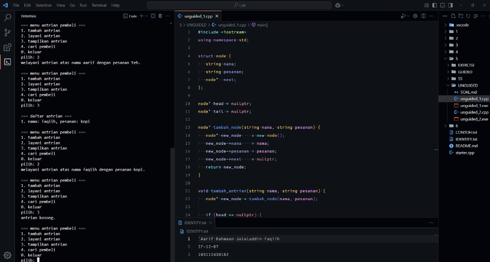

<h1 align="center">Laporan Praktikum Modul 5 <br> SINGLY LINKED LIST (BAGIAN KEDUA)</h1>
<p align="center">'Aarif Rahmaan Jalaluddin Faqiih - 103112430182</p>

## Dasar Teori

XXXXXXXXXXXXXXXXXXXXXXXXXXXXXXXXXXXXXXXXXXXXXXXX

---

## Guided

### Soal 1

XXXXXXXXXXXXXXXXXXXXXXXX

```cpp
#include <iostream>
```

> Output
> 
> 

XXXXXXXXXXXXXXXXXXXXXXXXXXXXXXXXXXXXXXXXXXXXXXXX

---

## Unguided

### Soal 1

buatlah searcing untuk mencari nama pembeli pada unguided sebelumnya.

```cpp
#include <iostream>
using namespace std;

struct node {
   string nama;
   string pesanan;
   node*  next;
};

node* head = nullptr;
node* tail = nullptr;

node* tambah_node(string nama, string pesanan) {
   node* new_node    = new node();
   new_node->nama    = nama;
   new_node->pesanan = pesanan;
   new_node->next    = nullptr;
   return new_node;
}

void tambah_antrian(string nama, string pesanan) {
   node* new_node = tambah_node(nama, pesanan);

   if (head == nullptr) {
      head = tail = new_node;
   } else {
      tail->next = new_node;
      tail       = new_node;
   }

   cout << "antrian atas nama " << nama << " dengan pesanan " << pesanan << " berhasil ditambahkan.\n";
}

void layani_antrian() {
   if (head == nullptr) {
      cout << "antrian kosong, bikin antrian dulu.\n";
      return;
   }

   node* temp = head;

   cout << "melayani antrian atas nama " << temp->nama << " dengan pesanan " << temp->pesanan << ".\n";

   head = head->next;

   delete temp;

   if (head == nullptr) {
      tail = nullptr;
   }
}

void tampilkan_antrian() {
   if (head == nullptr) {
       cout << "antrian kosong.\n";
       return;
   }

   node* temp = head;
   int nomor = 1;

   cout << "\n=== daftar antrian ===\n";

   while (temp != nullptr) {
       cout << nomor++ << ". nama: " << temp->nama << ", pesanan: " << temp->pesanan << endl;
       temp = temp->next;
   }
}

void cari_pembeli(string nama_dicari) {
   if (head == nullptr) {
      cout << "antrian kosong, tidak ada data untuk dicari.\n";
      return;
   }

   node* temp = head;
   int posisi = 1;

   bool ketemu = false;

   while (temp != nullptr) {
      if (temp->nama == nama_dicari) {
         cout << "pembeli ada di posisi ke-" << posisi 
              << " dengan pesanan " << temp->pesanan << endl;
         ketemu = true;
         break;
      }
      temp = temp->next;
      posisi++;
   }

   if (!ketemu) {
      cout << "pembeli dengan nama " << nama_dicari << " tidak ditemukan dalam antrian.\n";
   }
}

int main() {
   int pilihan;
   string nama, pesanan;

   do {
       cout << "\n=== menu antrian pembeli ===\n";
       cout << "1. tambah antrian\n";
       cout << "2. layani antrian\n";
       cout << "3. tampilkan antrian\n";
       cout << "4. cari pembeli\n"; // menu baru untuk searching
       cout << "0. keluar\n";
       cout << "pilih: ";
       cin >> pilihan;
       cin.ignore();

       switch (pilihan) {
           case 1:
               cout << "masukkan nama pembeli: ";
               getline(cin, nama); // input bisa pakai spasi
               cout << "masukkan pesanan: ";
               getline(cin, pesanan);
               tambah_antrian(nama, pesanan);
               break;

           case 2:
               layani_antrian(); // hapus antrian paling depan
               break;

           case 3:
               tampilkan_antrian(); // tampilkan semua antrian
               break;

           case 4:
               cout << "masukkan nama pembeli yang ingin dicari: ";
               getline(cin, nama);
               cari_pembeli(nama); // panggil fungsi baru
               break;

           case 0:
               cout << "program selesai.\n";
               break;

           default:
               cout << "pilihan tidak valid!\n";
       }
   } while (pilihan != 0); // berhenti kalau user milih 0

   return 0;
}
```

> Output
> 
> 

XXXXXXXXXXXXXXXXXXXXXXXXXXXXXXXXXXXXXXXXXXXXXXXX

---

### Soal 2

gunakan latihan pada pertemuan minggun ini dan tambahkan searching untuk mencari buku berdasarkan judul, penulis, dan ISBN.

```cpp
#include <iostream>
using namespace std;

struct Node {
   int isbn;
   string judul;
   string penulis;
   Node* next;
};

Node* head = nullptr;

Node* buat_node(int isbn, string judul, string penulis) {
   Node* newNode = new Node();
   newNode->isbn = isbn;
   newNode->judul = judul;
   newNode->penulis = penulis;
   newNode->next = nullptr;
   return newNode;
}

void tambah_buku(int isbn, string judul, string penulis) {
   Node* newNode = buat_node(isbn, judul, penulis);
   if (head == nullptr) {
      head = newNode;
   } else {
      Node* temp = head;
      while (temp->next != nullptr) temp = temp->next;
      temp->next = newNode;
   }
   cout << "buku \"" << judul << "\" oleh " << penulis << " dengan isbn " << isbn << " berhasil ditambahkan.\n";
}

void hapusNode(int isbn) {
   if (head == nullptr) {
      cout << "list kosong!\n";
      return;
   }
   Node* temp = head;
   Node* prev = nullptr;
   if (temp != nullptr && temp->isbn == isbn) {
      head = temp->next;
      delete temp;
      cout << "buku dengan isbn " << isbn << " berhasil dihapus.\n";
      return;
   }
   while (temp != nullptr && temp->isbn != isbn) {
      prev = temp;
      temp = temp->next;
   }
   if (temp == nullptr) {
      cout << "isbn " << isbn << " nggak ditemukan!\n";
      return;
   }
   prev->next = temp->next;
   delete temp;
   cout << "buku dengan isbn " << isbn << " berhasil dihapus.\n";
}

void updateNode(int isbnLama, int isbnBaru, string judulBaru, string penulisBaru) {
   Node* temp = head;
   while (temp != nullptr && temp->isbn != isbnLama) temp = temp->next;
   if (temp == nullptr) {
      cout << "isbn " << isbnLama << " nggak ditemukan!\n";
   } else {
      temp->isbn = isbnBaru;
      temp->judul = judulBaru;
      temp->penulis = penulisBaru;
      cout << "buku berhasil diupdate jadi: " << judulBaru << " oleh " << penulisBaru << " (isbn " << isbnBaru << ")\n";
   }
}

void tampilkanList() {
   if (head == nullptr) {
      cout << "list kosong!\n";
      return;
   }
   Node* temp = head;
   cout << "isi linked list:\n";
   while (temp != nullptr) {
      cout << "isbn: " << temp->isbn << ", judul: " << temp->judul << ", penulis: " << temp->penulis << endl;
      temp = temp->next;
   }
}

void cariBuku() {
   if (head == nullptr) {
      cout << "list kosong!\n";
      return;
   }
   int pilihan;
   cout << "\n1. cari berdasarkan ISBN\n2. cari berdasarkan Judul\n3. cari berdasarkan Penulis\npilih: ";
   cin >> pilihan;
   cin.ignore();
   Node* temp = head;
   bool ditemukan = false;

   if (pilihan == 1) {
      int cariISBN;
      cout << "masukkan ISBN: ";
      cin >> cariISBN;
      while (temp != nullptr) {
         if (temp->isbn == cariISBN) {
            cout << "ditemukan: " << temp->judul << " oleh " << temp->penulis << endl;
            ditemukan = true;
         }
         temp = temp->next;
      }
   } else if (pilihan == 2) {
      string cariJudul;
      cout << "masukkan judul: ";
      getline(cin, cariJudul);
      while (temp != nullptr) {
         if (temp->judul == cariJudul) {
            cout << "ditemukan: ISBN " << temp->isbn << ", penulis: " << temp->penulis << endl;
            ditemukan = true;
         }
         temp = temp->next;
      }
   } else if (pilihan == 3) {
      string cariPenulis;
      cout << "masukkan penulis: ";
      getline(cin, cariPenulis);
      while (temp != nullptr) {
         if (temp->penulis == cariPenulis) {
            cout << "ditemukan: " << temp->judul << " (ISBN " << temp->isbn << ")\n";
            ditemukan = true;
         }
         temp = temp->next;
      }
   } else {
      cout << "pilihan tidak valid!\n";
      return;
   }

   if (!ditemukan) cout << "data tidak ditemukan!\n";
}

int main() {
   int pilihan, isbn, isbnBaru;
   string judul, penulis, judulBaru, penulisBaru;
   do {
      cout << "\n=== menu single linked list buku ===\n";
      cout << "1. insert belakang\n";
      cout << "2. hapus isbn\n";
      cout << "3. update buku\n";
      cout << "4. tampilkan list\n";
      cout << "5. cari buku\n";
      cout << "0. keluar\n";
      cout << "pilih: ";
      cin >> pilihan;

      switch (pilihan) {
         case 1:
            cout << "masukkan isbn: ";
            cin >> isbn;
            cin.ignore();
            cout << "masukkan judul: ";
            getline(cin, judul);
            cout << "masukkan penulis: ";
            getline(cin, penulis);
            tambah_buku(isbn, judul, penulis);
            break;
         case 2:
            cout << "masukkan isbn yang ingin dihapus: ";
            cin >> isbn;
            hapusNode(isbn);
            break;
         case 3:
            cout << "masukkan isbn lama: ";
            cin >> isbn;
            cout << "masukkan isbn baru: ";
            cin >> isbnBaru;
            cin.ignore();
            cout << "masukkan judul baru: ";
            getline(cin, judulBaru);
            cout << "masukkan penulis baru: ";
            getline(cin, penulisBaru);
            updateNode(isbn, isbnBaru, judulBaru, penulisBaru);
            break;
         case 4:
            tampilkanList();
            break;
         case 5:
            cariBuku();
            break;
         case 0:
            cout << "program selesai.\n";
            break;
         default:
            cout << "pilihan tidak valid!\n";
      }
   } while (pilihan != 0);
   return 0;
}
```

> Output
> 
> 

XXXXXXXXXXXXXXXXXXXXXXXXXXXXXXXXXXXXXXXXXXXXXXXX

---

## Referensi

1. https://www.w3schools.com/cpp/cpp_functions.asp (diakses XXXXXXXXXXXX)
