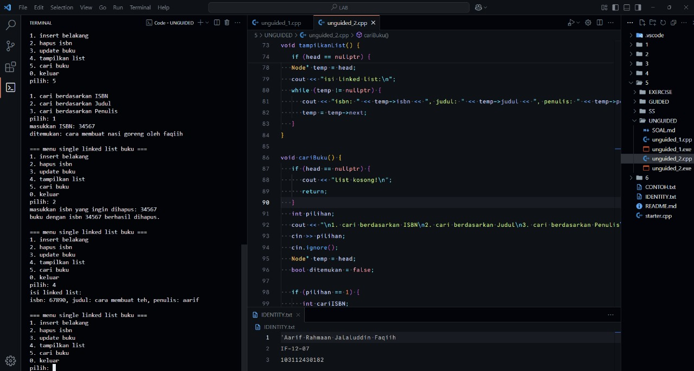

<h1 align="center">Laporan Praktikum Modul 5 <br> SINGLY LINKED LIST (BAGIAN KEDUA)</h1>
<p align="center">'Aarif Rahmaan Jalaluddin Faqiih - 103112430182</p>

## Dasar Teori

XXXXXXXXXXXXXXXXXXXXXXXXXXXXXXXXXXXXXXXXXXXXXXXX

---

## Guided

### Soal 1

XXXXXXXXXXXXXXXXXXXXXXXX

```cpp
#include <iostream>
```

> Output
> 
> 

XXXXXXXXXXXXXXXXXXXXXXXXXXXXXXXXXXXXXXXXXXXXXXXX

---

## Unguided

### Soal 1

buatlah searcing untuk mencari nama pembeli pada unguided sebelumnya.

```cpp
#include <iostream>
using namespace std;

struct node {
   string nama;
   string pesanan;
   node*  next;
};

node* head = nullptr;
node* tail = nullptr;

node* tambah_node(string nama, string pesanan) {
   node* new_node    = new node();
   new_node->nama    = nama;
   new_node->pesanan = pesanan;
   new_node->next    = nullptr;
   return new_node;
}

void tambah_antrian(string nama, string pesanan) {
   node* new_node = tambah_node(nama, pesanan);

   if (head == nullptr) {
      head = tail = new_node;
   } else {
      tail->next = new_node;
      tail       = new_node;
   }

   cout << "antrian atas nama " << nama << " dengan pesanan " << pesanan << " berhasil ditambahkan.\n";
}

void layani_antrian() {
   if (head == nullptr) {
      cout << "antrian kosong, bikin antrian dulu.\n";
      return;
   }

   node* temp = head;

   cout << "melayani antrian atas nama " << temp->nama << " dengan pesanan " << temp->pesanan << ".\n";

   head = head->next;

   delete temp;

   if (head == nullptr) {
      tail = nullptr;
   }
}

void tampilkan_antrian() {
   if (head == nullptr) {
       cout << "antrian kosong.\n";
       return;
   }

   node* temp = head;
   int nomor = 1;

   cout << "\n=== daftar antrian ===\n";

   while (temp != nullptr) {
       cout << nomor++ << ". nama: " << temp->nama << ", pesanan: " << temp->pesanan << endl;
       temp = temp->next;
   }
}

void cari_pembeli(string nama_dicari) {
   if (head == nullptr) {
      cout << "antrian kosong, tidak ada data untuk dicari.\n";
      return;
   }

   node* temp = head;
   int posisi = 1;

   bool ketemu = false;

   while (temp != nullptr) {
      if (temp->nama == nama_dicari) {
         cout << "pembeli ada di posisi ke-" << posisi 
              << " dengan pesanan " << temp->pesanan << endl;
         ketemu = true;
         break;
      }
      temp = temp->next;
      posisi++;
   }

   if (!ketemu) {
      cout << "pembeli dengan nama " << nama_dicari << " tidak ditemukan dalam antrian.\n";
   }
}

int main() {
   int pilihan;
   string nama, pesanan;

   do {
       cout << "\n=== menu antrian pembeli ===\n";
       cout << "1. tambah antrian\n";
       cout << "2. layani antrian\n";
       cout << "3. tampilkan antrian\n";
       cout << "4. cari pembeli\n"; // menu baru untuk searching
       cout << "0. keluar\n";
       cout << "pilih: ";
       cin >> pilihan;
       cin.ignore();

       switch (pilihan) {
           case 1:
               cout << "masukkan nama pembeli: ";
               getline(cin, nama); // input bisa pakai spasi
               cout << "masukkan pesanan: ";
               getline(cin, pesanan);
               tambah_antrian(nama, pesanan);
               break;

           case 2:
               layani_antrian(); // hapus antrian paling depan
               break;

           case 3:
               tampilkan_antrian(); // tampilkan semua antrian
               break;

           case 4:
               cout << "masukkan nama pembeli yang ingin dicari: ";
               getline(cin, nama);
               cari_pembeli(nama); // panggil fungsi baru
               break;

           case 0:
               cout << "program selesai.\n";
               break;

           default:
               cout << "pilihan tidak valid!\n";
       }
   } while (pilihan != 0); // berhenti kalau user milih 0

   return 0;
}
```

> Output
> 
> 

program ini bertujuan untuk mengelola antrian pembeli dengan menggunakan struktur data linked list. setiap pembeli yang mendaftar antrian akan disimpan dalam node yang berisi dua informasi, yaitu nama pembeli dan pesanan mereka. node tersebut akan saling terhubung dengan pointer next untuk membentuk antrian.

fungsi pertama, tambah_node, berfungsi untuk membuat node baru yang berisi informasi nama dan pesanan pembeli. fungsi ini mengembalikan pointer ke node baru yang siap ditambahkan ke dalam antrian.

fungsi tambah_antrian digunakan untuk menambahkan pembeli ke dalam antrian. jika antrian masih kosong (head == nullptr), maka node baru akan menjadi head dan tail antrian. jika antrian sudah ada isinya, node baru akan ditempatkan di akhir antrian dengan memperbarui pointer next pada tail dan menjadikan node baru sebagai tail.

fungsi layani_antrian digunakan untuk melayani pembeli yang pertama dalam antrian. jika antrian kosong, maka fungsi akan memberi pesan bahwa antrian kosong. jika tidak kosong, pembeli yang ada di head akan dilayani, kemudian head diperbarui ke node berikutnya dan node yang lama dihapus (dengan perintah delete temp). jika setelahnya antrian kosong, tail juga akan di-set ke nullptr.

fungsi tampilkan_antrian berfungsi untuk menampilkan semua pembeli yang ada dalam antrian beserta pesanan mereka. jika antrian kosong, maka program akan memberi pesan bahwa antrian kosong. jika tidak, program akan menampilkan daftar pembeli dan pesanan mereka satu per satu, dimulai dari head antrian.

fungsi cari_pembeli berfungsi untuk mencari apakah ada pembeli dengan nama tertentu dalam antrian. jika pembeli ditemukan, program akan menampilkan posisi pembeli tersebut dalam antrian serta pesanan mereka. jika tidak ditemukan, program akan memberi tahu bahwa pembeli tersebut tidak ada dalam antrian.

fungsi main merupakan menu utama yang memberikan pilihan kepada user untuk menambah antrian, melayani antrian, menampilkan antrian, atau mencari pembeli berdasarkan nama. pilihan 0 akan mengakhiri program. setiap pilihan akan diproses sesuai dengan kasus yang dipilih, dengan input yang bisa mengandung spasi berkat penggunaan getline untuk membaca nama dan pesanan pembeli.

---

### Soal 2

gunakan latihan pada pertemuan minggun ini dan tambahkan searching untuk mencari buku berdasarkan judul, penulis, dan ISBN.

```cpp
#include <iostream>
using namespace std;

struct Node {
   int isbn;
   string judul;
   string penulis;
   Node* next;
};

Node* head = nullptr;

Node* buat_node(int isbn, string judul, string penulis) {
   Node* newNode = new Node();
   newNode->isbn = isbn;
   newNode->judul = judul;
   newNode->penulis = penulis;
   newNode->next = nullptr;
   return newNode;
}

void tambah_buku(int isbn, string judul, string penulis) {
   Node* newNode = buat_node(isbn, judul, penulis);
   if (head == nullptr) {
      head = newNode;
   } else {
      Node* temp = head;
      while (temp->next != nullptr) temp = temp->next;
      temp->next = newNode;
   }
   cout << "buku \"" << judul << "\" oleh " << penulis << " dengan isbn " << isbn << " berhasil ditambahkan.\n";
}

void hapusNode(int isbn) {
   if (head == nullptr) {
      cout << "list kosong!\n";
      return;
   }
   Node* temp = head;
   Node* prev = nullptr;
   if (temp != nullptr && temp->isbn == isbn) {
      head = temp->next;
      delete temp;
      cout << "buku dengan isbn " << isbn << " berhasil dihapus.\n";
      return;
   }
   while (temp != nullptr && temp->isbn != isbn) {
      prev = temp;
      temp = temp->next;
   }
   if (temp == nullptr) {
      cout << "isbn " << isbn << " tidak ditemukan!\n";
      return;
   }
   prev->next = temp->next;
   delete temp;
   cout << "buku dengan isbn " << isbn << " berhasil dihapus.\n";
}

void updateNode(int isbnLama, int isbnBaru, string judulBaru, string penulisBaru) {
   Node* temp = head;
   while (temp != nullptr && temp->isbn != isbnLama) temp = temp->next;
   if (temp == nullptr) {
      cout << "isbn " << isbnLama << " tidak ditemukan!\n";
   } else {
      temp->isbn = isbnBaru;
      temp->judul = judulBaru;
      temp->penulis = penulisBaru;
      cout << "buku berhasil diupdate jadi: " << judulBaru << " oleh " << penulisBaru << " (isbn " << isbnBaru << ")\n";
   }
}

void tampilkanList() {
   if (head == nullptr) {
      cout << "list kosong!\n";
      return;
   }
   Node* temp = head;
   cout << "isi linked list:\n";
   while (temp != nullptr) {
      cout << "isbn: " << temp->isbn << ", judul: " << temp->judul << ", penulis: " << temp->penulis << endl;
      temp = temp->next;
   }
}

void cariBuku() {
   if (head == nullptr) {
      cout << "list kosong!\n";
      return;
   }
   int pilihan;
   cout << "\n1. cari berdasarkan ISBN\n2. cari berdasarkan Judul\n3. cari berdasarkan Penulis\npilih: ";
   cin >> pilihan;
   cin.ignore();
   Node* temp = head;
   bool ditemukan = false;

   if (pilihan == 1) {
      int cariISBN;
      cout << "masukkan ISBN: ";
      cin >> cariISBN;
      while (temp != nullptr) {
         if (temp->isbn == cariISBN) {
            cout << "ditemukan: " << temp->judul << " oleh " << temp->penulis << endl;
            ditemukan = true;
         }
         temp = temp->next;
      }
   } else if (pilihan == 2) {
      string cariJudul;
      cout << "masukkan judul: ";
      getline(cin, cariJudul);
      while (temp != nullptr) {
         if (temp->judul == cariJudul) {
            cout << "ditemukan: ISBN " << temp->isbn << ", penulis: " << temp->penulis << endl;
            ditemukan = true;
         }
         temp = temp->next;
      }
   } else if (pilihan == 3) {
      string cariPenulis;
      cout << "masukkan penulis: ";
      getline(cin, cariPenulis);
      while (temp != nullptr) {
         if (temp->penulis == cariPenulis) {
            cout << "ditemukan: " << temp->judul << " (ISBN " << temp->isbn << ")\n";
            ditemukan = true;
         }
         temp = temp->next;
      }
   } else {
      cout << "pilihan tidak valid!\n";
      return;
   }

   if (!ditemukan) cout << "data tidak ditemukan!\n";
}

int main() {
   int pilihan, isbn, isbnBaru;
   string judul, penulis, judulBaru, penulisBaru;
   do {
      cout << "\n=== menu single linked list buku ===\n";
      cout << "1. insert belakang\n";
      cout << "2. hapus isbn\n";
      cout << "3. update buku\n";
      cout << "4. tampilkan list\n";
      cout << "5. cari buku\n";
      cout << "0. keluar\n";
      cout << "pilih: ";
      cin >> pilihan;

      switch (pilihan) {
         case 1:
            cout << "masukkan isbn: ";
            cin >> isbn;
            cin.ignore();
            cout << "masukkan judul: ";
            getline(cin, judul);
            cout << "masukkan penulis: ";
            getline(cin, penulis);
            tambah_buku(isbn, judul, penulis);
            break;
         case 2:
            cout << "masukkan isbn yang ingin dihapus: ";
            cin >> isbn;
            hapusNode(isbn);
            break;
         case 3:
            cout << "masukkan isbn lama: ";
            cin >> isbn;
            cout << "masukkan isbn baru: ";
            cin >> isbnBaru;
            cin.ignore();
            cout << "masukkan judul baru: ";
            getline(cin, judulBaru);
            cout << "masukkan penulis baru: ";
            getline(cin, penulisBaru);
            updateNode(isbn, isbnBaru, judulBaru, penulisBaru);
            break;
         case 4:
            tampilkanList();
            break;
         case 5:
            cariBuku();
            break;
         case 0:
            cout << "program selesai.\n";
            break;
         default:
            cout << "pilihan tidak valid!\n";
      }
   } while (pilihan != 0);
   return 0;
}
```

> Output
> 
> 

program ini bertujuan untuk mengelola daftar buku menggunakan linked list, yang memungkinkan operasi seperti menambah, menghapus, memperbarui, mencari, dan menampilkan buku-buku berdasarkan isbn, judul, atau penulis.

pertama, kita mendefinisikan struktur Node yang berisi data isbn, judul, penulis, dan pointer next yang menunjuk ke node berikutnya. pointer head digunakan untuk menunjuk ke node pertama dari linked list.

fungsi buat_node berfungsi untuk membuat sebuah node baru yang berisi data isbn, judul, dan penulis, serta menginisialisasi pointer next ke nullptr. fungsi ini dipanggil dalam fungsi tambah_buku untuk menambahkan buku baru ke dalam linked list. jika linked list masih kosong (head == nullptr), maka node baru menjadi head. jika tidak, kita akan berjalan ke akhir linked list dan menambahkan node baru setelah node terakhir.

fungsi hapusNode berfungsi untuk menghapus node berdasarkan isbn. pertama, kita memeriksa apakah head kosong, jika ya maka akan menampilkan pesan "list kosong!". kemudian, kita mencari node dengan isbn yang sesuai. jika node pertama adalah node yang akan dihapus, maka kita update head menjadi node berikutnya. jika node yang ingin dihapus bukan node pertama, kita mencari node tersebut dan menghubungkan node sebelumnya dengan node setelahnya.

fungsi updateNode digunakan untuk memperbarui data buku berdasarkan isbn. kita mencari node dengan isbn lama, jika ditemukan, data node tersebut akan diperbarui dengan isbn, judul, dan penulis baru.

fungsi tampilkanList digunakan untuk menampilkan seluruh daftar buku yang ada di linked list. jika linked list kosong, akan ditampilkan pesan "list kosong!". jika tidak, kita akan mencetak isbn, judul, dan penulis dari setiap node dalam linked list.

fungsi cariBuku memungkinkan pengguna mencari buku berdasarkan pilihan, yaitu isbn, judul, atau penulis. kita akan berjalan melalui linked list dan mencocokkan data sesuai dengan pilihan pengguna. jika buku ditemukan, maka informasi buku akan ditampilkan, jika tidak, pesan "data tidak ditemukan!" akan ditampilkan.

di dalam fungsi main, terdapat menu interaktif untuk memilih operasi yang ingin dilakukan, seperti menambah buku, menghapus buku berdasarkan isbn, memperbarui buku, menampilkan daftar buku, dan mencari buku. program ini akan terus berjalan hingga pengguna memilih untuk keluar.

---

## Referensi

1. https://www.w3schools.com/cpp/cpp_functions.asp (diakses XXXXXXXXXXXX)
