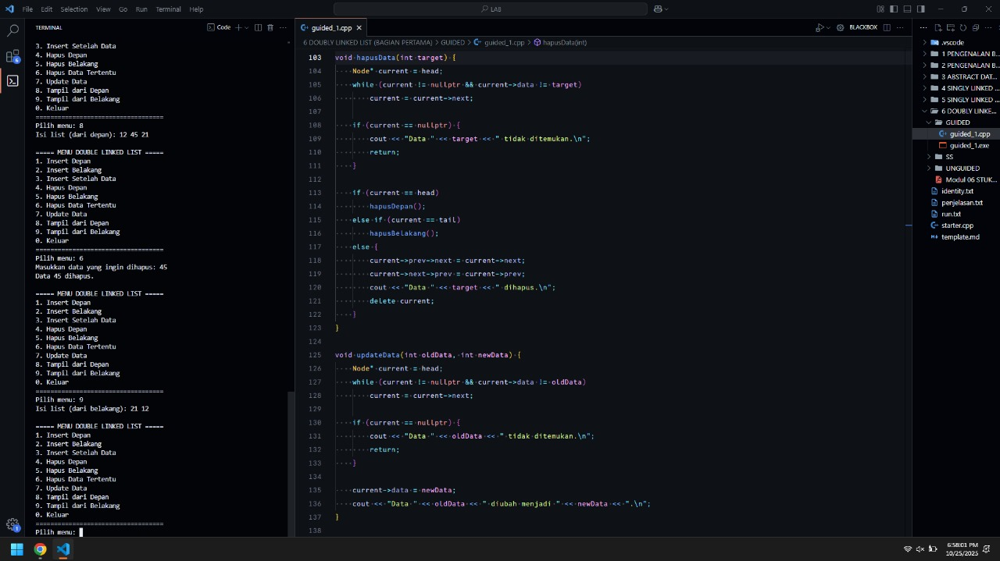
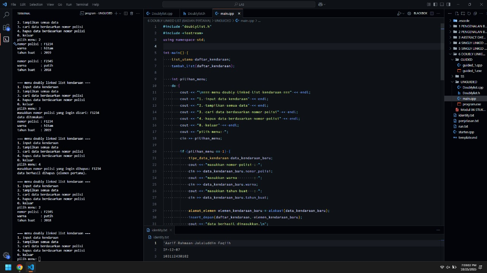

<h1 align="center">Laporan Praktikum Modul 6 <br> DOUBLY LINKED LIST (BAGIAN PERTAMA)</h1>
<p align="center">'Aarif Rahmaan Jalaluddin Faqiih - 103112430182</p>

## Dasar Teori

**Doubly Linked List** adalah salah satu bentuk struktur data dengan keterhubungan dua arah. Setiap elemen dalam list disebut **node**, dan setiap node terdiri dari tiga komponen utama:

1. **Data** : menyimpan nilai atau informasi yang akan dikelola.  
2. **Pointer `next`** : menunjuk ke node berikutnya dalam urutan.  
3. **Pointer `prev`** : menunjuk ke node sebelumnya dalam urutan.

Dengan adanya dua pointer tersebut, traversal (penelusuran) dapat dilakukan dari depan ke belakang maupun belakang ke depan, berbeda dengan singly linked list yang hanya bisa ditelusuri satu arah.

### 1. Struktur Umum Doubly Linked List
Struktur umum dari sebuah node dapat digambarkan sebagai berikut:

<code>[ prev | data | next ]</code>

Pointer `prev` menghubungkan node saat ini dengan node sebelumnya, sedangkan pointer `next` menghubungkan node dengan node berikutnya. Selain itu, terdapat dua pointer penting dalam list:
- **head** : menunjuk ke node pertama.
- **tail** : menunjuk ke node terakhir.

Jika list kosong, maka `head` dan `tail` bernilai `nullptr`.

### 2. Operasi Dasar pada Doubly Linked List

#### a. **Inisialisasi List**
Langkah pertama dalam pembuatan *doubly linked list* adalah menginisialisasi `head` dan `tail` menjadi `nullptr` sebagai tanda bahwa list masih kosong.

#### b. **Insert Node**
Operasi penambahan data dapat dilakukan di tiga posisi:
- **Insert Depan** : menambahkan node baru di awal list. Pointer `next` dari node baru akan menunjuk ke `head` lama, dan `head->prev` diubah agar menunjuk ke node baru.
- **Insert Belakang** : menambahkan node baru di akhir list. Pointer `prev` dari node baru menunjuk ke `tail` lama, dan `tail->next` diubah agar menunjuk ke node baru.
- **Insert Setelah Data Tertentu** : menyisipkan node di antara dua node yang sudah ada. Node baru akan terhubung dengan node target dan node setelahnya.

#### c. **Hapus Node**
Penghapusan elemen juga bisa dilakukan di tiga posisi:
- **Hapus Depan** : menghapus node pertama, kemudian menggeser `head` ke node berikutnya.
- **Hapus Belakang** : menghapus node terakhir, lalu menggeser `tail` ke node sebelumnya.
- **Hapus Data Tertentu** : mencari node dengan data tertentu dan memutus hubungan antara node tersebut dengan node sekitarnya.

#### d. **Update Node**
Operasi ini mengganti nilai data pada node tertentu dengan nilai baru tanpa mengubah posisi node dalam list.

#### e. **Traversal (Penelusuran)**
Traversal dapat dilakukan dengan dua arah:
- **Dari depan ke belakang** menggunakan pointer `next`.
- **Dari belakang ke depan** menggunakan pointer `prev`.

Hal ini menjadi keunggulan utama doubly linked list dibanding singly linked list yang hanya bisa menelusuri satu arah.

### 3. Penerapan dalam Program
Dalam program praktikum ini, doubly linked list digunakan untuk mengelola data berupa bilangan bulat (pada guided) dan data kendaraan (pada unguided):
- Menambah data dari depan, belakang, atau setelah data tertentu.
- Menghapus data dari berbagai posisi.
- Mengubah (update) nilai data.
- Menampilkan data dari depan atau belakang.

---

## Guided

### Guided 1 : Program untuk mengelola dan menampilkan data pada double linked list.

```cpp
#include <iostream>
using namespace std;

struct Node {
    int data;
    Node* prev;
    Node* next;
};

Node* head = nullptr;
Node* tail = nullptr;

void insertDepan(int data) {
    Node* newNode = new Node();
    newNode->data = data;
    newNode->prev = nullptr;
    newNode->next = head;

    if (head != nullptr)
       head->prev = newNode;
    else
       tail = newNode;

    head = newNode;
    cout << "Data " << data << " berhasil ditambahkan di depan. \n";
}

void insertBelakang(int data) {
    Node* newNode = new Node();
    newNode->data = data;
    newNode->next = nullptr;
    newNode->prev = tail;

    if (tail != nullptr)
        tail->next = newNode;
    else
        head = newNode;

    tail = newNode;
    cout << "Data " << data << " berhasil ditambahkan di belakang.\n";
}

void insertSetelah(int target, int data) {
    Node* current = head;
    while (current != nullptr && current ->data != target)
        current = current->next;

    if(current == nullptr) {
        cout << "Data " << target << " tidak ditemukan.\n";
        return;
    }

    Node* newNode = new Node();
    newNode->data = data;
    newNode->next = current->next;
    newNode->prev = current;

    if (current->next != nullptr)
        current->next->prev = newNode;
    else
        tail = newNode;

    current->next = newNode;
    cout << "Data " << data << " berhasil disisipkan setelah " << target << ".\n";
}

void hapusDepan() {
    if (head == nullptr) {
        cout << "List kosong.\n";
        return;
    }

    Node* temp = head;
    head = head->next;

    if (head != nullptr)
        head->prev = nullptr;
    else
        tail = nullptr;

    cout << "Data " << temp->data << " dihapus dari depan.\n";
    delete temp;
}

void hapusBelakang() {
    if  (tail == nullptr) {
        cout << "List kosong.\n";
        return;
    }

    Node* temp = tail;
    tail = tail->prev;

    if (tail != nullptr)
        tail->next = nullptr;
    else
        head = nullptr;
    
    cout << "Data " << temp->data << " dihapus dari belakang.\n";
    delete temp;
}

void hapusData(int target) {
    Node* current = head;
    while (current != nullptr && current->data != target)
        current = current->next;

    if (current == nullptr) {
        cout << "Data " << target << " tidak ditemukan.\n";
        return;
    }

    if (current == head)
        hapusDepan();
    else if (current == tail)
        hapusBelakang();
    else {
        current->prev->next = current->next;
        current->next->prev = current->prev;
        cout << "Data " << target << " dihapus.\n";
        delete current;
    }
}

void updateData(int oldData, int newData) {
    Node* current = head;
    while (current != nullptr && current->data != oldData)
        current = current->next;

    if (current == nullptr) {
        cout << "Data " << oldData << " tidak ditemukan.\n";
        return;
    }

    current->data = newData;
    cout << "Data " << oldData << " diubah menjadi " << newData << ".\n";
}

void tampilDepan() {
    if (head == nullptr) {
        cout << "List kosong.\n";
        return;
    }

    cout << "Isi list (dari depan): ";
    Node* current = head;
    while (current != nullptr) {
        cout << current->data << " ";
        current = current->next;
    }
    cout << "\n";
}

// ====================================
// Fungsi: Tampilkan dari belakang
// ====================================
void tampilBelakang() {
    if (tail == nullptr) {
        cout << "List kosong.\n";
        return;
    }

    cout << "Isi list (dari belakang): ";
    Node* current = tail;
    while (current != nullptr) {
        cout << current->data << " ";
        current = current->prev;
    }
    cout << "\n";
}

// ====================================
// MAIN PROGRAM (MENU INTERAKTIF)
// ====================================
int main() {
    int pilihan, data, target, oldData, newData;

    do {
        cout << "\n===== MENU DOUBLE LINKED LIST =====\n";
        cout << "1. Insert Depan\n";
        cout << "2. Insert Belakang\n";
        cout << "3. Insert Setelah Data\n";
        cout << "4. Hapus Depan\n";
        cout << "5. Hapus Belakang\n";
        cout << "6. Hapus Data Tertentu\n";
        cout << "7. Update Data\n";
        cout << "8. Tampil dari Depan\n";
        cout << "9. Tampil dari Belakang\n";
        cout << "0. Keluar\n";
        cout << "===================================\n";
        cout << "Pilih menu: ";
        cin >> pilihan;

        switch (pilihan) {
            case 1:
                cout << "Masukkan data: ";
                cin >> data;
                insertDepan(data);
                break;
            case 2:
                cout << "Masukkan data: ";
                cin >> data;
                insertBelakang(data);
                break;
            case 3:
                cout << "Masukkan data target: ";
                cin >> target;
                cout << "Masukkan data baru: ";
                cin >> data;
                insertSetelah(target, data);
                break;
            case 4:
                hapusDepan();
                break;
            case 5:
                hapusBelakang();
                break;
            case 6:
                cout << "Masukkan data yang ingin dihapus: ";
                cin >> target;
                hapusData(target);
                break;
            case 7:
                cout << "Masukkan data lama: ";
                cin >> oldData;
                cout << "Masukkan data baru: ";
                cin >> newData;
                updateData(oldData, newData);
                break;
            case 8:
                tampilDepan();
                break;
            case 9:
                tampilBelakang();
                break;
            case 0:
                cout << "👋 Keluar dari program.\n";
                break;
            default:
                cout << "Pilihan tidak valid.\n";
        }

    } while (pilihan != 0);

    return 0;
}
```

> Output
> 
> 

program ini tujuannya untuk mengelola data menggunakan struktur double linked list, yaitu struktur data yang tiap nodenya memiliki pointer ke node sebelumnya (prev) dan node setelahnya (next), sehingga bisa diakses dari dua arah, depan dan belakang.

pertama, terdapat struct Node yang berfungsi sebagai template atau cetakan dari setiap node pada linked list, yang berisi data, pointer prev, dan pointer next. kemudian ada dua pointer global yaitu head dan tail, yang masing-masing menunjuk ke node pertama dan node terakhir pada list.

fungsi insertDepan digunakan untuk menambahkan data baru di bagian depan list. cara kerjanya adalah membuat node baru, mengisi datanya, lalu menghubungkan node baru tersebut ke head yang lama. jika list kosong, maka node baru akan menjadi head sekaligus tail.

fungsi insertBelakang bekerja kebalikannya, yaitu menambahkan node di bagian belakang list. node baru dihubungkan ke tail yang lama, dan jika list kosong maka head dan tail sama-sama menunjuk ke node baru tersebut.

fungsi insertSetelah digunakan untuk menyisipkan data di tengah list setelah data tertentu. langkahnya yaitu mencari node yang datanya sama dengan target, kemudian membuat node baru dan menghubungkan pointer prev dan next-nya agar tetap tersambung dengan node sebelumnya dan sesudahnya. jika target tidak ditemukan, maka program menampilkan pesan bahwa data tidak ditemukan.

fungsi hapusDepan digunakan untuk menghapus node pertama pada list. jika list kosong, maka akan muncul pesan bahwa list kosong. jika ada data, maka head akan digeser ke node berikutnya dan node lama dihapus dari memori.

fungsi hapusBelakang bekerja dengan cara yang mirip tapi dari arah belakang. jika tail dihapus, maka tail akan digeser ke node sebelumnya, dan jika list kosong maka head juga diset ke nullptr.

fungsi hapusData digunakan untuk menghapus data tertentu di tengah list. caranya mencari node yang berisi data target, lalu memutuskan hubungan node tersebut dari node sebelumnya dan sesudahnya. jika data yang dihapus adalah head atau tail, maka fungsi hapusDepan atau hapusBelakang akan dipanggil.

fungsi updateData digunakan untuk mengubah nilai data lama menjadi nilai baru. cara kerjanya adalah mencari node yang berisi data lama, lalu menggantinya dengan data baru. jika data lama tidak ditemukan, maka akan ditampilkan pesan bahwa data tidak ditemukan.

fungsi tampilDepan digunakan untuk menampilkan isi list dari depan ke belakang dengan cara menelusuri pointer next dari head sampai tail. sebaliknya, fungsi tampilBelakang digunakan untuk menampilkan isi list dari belakang ke depan dengan cara menelusuri pointer prev dari tail sampai head.

---

## Unguided

### Unguided 1 : Buatlah implementasi ADT Doubly Linked list pada file “Doublylist.cpp” dan coba hasil implementasi ADT pada file “main.cpp”.

<code>Doublylist.h</code>

```cpp
#ifndef doublylist_h
#define doublylist_h

#include <string>
using namespace std;
#define nil NULL

typedef struct kendaraan {
    string nomor_polisi;
    string warna;
    int tahun_buat;
} tipe_data_kendaraan;

typedef struct elemen_list *alamat_elemen;

struct elemen_list {
    tipe_data_kendaraan info_kendaraan;
    alamat_elemen elemen_berikutnya;
    alamat_elemen elemen_sebelumnya;
};

struct list_utama {
    alamat_elemen elemen_pertama;
    alamat_elemen elemen_terakhir;
};

void tambah_list(list_utama &list_kendaraan);
alamat_elemen alokasi(tipe_data_kendaraan data_kendaraan);
void dealokasi(alamat_elemen &elemen_kendaraan);
void print_info(list_utama list_kendaraan);
void insert_depan(list_utama &list_kendaraan, alamat_elemen elemen_kendaraan);
alamat_elemen cari_elemen(list_utama list_kendaraan, string nomor_polisi);
void hapus_depan(list_utama &list_kendaraan, alamat_elemen &elemen_kendaraan);
void hapus_belakang(list_utama &list_kendaraan, alamat_elemen &elemen_kendaraan);
void hapus_setelah(alamat_elemen elemen_sebelumnya, alamat_elemen &elemen_kendaraan);

#endif
```

<code>Doublylist.cpp</code>

```cpp
#include "doublylist.h"
#include <iostream>
using namespace std;

void tambah_list(list_utama &list_kendaraan) {
    list_kendaraan.elemen_pertama = nil;
    list_kendaraan.elemen_terakhir = nil;
}

alamat_elemen alokasi(tipe_data_kendaraan data_kendaraan) {
    alamat_elemen elemen_kendaraan = new elemen_list;
    elemen_kendaraan->info_kendaraan = data_kendaraan;
    elemen_kendaraan->elemen_berikutnya = nil;
    elemen_kendaraan->elemen_sebelumnya = nil;
    return elemen_kendaraan;
}

void dealokasi(alamat_elemen &elemen_kendaraan) {
    delete elemen_kendaraan;
    elemen_kendaraan = nil;
}

void insert_depan(list_utama &list_kendaraan, alamat_elemen elemen_kendaraan) {
    if (list_kendaraan.elemen_pertama == nil) {
        list_kendaraan.elemen_pertama = elemen_kendaraan;
        list_kendaraan.elemen_terakhir = elemen_kendaraan;
    } else {
        elemen_kendaraan->elemen_sebelumnya = list_kendaraan.elemen_terakhir;
        (list_kendaraan.elemen_terakhir)->elemen_berikutnya = elemen_kendaraan;
        list_kendaraan.elemen_terakhir = elemen_kendaraan;
    }
}

void print_info(list_utama list_kendaraan) {
    if (list_kendaraan.elemen_pertama == nil) {
        cout << "list kosong" << endl;
    } else {
        alamat_elemen elemen_kendaraan = list_kendaraan.elemen_pertama;
        while (elemen_kendaraan != nil) {
            cout << "nomor polisi : " << elemen_kendaraan->info_kendaraan.nomor_polisi << endl;
            cout << "warna        : " << elemen_kendaraan->info_kendaraan.warna << endl;
            cout << "tahun buat   : " << elemen_kendaraan->info_kendaraan.tahun_buat << endl;
            cout << endl;
            elemen_kendaraan = elemen_kendaraan->elemen_berikutnya;
        }
    }
}

alamat_elemen cari_elemen(list_utama list_kendaraan, string nomor_polisi) {
    alamat_elemen elemen_kendaraan = list_kendaraan.elemen_pertama;
    while (elemen_kendaraan != nil) {
        if (elemen_kendaraan->info_kendaraan.nomor_polisi == nomor_polisi) {
            return elemen_kendaraan;
        }
        elemen_kendaraan = elemen_kendaraan->elemen_berikutnya;
    }
    return nil;
}

void hapus_depan(list_utama &list_kendaraan, alamat_elemen &elemen_kendaraan) {
    if (list_kendaraan.elemen_pertama == nil) {
        elemen_kendaraan = nil;
    } else if (list_kendaraan.elemen_pertama == list_kendaraan.elemen_terakhir) {
        elemen_kendaraan = list_kendaraan.elemen_pertama;
        list_kendaraan.elemen_pertama = nil;
        list_kendaraan.elemen_terakhir = nil;
    } else {
        elemen_kendaraan = list_kendaraan.elemen_pertama;
        list_kendaraan.elemen_pertama = (list_kendaraan.elemen_pertama)->elemen_berikutnya;
        (list_kendaraan.elemen_pertama)->elemen_sebelumnya = nil;
        elemen_kendaraan->elemen_berikutnya = nil;
    }
}

void hapus_belakang(list_utama &list_kendaraan, alamat_elemen &elemen_kendaraan) {
    if (list_kendaraan.elemen_pertama == nil) {
        elemen_kendaraan = nil;
    } else if (list_kendaraan.elemen_pertama == list_kendaraan.elemen_terakhir) {
        elemen_kendaraan = list_kendaraan.elemen_terakhir;
        list_kendaraan.elemen_pertama = nil;
        list_kendaraan.elemen_terakhir = nil;
    } else {
        elemen_kendaraan = list_kendaraan.elemen_terakhir;
        list_kendaraan.elemen_terakhir = (list_kendaraan.elemen_terakhir)->elemen_sebelumnya;
        (list_kendaraan.elemen_terakhir)->elemen_berikutnya = nil;
        elemen_kendaraan->elemen_sebelumnya = nil;
    }
}

void hapus_setelah(alamat_elemen elemen_sebelumnya, alamat_elemen &elemen_kendaraan) {
    if (elemen_sebelumnya == nil || elemen_sebelumnya->elemen_berikutnya == nil) {
        elemen_kendaraan = nil;
    } else {
        elemen_kendaraan = elemen_sebelumnya->elemen_berikutnya;
        elemen_sebelumnya->elemen_berikutnya = elemen_kendaraan->elemen_berikutnya;
        if (elemen_kendaraan->elemen_berikutnya != nil) {
            (elemen_kendaraan->elemen_berikutnya)->elemen_sebelumnya = elemen_sebelumnya;
        }
        elemen_kendaraan->elemen_berikutnya = nil;
        elemen_kendaraan->elemen_sebelumnya = nil;
    }
}
```

<code>main.cpp</code>

```cpp
#include "doublylist.h"
#include <iostream>
using namespace std;

int main() {
    list_utama daftar_kendaraan;
    tambah_list(daftar_kendaraan);

    int pilihan_menu;
    do {
        cout << "\n=== menu doubly linked list kendaraan ===" << endl;
        cout << "1. input data kendaraan" << endl;
        cout << "2. tampilkan semua data" << endl;
        cout << "3. cari data berdasarkan nomor polisi" << endl;
        cout << "4. hapus data berdasarkan nomor polisi" << endl;
        cout << "0. keluar" << endl;
        cout << "pilih menu: ";
        cin >> pilihan_menu;

        if (pilihan_menu == 1) {
            tipe_data_kendaraan data_kendaraan_baru;
            cout << "masukkan nomor polisi : ";
            cin >> data_kendaraan_baru.nomor_polisi;
            cout << "masukkan warna        : ";
            cin >> data_kendaraan_baru.warna;
            cout << "masukkan tahun buat   : ";
            cin >> data_kendaraan_baru.tahun_buat;

            alamat_elemen elemen_kendaraan_baru = alokasi(data_kendaraan_baru);
            insert_depan(daftar_kendaraan, elemen_kendaraan_baru);
            cout << "data berhasil dimasukkan.\n";

        } else if (pilihan_menu == 2) {
            print_info(daftar_kendaraan);

        } else if (pilihan_menu == 3) {
            string nomor_polisi_dicari;
            cout << "masukkan nomor polisi yang ingin dicari: ";
            cin >> nomor_polisi_dicari;

            alamat_elemen elemen_ditemukan = cari_elemen(daftar_kendaraan, nomor_polisi_dicari);
            if (elemen_ditemukan != nil) {
                cout << "data ditemukan:\n";
                cout << "nomor polisi : " << elemen_ditemukan->info_kendaraan.nomor_polisi << endl;
                cout << "warna        : " << elemen_ditemukan->info_kendaraan.warna << endl;
                cout << "tahun buat   : " << elemen_ditemukan->info_kendaraan.tahun_buat << endl;
            } else {
                cout << "data tidak ditemukan.\n";
            }

        } else if (pilihan_menu == 4) {
            string nomor_polisi_dihapus;
            cout << "masukkan nomor polisi yang ingin dihapus: ";
            cin >> nomor_polisi_dihapus;

            alamat_elemen elemen_dihapus = cari_elemen(daftar_kendaraan, nomor_polisi_dihapus);
            alamat_elemen elemen_sementara;

            if (elemen_dihapus == nil) {
                cout << "data tidak ditemukan.\n";
            } else if (elemen_dihapus == daftar_kendaraan.elemen_pertama) {
                hapus_depan(daftar_kendaraan, elemen_sementara);
                dealokasi(elemen_sementara);
                cout << "data berhasil dihapus (elemen pertama).\n";
            } else if (elemen_dihapus == daftar_kendaraan.elemen_terakhir) {
                hapus_belakang(daftar_kendaraan, elemen_sementara);
                dealokasi(elemen_sementara);
                cout << "data berhasil dihapus (elemen terakhir).\n";
            } else {
                hapus_setelah(elemen_dihapus->elemen_sebelumnya, elemen_sementara);
                dealokasi(elemen_sementara);
                cout << "data berhasil dihapus (elemen tengah).\n";
            }
        }
    } while (pilihan_menu != 0);

    cout << "program selesai.\n";
    return 0;
}
```

> Output
> 
> 

program ini tujuannya untuk membuat dan mengelola daftar kendaraan menggunakan struktur data doubly linked list. setiap kendaraan memiliki informasi nomor polisi, warna, dan tahun buat, dan bisa ditambahkan, ditampilkan, dicari, atau dihapus dari daftar. konsep dari doubly linked list adalah setiap elemen memiliki pointer ke elemen berikutnya dan elemen sebelumnya.

file Doublylist.h mendeklarasikan struktur data dan fungsi-fungsi yang dibutuhkan. struktur tipe_data_kendaraan menyimpan informasi kendaraan, sedangkan elemen_list menyimpan data kendaraan beserta pointer ke elemen sebelumnya dan berikutnya. list_utama menyimpan alamat elemen pertama dan terakhir dari daftar. selain itu, ada deklarasi fungsi seperti tambah_list, alokasi, dealokasi, insert_depan, print_info, cari_elemen, serta fungsi hapus seperti hapus_depan, hapus_belakang, dan hapus_setelah. fungsi-fungsi ini digunakan untuk manipulasi doubly linked list.

file Doublylist.cpp adalah implementasi dari fungsi-fungsi yang ada di header. fungsi tambah_list menginisialisasi daftar kosong dengan elemen pertama dan terakhir bernilai nil. fungsi alokasi membuat elemen baru dengan data kendaraan, sedangkan dealokasi menghapus elemen dari memori. fungsi insert_depan menambahkan elemen baru ke akhir daftar, dengan logika jika daftar kosong maka elemen baru menjadi elemen pertama dan terakhir, jika tidak, elemen baru ditempatkan setelah elemen terakhir.

fungsi print_info menampilkan seluruh data kendaraan dengan menelusuri elemen dari pertama sampai terakhir. fungsi cari_elemen mencari elemen berdasarkan nomor polisi dengan menelusuri satu per satu elemen dalam daftar. untuk penghapusan, fungsi hapus_depan menghapus elemen pertama, fungsi hapus_belakang menghapus elemen terakhir, dan fungsi hapus_setelah menghapus elemen setelah elemen tertentu.

---

## Referensi

1. Yuliana (2015). *Praktikum 19 Double Linked List 2*. Diakses 23 Oktober 2025, dari [https://yuliana.lecturer.pens.ac.id/Struktur%20Data/PRAKTIKUM%202015/Praktikum%2019%20-%20Double%20Linked%20List%202.pdf](https://yuliana.lecturer.pens.ac.id/Struktur%20Data/PRAKTIKUM%202015/Praktikum%2019%20-%20Double%20Linked%20List%202.pdf)
2. Abdulkadir (2019, Februari). *Modul Praktikum Algoritma & Struktur Data*. Diakses 24 Oktober 2025, dari [https://abdulkadir.blog.uma.ac.id/wp-content/uploads/sites/365/2019/02/Modul-Praktikum-Algoritma-Struktur-Data-Merge.pdf](https://abdulkadir.blog.uma.ac.id/wp-content/uploads/sites/365/2019/02/Modul-Praktikum-Algoritma-Struktur-Data-Merge.pdf)
3. GeeksforGeeks. *Doubly Linked List in C++*. Diakses 24 Oktober 2025, dari [https://www.geeksforgeeks.org/cpp/doubly-linked-list-in-cpp/](https://www.geeksforgeeks.org/cpp/doubly-linked-list-in-cpp/)
4. w3resource. *Linked List C++ Exercises, Practice, Solution*. Diakses 23 Oktober 2025, dari [https://www.w3resource.com/cpp-exercises/linked_list/index.php](https://www.w3resource.com/cpp-exercises/linked_list/index.php)
