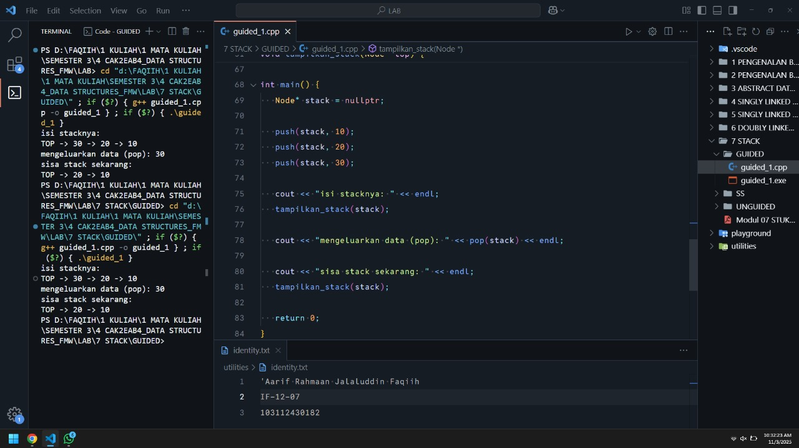
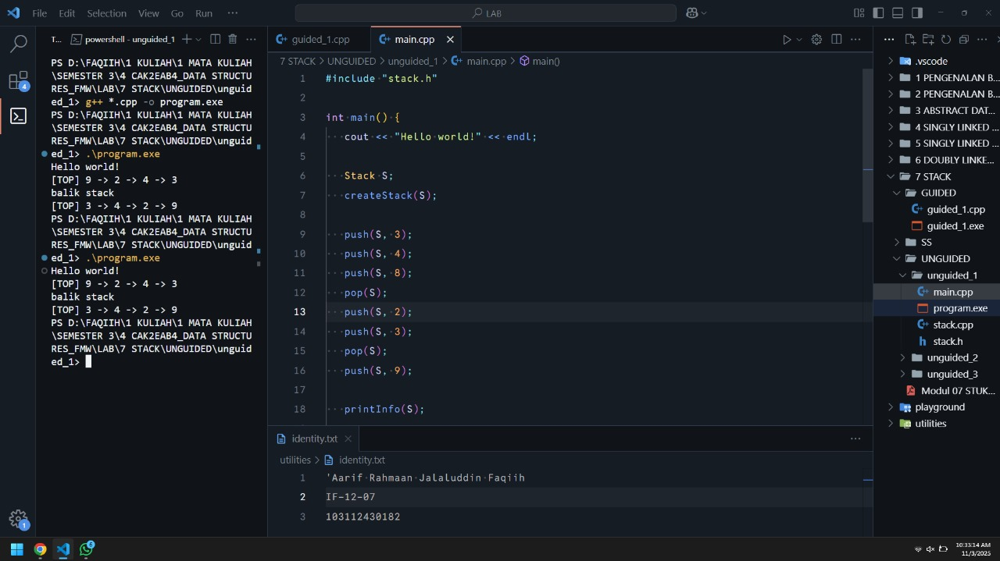
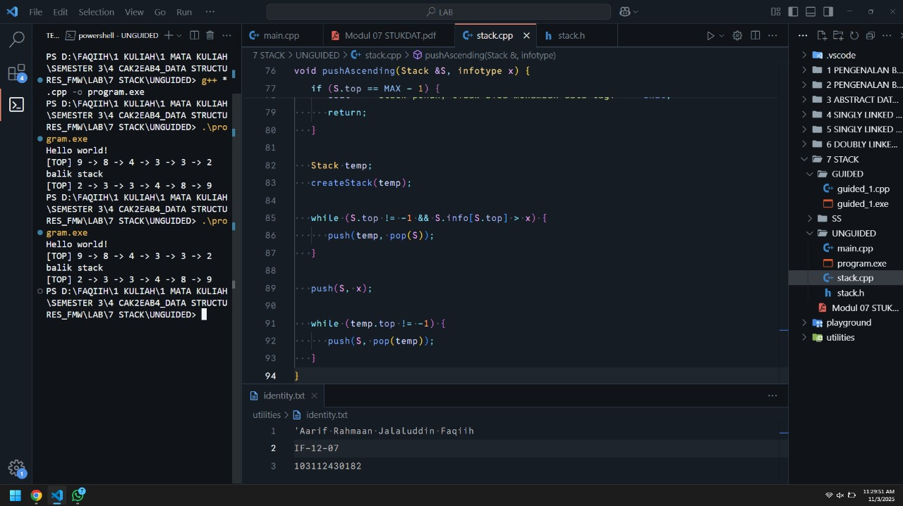
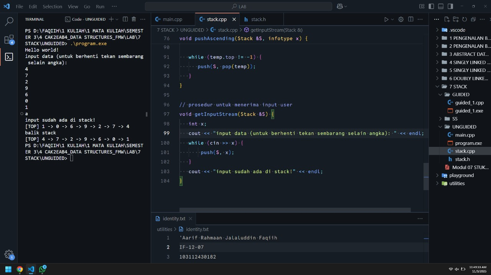

<h1 align="center">Laporan Praktikum Modul 7<br>STACK</h1>
<p align="center">'Aarif Rahmaan Jalaluddin Faqiih - 103112430182</p>

# **Dasar Teori**

## 1. Pengertian Stack

Stack adalah salah satu struktur data **linear** yang mengikuti prinsip **LIFO (Last In, First Out)**, yaitu elemen yang terakhir dimasukkan ke dalam stack akan menjadi elemen pertama yang dikeluarkan. Konsep ini mirip dengan tumpukan benda fisik seperti tumpukan piring atau kotak, di mana elemen yang berada paling atas hanya dapat ditambahkan atau diambil terlebih dahulu.

Stack memiliki dua operasi utama, yaitu:
- **Push** -> Menambahkan elemen baru ke bagian atas stack.  
- **Pop** -> Menghapus elemen paling atas dari stack.

Selain itu, terdapat juga operasi tambahan seperti:
- **Peek / Top** -> Melihat elemen teratas tanpa menghapusnya.
- **IsEmpty** -> Mengecek apakah stack kosong.
- **IsFull** -> Mengecek apakah stack sudah penuh (jika menggunakan array dengan kapasitas tetap).

Struktur data stack sering digunakan dalam berbagai aplikasi seperti:
- Pemanggilan fungsi secara rekursif (Function Call Stack)
- Pembalikan urutan data (misalnya pembalikan string)
- Algoritma notasi postfix dan evaluasi ekspresi aritmatika
- Undo/Redo pada aplikasi teks atau editor

---

## 2. Representasi Stack

### a. Stack Menggunakan **Array**
Stack dapat diimplementasikan menggunakan **array statis**, di mana elemen-elemen stack disimpan dalam sebuah array dengan ukuran maksimum tertentu. Dalam implementasi ini, digunakan sebuah variabel `top` untuk menandai posisi elemen teratas dari stack.

Jika dilakukan `push(40)`, maka top akan bergeser ke index 3 dan nilai 40 akan dimasukkan di posisi tersebut. Sebaliknya, saat dilakukan `pop()`, data 40 akan dihapus dan top bergeser ke index sebelumnya (index 2).

---

### b. Stack Menggunakan **Linked List**
Selain menggunakan array, stack juga bisa diimplementasikan dengan **linked list**, yaitu struktur data dinamis yang terdiri dari node-node yang saling terhubung. Setiap node berisi dua bagian:
- **Data** -> Nilai yang disimpan.
- **Pointer next** -> Menunjuk ke node berikutnya.

Dalam implementasi stack dengan linked list, elemen teratas (top) selalu berada di awal (head) dari linked list.  
Operasi `push` dilakukan dengan menambahkan node baru di bagian depan, sedangkan `pop` dilakukan dengan menghapus node teratas (head).

Kelebihan:
- Ukuran stack dinamis, tidak dibatasi kapasitas tetap.
- Tidak perlu menggeser elemen saat penambahan atau penghapusan.

Kekurangan:
- Membutuhkan memori tambahan untuk pointer.
- Akses sedikit lebih lambat karena manipulasi pointer.

---

## 3. Operasi Dasar pada Stack

Berikut ini penjelasan dari operasi dasar yang digunakan pada program:

### a. **CreateStack**
Membuat stack kosong dengan menginisialisasi nilai `top` menjadi -1 (jika array) atau `nullptr` (jika linked list). Nilai tersebut menandakan bahwa belum ada elemen dalam stack.

### b. **Push**
Menambahkan elemen baru ke atas stack.  
Langkah-langkahnya:
1. Periksa apakah stack penuh.
2. Jika belum penuh, naikkan nilai `top` (pada array) atau buat node baru (pada linked list).
3. Masukkan data ke posisi top.
4. Update pointer atau indeks top agar menunjuk ke elemen baru tersebut.

### c. **Pop**
Menghapus elemen paling atas dari stack.  
Langkah-langkahnya:
1. Periksa apakah stack kosong.
2. Jika tidak kosong, ambil nilai dari elemen teratas.
3. Turunkan nilai `top` (array) atau geser pointer `top` ke node berikutnya (linked list).
4. Hapus node atau abaikan elemen yang sudah tidak digunakan.

### d. **PrintInfo / Display**
Menampilkan isi stack dari elemen paling atas ke paling bawah. Operasi ini tidak mengubah isi stack, hanya membaca dan mencetak nilainya.

### e. **BalikStack**
Operasi untuk membalik urutan isi stack. Pada implementasi menggunakan array, pembalikan dilakukan dengan menukar elemen dari posisi awal dan akhir hingga seluruh data tertukar tempatnya.

### f. **PushAscending**
Operasi tambahan yang memastikan data dimasukkan ke dalam stack secara **berurutan dari kecil ke besar (ascending)**.  
Algoritmanya menggunakan stack sementara (`temp`) untuk menyimpan elemen yang lebih besar dari data baru. Setelah posisi yang sesuai ditemukan, data baru dimasukkan, lalu elemen di stack sementara dikembalikan ke stack utama.

### g. **GetInputStream**
Operasi ini memungkinkan pengguna memasukkan sejumlah data secara langsung melalui input terminal. Selama input yang dimasukkan berupa angka, data tersebut akan di-push ke stack. Input berhenti ketika pengguna mengetikkan karakter non-numerik.

---

## 4. Prinsip LIFO (Last In, First Out)

Konsep utama stack adalah **LIFO**, yaitu elemen yang terakhir masuk akan menjadi yang pertama keluar.  
Contoh urutan operasi:

| Operasi | Isi Stack (atas → bawah) |
|----------|--------------------------|
| Push(10) | 10 |
| Push(20) | 20 -> 10 |
| Push(30) | 30 -> 20 -> 10 |
| Pop()    | 20 -> 10 |

Pada contoh di atas, elemen `30` adalah yang terakhir dimasukkan namun menjadi yang pertama diambil (pop).

---

## 5. Aplikasi Stack dalam Kehidupan Nyata

Beberapa contoh penerapan stack dalam dunia nyata dan pemrograman antara lain:
1. **Undo/Redo pada aplikasi teks atau gambar**, di mana setiap tindakan disimpan ke dalam stack.
2. **Penyusunan ekspresi matematika** seperti konversi infix ke postfix.
3. **Pemanggilan fungsi (Function Call Stack)** dalam bahasa pemrograman.
4. **Pengecekan tanda kurung (Bracket Matching)** pada ekspresi matematika atau kode program.
5. **Algoritma Depth First Search (DFS)** dalam pencarian graf.

---

## 6. Kesimpulan

Stack merupakan struktur data sederhana namun sangat penting dalam dunia pemrograman. Dengan prinsip LIFO, stack memungkinkan pengelolaan data secara efisien pada situasi di mana elemen terakhir yang dimasukkan harus dikeluarkan terlebih dahulu.  
Baik implementasi menggunakan **array** maupun **linked list**, keduanya memiliki kelebihan dan kekurangan masing-masing, serta dapat disesuaikan dengan kebutuhan aplikasi yang dibuat.

### Soal 1 : program untuk push, pop, dan menampilkan isi stack.

```cpp
#include <iostream>
using namespace std;

// stack itu kaya box yang ditumpuk ke atas
// stack itu linked list tapi cuma bisa diakses dari belakang
// maksudnya gini, misal ada stack kaya gini
// | 30 | <- top
// | 20 |
// | 10 |
// kita cuma boleh nambahin di atas (push) atau ngambil dari atas (pop)
// ngga boleh ambil dari tengah atau bawah
// bayangin aja tumpukan box, kalo diambil dari tengah atau bawah pasti yang diatas bakal jatuh, makannya diakses dari atas
struct Node {
   int   data;
   Node* next;
};

// cek stacknya kosong ngga?
bool apakah_kosong(Node *top) {
   return top == nullptr;
};

// nambahin data ke atas stack
void push(Node*& top, int data) {
   Node* node_baru = new Node();
   node_baru->data = data;
   node_baru->next = top;
   top = node_baru;
};

// ngambil data dari atas stack
int pop(Node*& top) {
    // kalo stacknya kosong, ngga bisa di-pop
   if (apakah_kosong(top)) {
      cout << "stack kosong, apa yang mau di-pop?" << endl;
      return -1;
   }

   int data_dikeluarkan = top->data;
   // temp itu tempat penyimpanan node sementara untuk dihapus nanti
   // anggep aja kaya buat nandain yang mau dihapus
   Node* temp = top;
   // terus topnya digeser ke node berikutnya
   top = top->next;
   // nah baru deh node yang paling atas (yang tadi di temp) dihapus
   delete temp;
   return data_dikeluarkan;
};

// nampilin isi stack dari atas ke bawah
void tampilkan_stack(Node* top) {
   if (apakah_kosong(top)) {
    cout << "stack kosong, apa yang mau di-pop?" << endl;
      return;
   };

   cout << "TOP -> ";
   Node* temp = top;

   while (temp != nullptr) {
      cout << temp->data;
      if (temp->next != nullptr) cout << " -> ";
      temp = temp->next;
   }
   cout << endl;
};

int main() {
   Node* stack = nullptr;

   push(stack, 10);
   push(stack, 20);
   push(stack, 30);

   cout << "isi stacknya: " << endl;
   tampilkan_stack(stack);

   cout << "mengeluarkan data (pop): " << pop(stack) << endl;

   cout << "sisa stack sekarang: " << endl;
   tampilkan_stack(stack);

   return 0;
}
```

> Output
> 
> 

program ini tujuannya untuk menampilkan cara kerja struktur data stack menggunakan konsep linked list. stack itu ibarat tumpukan box, di mana kita hanya bisa menaruh (push) atau mengambil (pop) dari bagian atas saja. jadi kalau kita mau ambil yang di bawah, box di atasnya bakal jatuh, makanya stack cuma bisa diakses dari atas.

di awal program ada struct Node yang berisi dua komponen, yaitu data untuk menyimpan nilai, dan next untuk menyimpan alamat node berikutnya.

fungsi apakah_kosong digunakan untuk mengecek apakah stack kosong atau tidak. cara kerjanya dengan memeriksa apakah top bernilai nullptr, kalau iya berarti stack kosong.

fungsi push digunakan untuk menambah data ke atas stack. langkahnya dimulai dengan membuat node baru, lalu node baru itu menyimpan data yang dimasukkan, kemudian next-nya diarahkan ke top lama (karena node baru akan berada di atas node sebelumnya), dan terakhir top dipindahkan ke node baru, artinya node baru sekarang jadi paling atas.

fungsi pop digunakan untuk menghapus atau mengambil data dari atas stack. kalau stack kosong, maka tidak bisa dilakukan pop dan akan menampilkan pesan "stack kosong, apa yang mau di-pop?". kalau tidak kosong, maka data dari top disimpan dulu ke variabel sementara, lalu top digeser ke node berikutnya, dan node yang tadi disimpan sementara dihapus dari memori.

fungsi tampilkan_stack digunakan untuk menampilkan isi stack dari atas ke bawah. pertama dicek apakah stack kosong, kalau iya maka tampil pesan bahwa stack kosong. kalau tidak, maka program akan menampilkan elemen stack mulai dari top, ditelusuri satu per satu lewat pointer next, sampai habis. tampilannya berurutan dari atas ke bawah, dan di antara datanya dipisahkan tanda panah.

terakhir, di fungsi main, dibuat sebuah stack kosong dulu. lalu dilakukan push tiga kali untuk menambahkan data 10, 20, dan 30. setelah itu, program menampilkan isi stack dengan fungsi tampilkan_stack, kemudian melakukan pop satu kali untuk mengeluarkan data paling atas, dan menampilkan isi stack lagi untuk melihat sisa data setelah pop dilakukan.

---

## Unguided

### Soal 1 : Buatlah ADT Stack menggunakan ARRAY dalam file “stack.h”, “stack.cpp”, dan “main.cpp”

<code>stack.h</code>

```cpp
#ifndef STACK_H
#define STACK_H

#include <iostream>
using namespace std;

// tipe data int diganti namanya jadi infotype
typedef int infotype;

// ukuran maksimum stack
#define MAX 20

struct Stack {
   infotype info[MAX];
   int top;
};

// deklarasi semua fungsi dan prosedur yang bakal dipake
void createStack(Stack &S);
void push(Stack &S, infotype x);
infotype pop(Stack &S);
void printInfo(Stack S);
void balikStack(Stack &S);

#endif
```

<code>stack.cpp</code>

```cpp
#include "stack.h"

// bikin stack kosong
void createStack(Stack &S) {
   S.top = -1;
   // kenapa -1? karena index array dimulai dari 0, bukan 1
   // makannya dibikin -1, biar ngga 0
}

// masukin data ke atas stack
void push(Stack &S, infotype x) {
   // cek apakah stack penuh?
   if (S.top == MAX - 1) {
      cout << "stack penuh, tidak bisa menambah data lagi" << endl;
      return;
   }

   // kalo belum penuh, tambahkan data ke atas
   S.top = S.top + 1;
   S.info[S.top] = x;
}

// ambil data paling atas dari stack
infotype pop(Stack &S) {
   // cek apakah stack kosong?
   if (S.top == -1) {
      cout << "stack kosong, tidak ada yang bisa di-pop" << endl;
      return -1;
   }

   // ambil data paling atas
   infotype data = S.info[S.top];

   // terus turunin top-nya
   S.top = S.top - 1;

   // balikin data yang tadi diambil
   return data;
}

// nampilin isi stack dari atas ke bawah
void printInfo(Stack S) {
   if (S.top == -1) {
      cout << "stack kosong" << endl;
      return;
   }

   cout << "[TOP] ";

   // loop data dari index 0 sampe index terakhir
   for (int i = S.top; i >= 0; i--) {
      cout << S.info[i];
      if (i > 0) cout << " -> ";
   }

   cout << "" << endl;
}

// mbalik isi stack
void balikStack(Stack &S) {
   // tukar posisi awal dan akhir
   int i = 0;
   int j = S.top;

   // selama i masih di bawah j, maka tukar
   while (i < j) {
      infotype temp = S.info[i];
      S.info[i] = S.info[j];
      S.info[j] = temp;
      i++;
      j--;
   }
}
```

<code>main.cpp</code>

```cpp
#include "stack.h"

int main() {
   cout << "Hello world!" << endl;

   Stack S;
   createStack(S);

   push(S, 3);
   push(S, 4);
   push(S, 8);
   pop(S);
   push(S, 2);
   push(S, 3);
   pop(S);
   push(S, 9);

   printInfo(S);

   cout << "balik stack" << endl;
   balikStack(S);
   printInfo(S);

   return 0;
}
```

> Output
> 
> 

program ini tujuannya untuk membuat struktur data stack menggunakan array, dimana kita bisa melakukan operasi dasar seperti menambah data (push), menghapus data (pop), menampilkan isi stack (printInfo), dan membalik urutan stack (balikStack).

di file stack.h terdapat deklarasi tipe data dan fungsi yang digunakan di seluruh program. tipe data stack disusun dari array bertipe int dengan ukuran maksimum 20 elemen, serta satu variabel top untuk menandai posisi paling atas dari stack. semua fungsi utama seperti createStack, push, pop, printInfo, dan balikStack dideklarasikan agar bisa digunakan di file lain.

fungsi createStack bertugas untuk membuat stack kosong dengan mengatur nilai top menjadi -1. kenapa -1? karena array dimulai dari index 0, jadi -1 menandakan bahwa belum ada data sama sekali di dalam stack.

fungsi push digunakan untuk menambahkan data ke dalam stack. sebelum menambah data, program akan mengecek dulu apakah stack sudah penuh atau belum. kalau belum penuh, maka nilai top akan dinaikkan 1, lalu data baru disimpan ke posisi paling atas (index top).

fungsi pop berfungsi untuk menghapus data paling atas dari stack. sebelum menghapus, program mengecek apakah stack kosong atau tidak. jika kosong, maka program akan menampilkan pesan “stack kosong, tidak ada yang bisa di-pop”. kalau tidak kosong, maka data di posisi top diambil, lalu top diturunkan 1, dan data yang diambil dikembalikan sebagai hasil fungsi.

fungsi printInfo digunakan untuk menampilkan isi stack dari atas ke bawah. jika stack kosong maka akan menampilkan pesan “stack kosong”. tapi kalau ada datanya, maka program akan menampilkan isi stack mulai dari index paling atas hingga ke bawah, dengan format [TOP] di depan agar jelas posisi atasnya.

fungsi balikStack bertugas untuk membalik isi stack. cara kerjanya yaitu menukar data dari posisi awal dan akhir menggunakan dua variabel, i dan j. selama i masih lebih kecil dari j, kedua elemen di posisi tersebut akan ditukar tempatnya. setelah selesai, isi stack jadi kebalik urutannya.

fungsi main di file main.cpp bertugas untuk menjalankan semua fungsi di atas. pertama membuat stack kosong, lalu melakukan serangkaian operasi push dan pop, kemudian menampilkan hasilnya dengan printInfo. setelah itu stack dibalik dengan balikStack dan hasilnya ditampilkan lagi.

program ini menampilkan hasil akhir berupa urutan data di stack dari atas ke bawah sebelum dan sesudah dibalik.

---

### Soal 2 : Tambahkan prosedur pushAscending(in/out S : Stack, in x : integer)

<code>stack.h</code>

```cpp
void pushAscending(Stack &S, infotype x);
```

<code>stack.cpp</code>

```cpp
// input data secara ascending (dari kecil ke besar)
void pushAscending(Stack &S, infotype x) {
   if (S.top == MAX - 1) {
      cout << "stack penuh, tidak bisa menambah data lagi" << endl;
      return;
   }

   Stack temp;
   createStack(temp);

   while (S.top != -1 && S.info[S.top] > x) {
      push(temp, pop(S));
   }

   push(S, x);

   while (temp.top != -1) {
      push(S, pop(temp));
   }
}
```

<code>main.cpp</code>

```cpp
   pushAscending(S, 3);
   pushAscending(S, 4);
   pushAscending(S, 8);
   pushAscending(S, 2);
   pushAscending(S, 3);
   pushAscending(S, 9);
```

> Output
> 
> 

menambahkan fitur baru pada struktur stack, yaitu pushAscending. fungsinya agar data yang dimasukkan ke dalam stack tersusun secara ascending (dari kecil ke besar).

fungsi pushAscending bekerja dengan cara memeriksa dulu apakah stack sudah penuh. kalau penuh, maka program akan menampilkan pesan “stack penuh, tidak bisa menambah data lagi”. jika masih ada ruang, maka program membuat stack sementara (temp) yang berfungsi sebagai tempat penyimpanan sementara.

kemudian selama data paling atas di stack utama lebih besar dari data baru yang ingin dimasukkan, program akan memindahkan data tersebut ke stack temp. hal ini dilakukan agar posisi data baru bisa dimasukkan di tempat yang tepat sesuai urutan ascending. setelah posisi yang sesuai ditemukan, data baru (x) dimasukkan ke stack utama.

setelah itu, semua data yang tadi disimpan di stack temp akan dikembalikan ke stack utama dengan cara di-pop dari temp lalu di-push kembali ke stack utama.

hasil akhirnya adalah isi stack akan selalu dalam urutan dari nilai terkecil di bawah hingga nilai terbesar di atas.

---

### Soal 3 : Tambahkan prosedur getInputStream(in/out S : Stack)

<code>stack.h</code>

```cpp
void getInputStream(Stack &S);
```

<code>stack.cpp</code>

```cpp
// prosedur untuk menerima input user
void getInputStream(Stack &S) {
   int x;
   cout << "input data (untuk berhenti tekan sembarang selain angka): " << endl;
   while (cin >> x) {
       push(S, x);
   }
   cout << "input sudah ada di stack!" << endl;
}
```

<code>main.cpp</code>

```cpp
   getInputStream(S);
```

> Output
> 
> 

menambahkan prosedur getInputStream, yaitu prosedur yang bisa menerima input dari user secara langsung dan memasukkannya ke dalam stack.

fungsi getInputStream bekerja dengan cara meminta user untuk mengetikkan angka satu per satu. selama input yang dimasukkan bertipe angka (integer), setiap angka tersebut langsung dimasukkan ke dalam stack menggunakan fungsi push.

proses input akan berhenti jika user mengetikkan karakter selain angka, misalnya huruf atau simbol lain. begitu proses input selesai, program akan menampilkan pesan “input sudah ada di stack!” sebagai tanda bahwa semua data yang dimasukkan sudah tersimpan di dalam stack.

fungsi ini mempermudah user karena tidak perlu memanggil fungsi push berkali-kali untuk setiap data, cukup memasukkan semua angka sekaligus di satu sesi input.

---

## Referensi

1. GeeksforGeeks. C++ Program to Implement Stack using Array. Diakses pada 30 Oktober 2025, dari https://www.geeksforgeeks.org/cpp/cpp-program-to-implement-stack-using-array/
2. W3Resource. C++ Stack Exercise 1. Diakses pada 31 Oktober 2025, dari https://www.w3resource.com/cpp-exercises/stack/cpp-stack-exercise-1.php
3. Dremendo. C++ Stack Using Linked List. Diakses pada 2 November 2025, dari https://www.dremendo.com/cpp-programming-tutorial/cpp-stack-using-linked-list
4. GeeksforGeeks. Stack Using Linked List in C. Diakses pada 1 November 2025, dari https://www.geeksforgeeks.org/c/stack-using-linked-list-in-c/
5. GeeksforGeeks. Sort Stack Using Temporary Stack. Diakses pada 3 November 2025, dari https://www.geeksforgeeks.org/dsa/sort-stack-using-temporary-stack/
6. GeeksforGeeks. Sort a Stack Using Recursion. Diakses pada 31 Oktober 2025, dari https://www.geeksforgeeks.org/dsa/sort-a-stack-using-recursion/
7. Dremendo. C++ Stack Tutorial. Diakses pada 30 Oktober 2025, dari https://www.dremendo.com/cpp-programming-tutorial/cpp-stack
8. Teachics. Stack in C – Array and Linked List Operations. Diakses pada 2 November 2025, dari https://teachics.org/data-structure-c-tutorial/stack-array-linked-list-operations/
