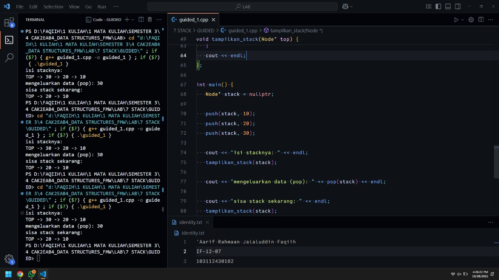

<h1 align="center">Laporan Praktikum Modul 7<br>STACK</h1>
<p align="center">'Aarif Rahmaan Jalaluddin Faqiih - 103112430182</p>

## Dasar Teori

XXXXXXXXXXXXXXXXXXXXXXXXXXXXXXXXXXXXXXXXXXXXXXXX

---

## Guided

### Soal 1 : program untuk push, pop, dan menampilkan isi stack.

```cpp
#include <iostream>
using namespace std;

// stack itu kaya box yang ditumpuk ke atas
// stack itu linked list tapi cuma bisa diakses dari belakang
// maksudnya gini, misal ada stack kaya gini
// | 30 | <- top
// | 20 |
// | 10 |
// kita cuma boleh nambahin di atas (push) atau ngambil dari atas (pop)
// ngga boleh ambil dari tengah atau bawah
// bayangin aja tumpukan box, kalo diambil dari tengah atau bawah pasti yang diatas bakal jatuh, makannya diakses dari atas
struct Node {
   int   data;
   Node* next;
};

// cek stacknya kosong ngga?
bool apakah_kosong(Node *top) {
   return top == nullptr;
};

// nambahin data ke atas stack
void push(Node*& top, int data) {
   Node* node_baru = new Node();
   node_baru->data = data;
   node_baru->next = top;
   top = node_baru;
};

// ngambil data dari atas stack
int pop(Node*& top) {
    // kalo stacknya kosong, ngga bisa di-pop
   if (apakah_kosong(top)) {
      cout << "stack kosong, apa yang mau di-pop?" << endl;
      return -1;
   }

   int data_dikeluarkan = top->data;
   // temp itu tempat penyimpanan node sementara untuk dihapus nanti
   // anggep aja kaya buat nandain yang mau dihapus
   Node* temp = top;
   // terus topnya digeser ke node berikutnya
   top = top->next;
   // nah baru deh node yang paling atas (yang tadi di temp) dihapus
   delete temp;
   return data_dikeluarkan;
};

// nampilin isi stack dari atas ke bawah
void tampilkan_stack(Node* top) {
   if (apakah_kosong(top)) {
    cout << "stack kosong, apa yang mau di-pop?" << endl;
      return;
   };

   cout << "TOP -> ";
   Node* temp = top;

   while (temp != nullptr) {
      cout << temp->data;
      if (temp->next != nullptr) cout << " -> ";
      temp = temp->next;
   }
   cout << endl;
};

int main() {
   Node* stack = nullptr;

   push(stack, 10);
   push(stack, 20);
   push(stack, 30);

   cout << "isi stacknya: " << endl;
   tampilkan_stack(stack);

   cout << "mengeluarkan data (pop): " << pop(stack) << endl;

   cout << "sisa stack sekarang: " << endl;
   tampilkan_stack(stack);

   return 0;
}
```

> Output
> 
> 

program ini tujuannya untuk menampilkan cara kerja struktur data stack menggunakan konsep linked list. stack itu ibarat tumpukan box, di mana kita hanya bisa menaruh (push) atau mengambil (pop) dari bagian atas saja. jadi kalau kita mau ambil yang di bawah, box di atasnya bakal jatuh, makanya stack cuma bisa diakses dari atas.

di awal program ada struct Node yang berisi dua komponen, yaitu data untuk menyimpan nilai, dan next untuk menyimpan alamat node berikutnya.

fungsi apakah_kosong digunakan untuk mengecek apakah stack kosong atau tidak. cara kerjanya dengan memeriksa apakah top bernilai nullptr, kalau iya berarti stack kosong.

fungsi push digunakan untuk menambah data ke atas stack. langkahnya dimulai dengan membuat node baru, lalu node baru itu menyimpan data yang dimasukkan, kemudian next-nya diarahkan ke top lama (karena node baru akan berada di atas node sebelumnya), dan terakhir top dipindahkan ke node baru, artinya node baru sekarang jadi paling atas.

fungsi pop digunakan untuk menghapus atau mengambil data dari atas stack. kalau stack kosong, maka tidak bisa dilakukan pop dan akan menampilkan pesan "stack kosong, apa yang mau di-pop?". kalau tidak kosong, maka data dari top disimpan dulu ke variabel sementara, lalu top digeser ke node berikutnya, dan node yang tadi disimpan sementara dihapus dari memori.

fungsi tampilkan_stack digunakan untuk menampilkan isi stack dari atas ke bawah. pertama dicek apakah stack kosong, kalau iya maka tampil pesan bahwa stack kosong. kalau tidak, maka program akan menampilkan elemen stack mulai dari top, ditelusuri satu per satu lewat pointer next, sampai habis. tampilannya berurutan dari atas ke bawah, dan di antara datanya dipisahkan tanda panah.

terakhir, di fungsi main, dibuat sebuah stack kosong dulu. lalu dilakukan push tiga kali untuk menambahkan data 10, 20, dan 30. setelah itu, program menampilkan isi stack dengan fungsi tampilkan_stack, kemudian melakukan pop satu kali untuk mengeluarkan data paling atas, dan menampilkan isi stack lagi untuk melihat sisa data setelah pop dilakukan.

---

## Unguided

### Soal 1 : Buatlah ADT Stack menggunakan ARRAY dalam file “stack.h”, “stack.cpp”, dan “main.cpp”

<code>stack.h</code>

```cpp
#ifndef STACK_H
#define STACK_H

#include <iostream>
using namespace std;

// tipe data int diganti namanya jadi infotype
typedef int infotype;

// ukuran maksimum stack
#define MAX 20

struct Stack {
   infotype info[MAX];
   int top;
};

// deklarasi semua fungsi dan prosedur yang bakal dipake
void createStack(Stack &S);
void push(Stack &S, infotype x);
infotype pop(Stack &S);
void printInfo(Stack S);
void balikStack(Stack &S);

#endif
```

<code>stack.cpp</code>

```cpp
#include "stack.h"

// bikin stack kosong
void createStack(Stack &S) {
   S.top = -1;
   // kenapa -1? karena index array dimulai dari 0, bukan 1
   // makannya dibikin -1, biar ngga 0
}

// masukin data ke atas stack
void push(Stack &S, infotype x) {
   // cek apakah stack penuh?
   if (S.top == MAX - 1) {
      cout << "stack penuh, tidak bisa menambah data lagi" << endl;
      return;
   }

   // kalo belum penuh, tambahkan data ke atas
   S.top = S.top + 1;
   S.info[S.top] = x;
}

// ambil data paling atas dari stack
infotype pop(Stack &S) {
   // cek apakah stack kosong?
   if (S.top == -1) {
      cout << "stack kosong, tidak ada yang bisa di-pop" << endl;
      return -1;
   }

   // ambil data paling atas
   infotype data = S.info[S.top];

   // terus turunin top-nya
   S.top = S.top - 1;

   // balikin data yang tadi diambil
   return data;
}

// nampilin isi stack dari atas ke bawah
void printInfo(Stack S) {
   if (S.top == -1) {
      cout << "stack kosong" << endl;
      return;
   }

   cout << "[TOP] ";

   // loop data dari index 0 sampe index terakhir
   for (int i = S.top; i >= 0; i--) {
      cout << S.info[i];
      if (i > 0) cout << " -> ";
   }

   cout << "" << endl;
}

// mbalik isi stack
void balikStack(Stack &S) {
   // tukar posisi awal dan akhir
   int i = 0;
   int j = S.top;

   // selama i masih di bawah j, maka tukar
   while (i < j) {
      infotype temp = S.info[i];
      S.info[i] = S.info[j];
      S.info[j] = temp;
      i++;
      j--;
   }
}
```

<code>main.cpp</code>

```cpp
#include "stack.h"

int main() {
   cout << "Hello world!" << endl;

   Stack S;
   createStack(S);

   push(S, 3);
   push(S, 4);
   push(S, 8);
   pop(S);
   push(S, 2);
   push(S, 3);
   pop(S);
   push(S, 9);

   printInfo(S);

   cout << "balik stack" << endl;
   balikStack(S);
   printInfo(S);

   return 0;
}
```

> Output
> 
> 

XXXXXXXXXXXXXXXXXXXXXXXXXXXXXXXXXXXXXXXXXXXXXXXX

---

### Soal 2 : Tambahkan prosedur pushAscending(in/out S : Stack, in x : integer)

<code>stack.h</code>

```cpp
void pushAscending(Stack &S, infotype x);
```

<code>stack.cpp</code>

```cpp
// input data secara ascending (dari kecil ke besar)
void pushAscending(Stack &S, infotype x) {
   if (S.top == MAX - 1) {
      cout << "stack penuh, tidak bisa menambah data lagi" << endl;
      return;
   }

   Stack temp;
   createStack(temp);

   while (S.top != -1 && S.info[S.top] > x) {
      push(temp, pop(S));
   }

   push(S, x);

   while (temp.top != -1) {
      push(S, pop(temp));
   }
}
```

<code>main.cpp</code>

```cpp
   pushAscending(S, 3);
   pushAscending(S, 4);
   pushAscending(S, 8);
   pushAscending(S, 2);
   pushAscending(S, 3);
   pushAscending(S, 9);
```

> Output
> 
> 

XXXXXXXXXXXXXXXXXXXXXXXXXXXXXXXXXXXXXXXXXXXXXXXX

---

### Soal 3 : Tambahkan prosedur getInputStream(in/out S : Stack)

XXXXXXXXXXXXXXXXXXXXXXXX

<code>stack.h</code>

```cpp
void getInputStream(Stack &S);
```

<code>stack.cpp</code>

```cpp
// prosedur untuk menerima input user
void getInputStream(Stack &S) {
   int x;
   cout << "input data (untuk berhenti tekan sembarang selain angka): " << endl;
   while (cin >> x) {
       push(S, x);
   }
   cout << "input sudah ada di stack!" << endl;
}
```

<code>main.cpp</code>

```cpp
   getInputStream(S);
```

> Output
> 
> 

XXXXXXXXXXXXXXXXXXXXXXXXXXXXXXXXXXXXXXXXXXXXXXXX

---

## Referensi

1. XXXXXXXXXXXXXXXXXXXXXXXXXXXXXXXXXXXXXXXXXXXXXXXX
