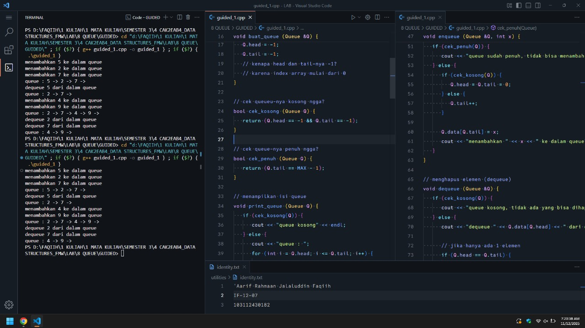

<h1 align="center">Laporan Praktikum Modul 8 <br> QUEUE</h1>
<p align="center">'Aarif Rahmaan Jalaluddin Faqiih - 103112430182</p>

## Dasar Teori

### **1. definisi queue**

queue adalah struktur data linear yang menerapkan prinsip **fifo (first in, first out)**.
elemen yang lebih dulu masuk akan menjadi elemen pertama yang keluar.

**implikasi:**

* urutan operasi sangat penting.
* tidak bisa langsung mengambil elemen tengah seperti array biasa.

---

### **2. komponen utama**

setiap queue berbasis array yang memiliki dua penunjuk utama:

* **head** -> posisi elemen yang akan dikeluarkan (dequeue).
* **tail** -> posisi elemen yang ditambahkan (enqueue).

---

### **3. operasi dasar queue**

**a. enqueue (menambah elemen)**
menempatkan elemen baru ke posisi tail.

**b. dequeue (menghapus elemen)**
mengambil elemen di head.

**c. isempty**
true jika tidak ada elemen (head = tail = -1).

**d. isfull**
true jika array sudah tidak memiliki slot data.

---

### **4. tiga metode implementasi queue berbasis array**

---

#### **a. alternatif 1 : head tetap diam, tail bergerak**

* head selalu di posisi 0.
* elemen baru masuk di tail.
* jika dequeue dilakukan, **semua elemen digeser ke kiri**.
* operasi dequeue memakan waktu **o(n)** karena pergeseran.
* implementasi mudah, tapi kurang efisien.

---

#### **b. alternatif 2 : head bergerak, tail bergerak, tapi linear (tanpa putaran)**

* head naik setiap dequeue.
* tail naik setiap enqueue.
* ketika tail mencapai ujung array tetapi masih ada ruang di depan (head > 0), array digeser ke depan.
* mengurangi jumlah geseran dibanding alternatif 1.

---

#### **c. alternatif 3 : circular queue (head & tail berputar)**

* menggunakan operasi modulo: `(index + 1) % max`.
* jika tail mencapai ujung, ia kembali ke 0.
* tidak ada pergeseran elemen.
* semua operasi (enqueue/dequeue) menjadi **o(1)**.
* memanfaatkan array secara maksimal tanpa membuang ruang.

---

### **5. karakteristik queue**

* fifo
* tidak dapat diakses secara acak seperti array atau list
* antrian selalu bergerak seiring bertambah/berkurangnya elemen
* cocok untuk kasus real-time dan scheduling

---

### **6. contoh penerapan queue**

* **print queue**
* **simulasi antrian** (bank, kasir, rumah sakit)

---

## Guided

### Soal 1

```cpp
#include <iostream>
using namespace std;

// ukuran maksimal queue
#define MAX 5

// struktur queue
struct Queue {
   // datanya pake array yaa, bukan linked list
   int data[MAX];
   int head;
   int tail;
};

// membuat antrian kosong
void buat_queue (Queue &Q) {
   Q.head = -1;
   Q.tail = -1;
   // kenapa head dan tail-nya -1?
   // karena index array mulai dari 0
}

// cek queueu-nya kosong ngga?
bool cek_kosong (Queue Q) {
   return (Q.head == -1 && Q.tail == -1);
}

// cek queue-nya penuh ngga?
bool cek_penuh (Queue Q) {
   return (Q.tail == MAX - 1);
}

// menampilkan isi queue
void print_queue (Queue Q) {
   if (cek_kosong(Q)) {
      cout << "queue kosong" << endl;
   } else {
      cout << "queue : ";
      for (int i = Q.head; i <= Q.tail; i++) {
         cout << Q.data[i] << " -> ";
      }
      cout << endl;
   }
}

// menambahkan elemen (enqueue)
void enqueue (Queue &Q, int x) {
// x itu data yang mau dimasukin ke dalam queue
// kenapa namanya x? itu sih terserah, mau pake nama apa aja boleh
// mau dinamain ayam_bakar_haji_ismail juga gapapa
   if (cek_penuh(Q)) {
      cout << "queue sudah penuh, tidak bisa menambah data" << endl;
   } else {
      if (cek_kosong(Q)) {
         Q.head = Q.tail = 0;
      } else {
         Q.tail++;
      }

      Q.data[Q.tail] = x;
      cout << "menambahkan " << x << " ke dalam queue" << endl;
   }
}

// menghapus elemen (dequeue)
void dequeue (Queue &Q) {
   if (cek_kosong(Q)) {
      cout << "queue kosong, tidak ada yang bisa dihapus" << endl;
   } else {
      cout << "dequeue " << Q.data[Q.head] << " dari dalam queue" << endl;

      // jika hanya ada 1 elemen
      if (Q.head == Q.tail) {
         Q.head = Q.tail = -1;
      } else {
         // geser semua elemen ke depan/kiri
         // biar tempat kosong di depan dipenuhin
         // dan tempat di belakang bisa dikosongin
         for (int i = Q.head; i < Q.tail; i++) {
            Q.data[i] = Q.data[i + 1];
         }

         Q.tail--;
      }
   }
}

// eksekutor
int main() {
   Queue Q;
   buat_queue(Q);

   enqueue(Q, 5);
   enqueue(Q, 2);
   enqueue(Q, 7);
   print_queue(Q);

   dequeue(Q);
   print_queue(Q);

   enqueue(Q, 4);
   enqueue(Q, 9);
   print_queue(Q);

   dequeue(Q);
   dequeue(Q);
   print_queue(Q);

   return 0;
}
```

> Output
> 
> 

program ini bertujuan untuk mempelajari struktur data queue atau antrian menggunakan array.

di awal program, terdapat struktur bernama Queue yang terdiri dari array data berukuran maksimal 5 elemen, serta dua variabel yaitu head dan tail yang berfungsi sebagai penanda posisi depan dan belakang antrian.

prosedur buat_queue digunakan untuk menginisialisasi queue kosong, dengan cara mengatur nilai head dan tail menjadi -1. kenapa -1? karena index array dimulai dari 0.

fungsi cek_kosong digunakan untuk memeriksa apakah queue masih kosong atau tidak, caranya adalah dengan mengecek apakah nilai head dan tail sama-sama -1. jika iya, berarti queue masih kosong. sebaliknya, fungsi cek_penuh digunakan untuk memeriksa apakah queue sudah penuh atau belum, yaitu dengan mengecek apakah tail sudah mencapai index terakhir dari array (MAX - 1).

fungsi print_queue digunakan untuk menampilkan isi dari queue. kalau queue-nya kosong, maka akan muncul tulisan “queue kosong”. tapi kalau tidak kosong, maka program akan menampilkan isi queue dari index head sampai tail.

fungsi enqueue digunakan untuk menambahkan data ke dalam queue. parameter x adalah data yang mau dimasukkan. kalau queue sudah penuh, maka program akan menampilkan pesan bahwa data tidak bisa ditambahkan. tapi kalau masih ada ruang, maka data baru akan dimasukkan ke posisi tail. jika queue masih kosong, head dan tail di-set ke 0 dulu, tapi kalau sudah ada data sebelumnya, maka tail akan digeser sebelum data baru dimasukkan.

fungsi dequeue digunakan untuk menghapus data dari queue, yaitu data yang berada di posisi paling depan (head). kalau queue kosong, maka akan muncul pesan bahwa tidak ada data yang bisa dihapus. kalau hanya ada satu data, maka setelah dihapus queue akan dikosongkan dengan cara mengatur head dan tail menjadi -1. tapi kalau lebih dari satu data, maka semua elemen akan digeser satu posisi ke depan supaya tidak ada celah kosong di depan, dan nilai tail dikurangi satu agar posisi belakang ikut bergeser.

fungsi main bertugas untuk mengeksekusi semua proses di atas. pertama-tama program membuat queue kosong, lalu menambahkan beberapa data menggunakan enqueue, menampilkan isi queue, menghapus beberapa data dengan dequeue, dan menampilkan hasil akhirnya setelah setiap operasi.

---

## Unguided

### Soal 1 : Buatlah ADT Queue menggunakan ARRAY sebagai berikut di dalam file “queue.h”:

<pre>
type infotype : integer
type Queue : <
  info : array [5] of infotype
  head, tail : integer
>
procedure createQueue (input/output Q : Queue)
function isEmptyQueue (Q : Queue) -> boolean
function isFullQueue (Q : Queue) -> boolean
procedure enqueue (input/output Q : Queue, input x : infotype)
function dequeue (input/output Q : Queue) -> infotype
procedure printInfo (input Q : Queue)
</pre>

### Buatlah implementasi ADT Queue pada file “queue.cpp” dengan menerapkan mekanisme queue  Alternatif 1 (head diam, tail bergerak).

<pre>
int main() {
  cout << "Hello World" << endl;
  Queue Q;
  createQueue(Q);

  cout << "----------------------" << endl;
  cout << " H - T \t | Queue info" << endl;
  cout << "----------------------" << endl;

  printInfo(Q);

  enqueue(Q, 5);  printInfo(Q);
  enqueue(Q, 2);  printInfo(Q);
  enqueue(Q, 7);  printInfo(Q);
  dequeue(Q);     printInfo(Q);
  enqueue(Q, 4);  printInfo(Q);
  dequeue(Q);     printInfo(Q);
  dequeue(Q);     printInfo(Q);

  return 0;
}
</pre>

<code>queue.h</code>

```cpp
#ifndef QUEUE_H
#define QUEUE_H

#include <iostream>
using namespace std;

typedef int infotype;
#define MAX 5

struct Queue {
   infotype info[MAX];
   int head;
   int tail;
};

void createQueue(Queue &Q);
bool isEmptyQueue(Queue Q);
bool isFullQueue(Queue Q);
void enqueue(Queue &Q, infotype x);
infotype dequeue(Queue &Q);
void printInfo(Queue Q);

#endif
```

<code>queue.cpp</code>

```cpp
#include "queue.h"

void createQueue(Queue &Q) {
   Q.head = -1;
   Q.tail = -1;
}

bool isEmptyQueue(Queue Q) {
   return (Q.head == -1 && Q.tail == -1);
}

bool isFullQueue(Queue Q) {
   return (Q.tail == MAX - 1);
}

void enqueue(Queue &Q, infotype x) {
   if (isFullQueue(Q)) {
      cout << "queue penuh, tidak bisa menambah data" << endl;
   } else {
      if (isEmptyQueue(Q)) {
         Q.head = 0;
         Q.tail = 0;
      } else {
         Q.tail++;
      }
      Q.info[Q.tail] = x;
   }
}

infotype dequeue(Queue &Q) {
   if (isEmptyQueue(Q)) {
      cout << "queue kosong, tidak ada yang bisa dihapus" << endl;
      return -1;
   }

   infotype hasil = Q.info[Q.head];

   if (Q.head == Q.tail) {
      Q.head = -1;
      Q.tail = -1;
   } else {
      for (int i = Q.head; i < Q.tail; i++) {
         Q.info[i] = Q.info[i + 1];
      }
      Q.tail--;
   }

   return hasil;
}

void printInfo(Queue Q) {
   if (isEmptyQueue(Q)) {
      cout << Q.head << "  - " << Q.tail << "  | empty queue" << endl;
   } else {
      cout << " " << Q.head << "  -  " << Q.tail << "  | ";
      for (int i = Q.head; i <= Q.tail; i++) {
         cout << Q.info[i] << " ";
      }
      cout << endl;
   }
}
```

<code>main.cpp</code>

```cpp
#include "queue.h"

int main() {
   cout << "Hello world!" << endl;

   cout<<"-----------------------"<<endl;
   cout<<" H  -  T  | Queue Info"<<endl;
   cout<<"-----------------------"<<endl;

   Queue Q;
   createQueue(Q);

   printInfo(Q);
   enqueue(Q,5); printInfo(Q);
   enqueue(Q,2); printInfo(Q);
   enqueue(Q,7); printInfo(Q);
   dequeue(Q); printInfo(Q);
   enqueue(Q,4); printInfo(Q);
   dequeue(Q); printInfo(Q);
   dequeue(Q); printInfo(Q);

   cout<<"-1  - -1  | empty queue"<<endl;

   return 0;
}
```

> Output
> 
> 

program ini bertujuan untuk menampilkan proses penambahan dan penghapusan data pada sebuah queue dengan menggunakan alternatif 1.

prosedur createQueue tujuannya untuk menginisialisasi queue dalam kondisi kosong. caranya adalah dengan memberi nilai head dan tail sebesar -1.

setelah itu ada fungsi isEmptyQueue dan isFullQueue. fungsi isEmptyQueue bekerja dengan cara mengecek apakah head dan tail bernilai -1, kalau iya berarti queue masih kosong. kemudian fungsi isFullQueue bekerja dengan cara mengecek apakah tail sudah mencapai index terakhir yaitu MAX - 1, jika sudah berarti queue penuh dan tidak bisa menambah data lagi.

fungsi enqueue bekerja dengan cara menambahkan data baru ke dalam queue. pertama dicek apakah queue penuh, kalau penuh maka program menampilkan pesan tidak bisa menambah data. jika tidak penuh dan queue masih kosong, maka head dan tail diubah menjadi 0. tapi jika queue sudah terisi, maka tail ditambah 1 agar data baru masuk ke posisi berikutnya. setelah itu nilai x dimasukkan ke array info pada posisi tail.

fungsi dequeue bekerja dengan cara menghapus data paling depan dalam queue, yaitu data pada index head. pertama dicek apakah queue kosong, kalau kosong maka program menampilkan pesan tidak ada yang bisa dihapus dan mengembalikan nilai -1. jika tidak kosong, data paling depan disimpan dulu ke variabel hasil. kemudian dicek apakah head sama dengan tail, artinya hanya ada satu data dalam queue. jika iya, maka queue direset menjadi kosong dengan mengubah head dan tail menjadi -1. tapi kalau datanya lebih dari satu, maka semua elemen digeser ke kiri, setelah itu tail dikurangi 1.

fungsi printInfo bekerja dengan cara menampilkan posisi head, tail, dan isi queue. jika queue kosong maka ditampilkan pesan empty queue. jika tidak kosong, maka program menampilkan angka dari index head sampai index tail sesuai data yang tersimpan dalam queue.

terakhir, fungsi main bertugas untuk membuat queue, memanggil fungsi, menambah data, menghapus data, dan menampilkan perubahan kondisi queue setelah setiap operasi dilakukan.

---

### Soal 2 : Buatlah implementasi ADT Queue pada file “queue.cpp” dengan menerapkan mekanisme queue  Alternatif 2 (head bergerak, tail bergerak).

<code>queue.h</code>

```cpp
#ifndef QUEUE_H
#define QUEUE_H

#include <iostream>
using namespace std;

typedef int infotype;
#define MAX 5

struct Queue {
   infotype info[MAX];
   int head;
   int tail;
};

void createQueue(Queue &Q);
bool isEmptyQueue(Queue Q);
bool isFullQueue(Queue Q);
void enqueue(Queue &Q, infotype x);
infotype dequeue(Queue &Q);
void printInfo(Queue Q);

#endif
```

<code>queue.cpp</code>

```cpp
#include "queue.h"

void createQueue(Queue &Q) {
   Q.head = -1;
   Q.tail = -1;
}

bool isEmptyQueue(Queue Q) {
   return (Q.head == -1 && Q.tail == -1);
}

bool isFullQueue(Queue Q) {
   return (Q.tail == MAX - 1);
}

void enqueue(Queue &Q, infotype x) {
   if (isFullQueue(Q) && Q.head > 0) {
      // geser semua elemen ke depan
      int j = 0;
      for (int i = Q.head; i <= Q.tail; i++) {
         Q.info[j] = Q.info[i];
         j++;
      }

      Q.tail = j - 1;
      Q.head = 0;
   }

   if (isFullQueue(Q)) {
      cout << "queue penuh (beneran penuh), ga bisa nambah data" << endl;
      return;
   }

   if (isEmptyQueue(Q)) {
      Q.head = 0;
      Q.tail = 0;
      Q.info[Q.tail] = x;
   } else {
      Q.tail++;
      Q.info[Q.tail] = x;
   }
}

infotype dequeue(Queue &Q) {
   if (isEmptyQueue(Q)) {
      cout << "queue kosong, ga ada yang bisa dihapus" << endl;
      return -1;
   }

   infotype hasil = Q.info[Q.head];

   if (Q.head == Q.tail) {
      Q.head = -1;
      Q.tail = -1;
   } else {
      Q.head++;
   }

   return hasil;
}

void printInfo(Queue Q) {
   if (isEmptyQueue(Q)) {
      cout << Q.head << "  - " << Q.tail << "  | empty queue" << endl;
   } else {
      cout << " " << Q.head << "  -  " << Q.tail << "  | ";
      for (int i = Q.head; i <= Q.tail; i++) {
         cout << Q.info[i] << " ";
      }
      cout << endl;
   }
}
```

<code>main.cpp</code>

```cpp
#include "queue.h"

int main() {
   cout << "Hello world!" << endl;

   cout<<"-----------------------"<<endl;
   cout<<" H  -  T  | Queue Info"<<endl;
   cout<<"-----------------------"<<endl;

   Queue Q;
   createQueue(Q);

   printInfo(Q);
   enqueue(Q,5); printInfo(Q);
   enqueue(Q,2); printInfo(Q);
   enqueue(Q,7); printInfo(Q);
   dequeue(Q); printInfo(Q);
   enqueue(Q,4); printInfo(Q);
   dequeue(Q); printInfo(Q);
   dequeue(Q); printInfo(Q);

   cout<<"-1  - -1  | empty queue"<<endl;

   return 0;
}
```

> Output
> 
> 

program ini bertujuan untuk menampilkan proses penambahan dan penghapusan data pada sebuah queue dengan menggunakan alternatif 2, yaitu queue dengan head dan tail yang bergerak tanpa berputar, dan hanya melakukan pergeseran elemen jika tail sudah mencapai index paling akhir pada array.

fungsi enqueue bekerja dengan cara menambahkan elemen baru x ke dalam queue. pertama fungsi ini mengecek apakah tail sudah berada di ujung array tetapi head tidak berada di 0. kalau kondisi itu terjadi berarti masih ada ruang kosong di bagian depan array, jadi perlu dilakukan pergeseran elemen. pergeseran dilakukan dengan cara menyalin semua elemen mulai dari index head sampai tail ke posisi paling depan array mulai dari index 0. setelah itu tail disesuaikan menjadi posisi baru, yaitu j-1, dan head kembali menjadi 0.

fungsi dequeue bekerja dengan cara mengambil dan menghapus data paling depan pada queue. pertama dicek apakah queue kosong. kalau kosong maka program menampilkan pesan bahwa tidak ada data yang bisa dihapus. kalau tidak kosong, maka data yang berada di index head disimpan sementara sebagai hasil. jika setelah penghapusan queue menjadi kosong, yaitu ketika head dan tail berada di posisi yang sama, maka keduanya diset kembali menjadi -1. jika tidak kosong, maka head cukup maju satu langkah ke depan.

---

### Soal 3 : Buatlah implementasi ADT Queue pada file “queue.cpp” dengan menerapkan mekanisme queue  Alternatif 3 (head dan tail berputar).

<code>queue.h</code>

```cpp
#ifndef QUEUE_H
#define QUEUE_H

#include <iostream>
using namespace std;

typedef int infotype;
#define MAX 5

struct Queue {
   infotype info[MAX];
   int head;
   int tail;
};

void createQueue(Queue &Q);
bool isEmptyQueue(Queue Q);
bool isFullQueue(Queue Q);
void enqueue(Queue &Q, infotype x);
infotype dequeue(Queue &Q);
void printInfo(Queue Q);

#endif
```

<code>queue.cpp</code>

```cpp
#include "queue.h"

void createQueue(Queue &Q) {
   Q.head = -1;
   Q.tail = -1;
}

bool isEmptyQueue(Queue Q) {
   return (Q.head == -1 && Q.tail == -1);
}

bool isFullQueue(Queue Q) {
   if (isEmptyQueue(Q)) return false;
   return ((Q.tail + 1) % MAX) == Q.head;
}

void enqueue(Queue &Q, infotype x) {
   if (isFullQueue(Q)) {
      cout << "queue penuh, tidak bisa menambah data" << endl;
      return;
   }

   if (isEmptyQueue(Q)) {
      Q.head = 0;
      Q.tail = 0;
   } else {
      Q.tail = (Q.tail + 1) % MAX;
   }

   Q.info[Q.tail] = x;
}

infotype dequeue(Queue &Q) {
   if (isEmptyQueue(Q)) {
      cout << "queue kosong, tidak ada yang bisa dihapus" << endl;
      return -1;
   }

   infotype hasil = Q.info[Q.head];

   if (Q.head == Q.tail) {
      Q.head = -1;
      Q.tail = -1;
   } else {
      Q.head = (Q.head + 1) % MAX;
   }

   return hasil;
}

void printInfo(Queue Q) {
   if (isEmptyQueue(Q)) {
      cout << Q.head << "  - " << Q.tail << "  | empty queue" << endl;
   } else {
      cout << " " << Q.head << "  -  " << Q.tail << "  | ";

      int i = Q.head;
      while (true) {
         cout << Q.info[i] << " ";
         if (i == Q.tail) break;
         i = (i + 1) % MAX;
      }

      cout << endl;
   }
}
```

<code>main.cpp</code>

```cpp
#include "queue.h"

int main() {
   cout << "Hello world!" << endl;

   cout<<"-----------------------"<<endl;
   cout<<" H  -  T  | Queue Info"<<endl;
   cout<<"-----------------------"<<endl;

   Queue Q;
   createQueue(Q);

   printInfo(Q);
   enqueue(Q,5); printInfo(Q);
   enqueue(Q,2); printInfo(Q);
   enqueue(Q,7); printInfo(Q);
   dequeue(Q); printInfo(Q);
   enqueue(Q,4); printInfo(Q);
   dequeue(Q); printInfo(Q);
   dequeue(Q); printInfo(Q);

   cout<<"-1  - -1  | empty queue"<<endl;

   return 0;
}
```

> Output
> 
> 

program ini bertujuan untuk mengimplementasikan struktur data queue menggunakan metode circular buffer sesuai dengan alternatif 3, yaitu representasi HEAD dan TAIL yang bergerak melingkar dari index awal sampai index akhir kemudian kembali ke awal tanpa perlu melakukan pergeseran elemen seperti pada alternatif sebelumnya.

fungsi enqueue bekerja dengan cara menambahkan elemen baru ke dalam queue. jika queue sudah berisi, maka tail dimajukan 1 langkah dengan rumus (tail + 1) % MAX agar ketika tail mencapai index MAX-1, langkah berikutnya kembali ke index 0. setelah posisi tail diperbarui, nilai x dimasukkan ke array info pada indeks tail.

fungsi dequeue bekerja dengan cara mengambil dan menghapus elemen pada posisi head. jika jumlah elemen lebih dari satu, maka head dimajukan 1 langkah menggunakan rumus (head + 1) % MAX sehingga ia berputar jika mencapai index MAX-1.

fungsi printInfo bekerja dengan cara menampilkan kondisi queue, yaitu print posisi head dan tail serta seluruh elemen yang sedang ada di dalam queue. jika queue kosong maka program menampilkan tulisan empty queue. jika tidak kosong, program menampilkan semua elemen mulai dari head hingga tail dengan menggunakan pergerakan melingkar, yaitu dengan menaikkan index menggunakan (i + 1) % MAX sampai index mencapai posisi tail.

---

## Kesimpulan

dari praktikum ini, kita bisa belajar bagaimana struktur data queue dapat diimplementasikan dalam tiga pendekatan berbeda dengan karakteristik dan efisiensinya masing-masing. pada alternatif pertama, operasi dequeue membutuhkan pergeseran elemen sehingga kurang efisien karena kompleksitasnya meningkat seiring jumlah data.

alternatif kedua memperbaiki masalah tersebut dengan menggerakkan head dan tail secara linear, serta hanya melakukan pergeseran ketika benar-benar diperlukan saat tail mencapai batas array tetapi masih ada ruang kosong di depan.

alternatif ketiga menjadi solusi dari dua alternatif sebelumnya melalui penggunaan circular queue, di mana head dan tail dapat berputar menggunakan operasi modulo sehingga tidak ada pergeseran sama sekali. dari ketiga implementasi tersebut dapat disimpulkan bahwa pemilihan mekanisme queue dapat mempengaruhi kinerja program, dan circular queue adalah metode terbaik.

---

## Referensi

1. GeeksforGeeks. (2025, October 30). *Implementation of Circular Queue Using Array*. Retrieved November 12, 2025, from [https://www.geeksforgeeks.org/dsa/introduction-to-circular-queue/](https://www.geeksforgeeks.org/dsa/introduction-to-circular-queue/)
2. Mishra, H. (2024, June 3). *Queues, Data Structures*. DEV Community. Retrieved November 14, 2025, from [https://dev.to/harshm03/queues-data-structures-1dd1](https://dev.to/harshm03/queues-data-structures-1dd1)
3. Mufada, N. *Struktur Data Queue: Pengertian, Jenis, dan Kegunaannya*. Medium. Retrieved November 15, 2025, from [https://medium.com/%40nadhifmufada09/struktur-data-queue-pengertian-jenis-dan-kegunaannya-0494fa6ccc1d](https://medium.com/%40nadhifmufada09/struktur-data-queue-pengertian-jenis-dan-kegunaannya-0494fa6ccc1d)
4. SoftwareSeni. *Queue Adalah: Pengertian, Tipe, dan Contoh Implementasi*. Retrieved November 16, 2025, from [https://www.softwareseni.co.id/blog/queue-adalah-pengertian-tipe-dan-contoh-implementasi](https://www.softwareseni.co.id/blog/queue-adalah-pengertian-tipe-dan-contoh-implementasi)
